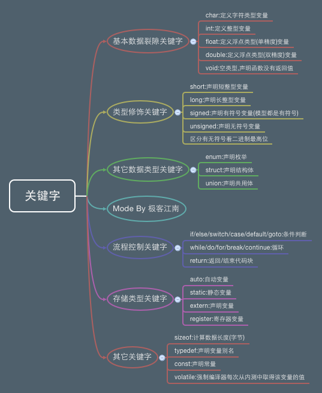

[TOC]

---

# 关键字

---

##1.【理解】关键字的基本概念

- 被C语言赋予了特殊含义的单词
    + 关键字特征:全部都是小写
    + 关键字在开发工具中会显示特殊颜色
    	+ 编译器严格区分大小写
    	+ **注意: 关键字不能用作变量名、函数名等**

- C语言中一共有32个关键字
 + auto double int struct break else long switch
 +  case enum register typedef char extern return
 + union const float short unsigned continue for
 + signed void default goto sizeof volatile do if while static

>这些不用专门去记住,用多了就会了。在编译器里都是有特殊颜色的。 我们用到时候会一个一个讲解这个些关键字怎么用,现在浏览下,有个印象就OK了。

---

##2.【理解】数据类型关键字

- 基本数据类型(5个)
    + void :声明函数无返回值或无参数,声明无类型指针,显式丢弃运算结果
    + char :字符型类型数据,属于整型数据的一种
    + int :整型数据,通常为编译器指定的机器字长
    + float :单精度浮点型数据,属于浮点数据的一种
    + double :双精度浮点型数据,属于浮点数据的一种

- 类型修饰关键字(4个)
    + short :修饰int,短整型数据,可省略被修饰的int。
    + long :修饰int,长整形数据,可省略被修饰的int。
    + signed :修饰整型数据,有符号数据类型
    + unsigned :修饰整型数据,无符号数据类型

- 复杂类型关键字(5个) struct :结构体声明
分区
    + struct :结构体声明
    + union :共用体声明
    + enum :枚举声明
    + typedef :声明类型别名
    + sizeof :得到特定类型或特定类型变量的大小

- 存储级别关键字(6个)
    + auto :指定为自动变量,由编译器自动分配及释放。通常在栈上分配
    + static :指定为静态变量,分配在静态变量区,修饰函数时,指定函数作用域为文件内部
    + register :指定为寄存器变量,建议编译器将变量存储到寄存器中使用,也可以修饰函数形
参,建议编译器通过寄存器而不是堆栈传递参数
    + extern :指定对应变量为外部变量,即标示变量或者函数的定义在别的文件中,􏰁示编译器
遇到此变量和函数时在其他模块中寻找其定义。
    + const :与volatile合称“cv特性”,指定变量不可被当前线程/进程改变(但有可能被系统
或其他线程/进程改变)
    + volatile :与const合称“cv特性”,指定变量的值有可能会被系统或其他进程/线程改变, 强制编译器每次从内存中取得该变量的值

---

##3.【理解】流程控制关键字

- 跳转结构(4个)
    + return :用在函数体中,返回特定值(或者是void值,即不返回值)
    + continue :结束当前循环,开始下一轮循环
    + break :跳出当前循环或switch结构
    + goto :无条件跳转语句

- 分支结构(5个)
    + if :条件语句,后面不需要放分号
    + else :条件语句否定分支(与if连用)
    + switch :开关语句(多重分支语句)
    + case :开关语句中的分支标记
    + default :开关语句中的“其他”分支,可选。

- 循环结构(3个)
    + for:for循环结构,for(1;2;3)4;的执行顺序为1->2->4->3->2...循环,其中2为循环条件。
在整个for循环过程中,表达式1只计算一次,表达式2和表达式3则可能计算多次,也可能一次也 不计算。循环体可能多次执行,也可能一次都不执行。
    + do :do循环结构,do 1 while(2); 的执行顺序是1->2->1...循环,2为循环条件
    + while :while循环结构,while(1) 2; 的执行顺序是1->2->1...循环,1为循环条件 以上循环语句,当循环条件表达式为真则继续循环,为假则跳出循环。

---

