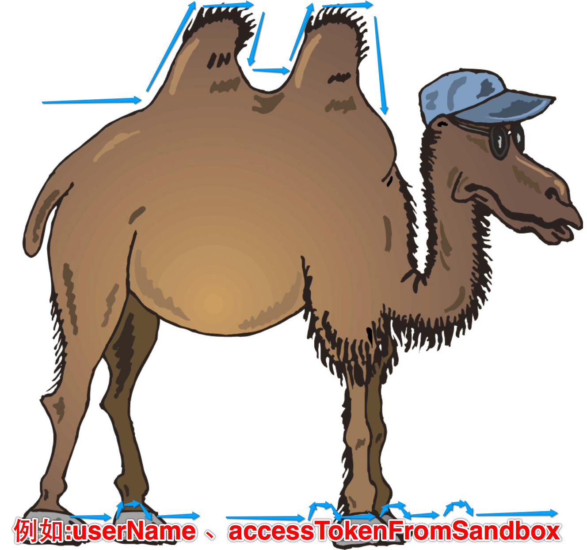

[TOC]

---

# 标示符命名规范

---

##1.【理解】标识符命名规范

- 命名规范:
    + 起一个有意义名字,能够􏰁高代码的可读性
    + 驼峰命名(除开第一个单词后面每个单词首字母大写)
    + 
    + 

---

##2.【了解】标示符命名规范详述

- 驼峰命名法(Camel-Case)是电脑程序编写时的一套命名规则(惯例):
    + 程序员们为了自己的代码能更容易的在同行之间交流,所以才取统一的可读性比较好的命名方式。
        * 例如:有些程序员喜欢全部小写,有些程序员喜欢用下划线,所以如果要写一个my name的变量,他们常用的写法会有myname、my_name、MyName或者myName。这样的命名规则不适合所有程序员阅读,而利用驼峰命名法来表示,可以增加程序可读性。

    + 驼峰命名法就是当变量名或函数名是由一个或多个单字连结在一起,而构成的唯一识别字时,第一个单字以小写字母开始,第二个单字的首字母大写;或每一个单字的首字母都采用 大写字母
        * 例如:myFirstName、myLastName,这样的变量名看上去就像骆驼峰一样此起彼伏,故得名。

    + 驼峰命名法(Camel-Case)一词来自 Perl 语言中普遍使用的大小写混合格式,
而 Larry Wall 等人所著的畅销书《Programming Perl》(O&#039;Reilly 出版)的封面图片正 是一匹骆驼。 驼峰命名法的命名规则可视为一种惯例,并无绝对与强制,为的是增加识别和可读 性。

- 不按照规范的后果
    + 

---
## 3.【了解】其它标识符命名规范

- 命名应当直观且可以拼读,要望文知意,便于记忆和阅读。
    + 标识符最好采用英文单词或其组合,不允许使用拼音。程序中的英文单词一般不要太复杂, 用词应当准确。

- 命名的长度应当符合“min-length && max-information”原则。
    + C 是一种简洁的语言, 命名也应该是简洁的。例如变量名MaxVal 就比 MaxValueUntilOverflow 好用。标识符的长度一般不要过长,较长的单词可通过去掉“元音”形 成缩写。
    + 另外,英文词尽量不缩写,特别是非常用专业名词,如果有缩写,在同一系统中对同一单词必 须使用相同的表示法,并且注明其意思。
    + 大多数ANSI编译程序允许有至多31个有效字符。也就是说,只有变量名或函数名的前31个字符 的唯一性会被检查,其余的字符将被忽略掉。
    + ```比如: PrintOutAllTheClientsMonthEndReports(); prt_rpts();```

- 当标识符由多个词组成时,建议采用“驼峰命名法”。
    + 比如:int CurrentVal;这样的名字看起来比较清晰,远比一长串字符好得多。

- 尽量避免名字中出现数字编号,如Value1,Value2 等,除非逻辑上的确需要编号。
    + 比如驱动开发时为管脚命名,非编号名字反而不好。 初学者总是喜欢用带编号的变量名或函数名,这样子看上去很简单方便,但其实是一颗颗定时炸 弹。这个习惯初学者一定要改过来。

- 对在多个文件之间共同使用的全局变量或函数要加范围限定符
    + (建议使用模块名(缩写)作为范围限定符)。(GUI_ ,etc)标识符的命名规则

- 标识符名分为两部分:规范标识符前缀(后缀) + 含义标识。
    + 非全局变量可以不用使用范围限定符前缀。

---


