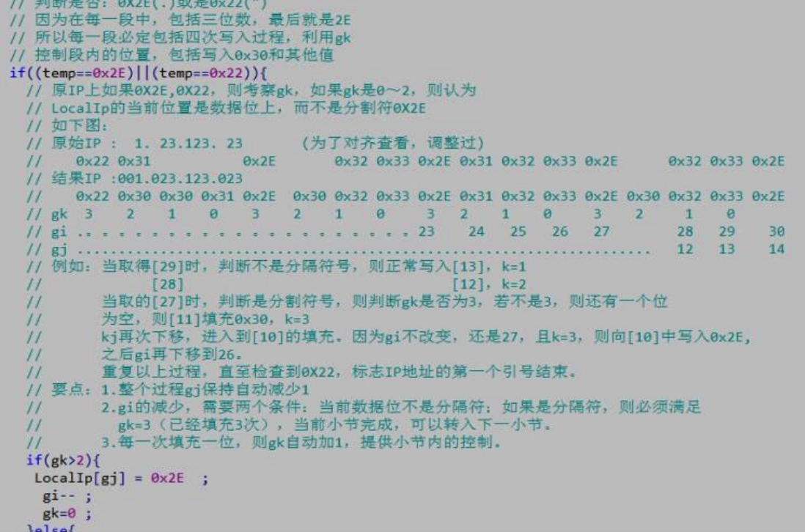

[TOC]

---

# 注释基本概念

---
##1.【掌握】什么是注释

- 注释是在所有计算机语言中都非常重要的一个概念，从字面上看，就是注解、解释的意思

- 注释可以用来解释某一段程序或者某一行代码是什么意思，方便程序员之间的交流。假如我写完一行代码后，加上相应的注释，那么别人看到这个注释就知道我的这行代码是做什么用的
- 注释可以是任何文字，也就是说可以写中文
- 在开发工具中注释一般是绿色

> 江哥提示:
    >+ 初学者编写程序可以养成习惯：先写注释再写代码。
    >+ 将自己的思想通过注释先整理出来，在用代码去体现。
    >+ 因为代码仅仅是思想的一种体现形式而已。

---

##2.【了解】为什么要使用注释?

- 新浪微博表情键盘"其中一个"文件代码

	

	

```objc

typedef enum{
    HMToolBarBtnTypeNear = 100,
    HMToolBarBtnTypeNormal,
    HMToolBarBtnTypeEmoji,
    HMToolBarBtnTypeLXH
}HMToolBarBtnType;

@interface HMEmoticonsController ()<UICollectionViewDataSource, UICollectionViewDelegate>
@property (weak, nonatomic) IBOutlet UICollectionViewFlowLayout *layout;
@property (weak, nonatomic) IBOutlet UICollectionView *emoticonView;
- (IBAction)emoticonToolbarClick:(UIBarButtonItem *)sender;
@end

@implementation HMEmoticonsController

- (void)viewDidLoad {
    [super viewDidLoad];
    NSUInteger col = 7;
    NSUInteger row = 3;
    NSUInteger margin = 10;
    CGFloat screenWidth = [UIScreen mainScreen].bounds.size.width;
    CGFloat emoticonWidth = (screenWidth - (col + 1) * margin) / col;
    CGFloat emoticonHeight = emoticonWidth;
    self.layout.itemSize = CGSizeMake(emoticonWidth, emoticonHeight);
    self.layout.minimumInteritemSpacing = margin;
    self.layout.minimumLineSpacing = margin;
    self.layout.sectionInset = UIEdgeInsetsMake(margin, margin, margin, margin);
    self.layout.scrollDirection = UICollectionViewScrollDirectionHorizontal;
    self.emoticonView.pagingEnabled = YES;
}
- (NSInteger)numberOfSectionsInCollectionView:(UICollectionView *)collectionView
{
    return [HMEmoticonsManager shareManager].emotionSections.count;
}

- (NSInteger)collectionView:(UICollectionView *)collectionView numberOfItemsInSection:(NSInteger)section
{
    HMEmoticonSection *categoryScetion = [HMEmoticonsManager shareManager].emotionSections[section];
    return categoryScetion.emoticons.count;
}
- (UICollectionViewCell *)collectionView:(UICollectionView *)collectionView cellForItemAtIndexPath:(NSIndexPath *)indexPath
{
    HMEmoticonCell *cell = [collectionView dequeueReusableCellWithReuseIdentifier:[HMEmoticonCell identifier] forIndexPath:indexPath];
     HMEmoticonSection *categoryScetion = [HMEmoticonsManager shareManager].emotionSections[indexPath.section];
    HMEmoticon *emoticon = categoryScetion.emoticons[indexPath.item];
    cell.emoticon = emoticon;
    return cell;
}

#pragma mark - UICollectionViewDelegate
- (void)collectionView:(UICollectionView *)collectionView didSelectItemAtIndexPath:(NSIndexPath *)indexPath
{
    HMEmoticonSection *categoryScetion = [HMEmoticonsManager shareManager].emotionSections[indexPath.section];
    HMEmoticon *emoticon = categoryScetion.emoticons[indexPath.item];
    HMEmoticonSection *nearSection = [HMEmoticonsManager shareManager].emotionSections[0];
    BOOL contain = NO;
    for (HMEmoticon *oldEmoticon in nearSection.emoticons) {
        if ([oldEmoticon.chs isEqualToString:emoticon.chs] ||
            [oldEmoticon.emoji isEqualToString:emoticon.emoji]) {
            contain = YES;
            break;
        }
    }
    if (!contain) {
        [nearSection.emoticons removeObjectAtIndex:nearSection.emoticons.count - 2];
        [nearSection.emoticons insertObject:emoticon atIndex:0];
        [self.emoticonView reloadData];
    }
    if ([self.delegate respondsToSelector:@selector(emoticonsController:emoticon:)]) {
        [self.delegate emoticonsController:self emoticon:emoticon];
    }
}

- (IBAction)emoticonToolbarClick:(UIBarButtonItem *)sender
{
    NSUInteger count = 0;
    // Emoji = 2
    for (int i = 0; i < sender.tag; i++) { // 0 1
        NSNumber *currentSectionCount = [HMEmoticonsManager shareManager].categroySections[i];
        count += currentSectionCount.intValue; // 7
    }
    CGRect rect = self.emoticonView.frame;
    rect.origin.x = count * rect.size.width;
    [self.emoticonView scrollRectToVisible:rect animated:YES];
}
```
- 观后感?
    + 
---

##3.【了解】应用注释的目的和应用场景

- 常见用法一(解释代码):

```objc
- (UIBarButtonItem *)initWithNorImage:(NSString *)norimage higImage:(NSString *)higImage title:(NSString *)title target:(id)target action:(SEL)action
{
    // 1.创建一个按钮
    UIButton *btn = [[UIButton alloc] init];
    // 2.设置按钮的默认图片和高亮图片
    if (norimage != nil &&
        ![norimage isEqualToString:@""]) {
        // 图片不为空
        [btn setImage:[UIImage imageNamed:norimage] forState:UIControlStateNormal];
    }
    if (higImage != nil &&
        ![higImage isEqualToString:@""]) {
        // 图片不为空
        [btn setImage:[UIImage imageNamed:higImage] forState:UIControlStateHighlighted];
    }
    // 设置标题
    [btn setTitle:title forState:UIControlStateNormal];

    // 3.监听按钮的点击事件
    [btn addTarget:target action:action forControlEvents:UIControlEventTouchUpInside];
    // 4.设置按钮的frame
    // 可以调用控件的sizeToFit方法来自动调整控件的大小
    [btn sizeToFit];

    // 5.根据按钮创建BarButtonItem
    return [[UIBarButtonItem alloc] initWithCustomView:btn];
}
```

- 常见用法二(做函数说明):

```objc
/**
 *  创建item
 *
 *  @param norimage 默认状态的图片
 *  @param higImage 高亮状态的图片
 *  @param title    标题
 *
 *  @return 创建好的item
 */
- (UIBarButtonItem *)initWithNorImage:(NSString *)norimage higImage:(NSString *)higImage title:(NSString *)title target:(id)target action:(SEL)action
{
    // 1.创建一个按钮
    UIButton *btn = [[UIButton alloc] init];
    // 2.设置按钮的默认图片和高亮图片
    if (norimage != nil &&
        ![norimage isEqualToString:@""]) {
        // 图片不为空
        [btn setImage:[UIImage imageNamed:norimage] forState:UIControlStateNormal];
    }
    if (higImage != nil &&
        ![higImage isEqualToString:@""]) {
        // 图片不为空
        [btn setImage:[UIImage imageNamed:higImage] forState:UIControlStateHighlighted];
    }
    // 设置标题
    [btn setTitle:title forState:UIControlStateNormal];

    // 3.监听按钮的点击事件
    [btn addTarget:target action:action forControlEvents:UIControlEventTouchUpInside];
    // 4.设置按钮的frame
    // 可以调用控件的sizeToFit方法来自动调整控件的大小
    [btn sizeToFit];

    // 5.根据按钮创建BarButtonItem
    return [[UIBarButtonItem alloc] initWithCustomView:btn];
}
```
- 常见用法三(做思路分析):
    + 

---

##4.【理解】注释的特点

- 注释是写给人看的，不是给计算机看的。计算机怎么可能看得我们写的中文。因此当编译程序的时候，并不会将注释编译到.o目标文件中
- 从.o文件的大小可以间接看出注释后的代码并没有被编译
- 检查代码的作用
- 排除错误

---
