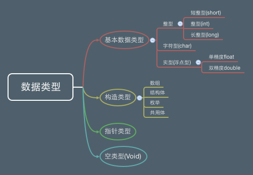

[TOC]

---

#  数据及数据类型

---

##1.【理解】什么是数据？

- 生活中时时刻刻都在跟数据打交道，比如体重数据、血压数据、股价数据等。在我们使用计算机的过程中，会接触到各种各样的数据，有文档数据、图片数据、视频数据，还有聊QQ时产生的文字数据、用迅雷下载的文件数据等。

##2.【理解】数据类型

- 数据的分类
    + 静态的数据
    + 动态的数据

- 静态的数据
    + 概念：静态数据是指一些永久性的数据，一般存储在硬盘中。硬盘的存储空间一般都比较大，现在普通计算机的硬盘都有500G左右，因此硬盘中可以存放一些比较大的文件。
    + 存储的时长：计算机关闭之后再开启，这些数据依旧还在，只要你不主动删掉或者硬盘没坏，这些数据永远都在
    + 哪些是静态数据：静态数据一般是以文件的形式存储在硬盘上，比如文档、照片、视频等。

- 动态的数据
    + 概念：动态数据指在程序运行过程中，动态产生的临时数据，一般存储在内存中。内存的存储空间一般都比较小，现在普通计算机的内存只有8G左右，因此要谨慎使用内存，不要占用太多的内存空间。
    + 存储的时长：计算机关闭之后，这些临时数据就会被清除。
    + 哪些是动态数据：当运行某个程序（软件）时，整个程序就会被加载到内存中，在程序运行过程中，会产生各种各样的临时数据，这些临时数据都是存储在内存中的。当程序停止运行或者计算机被强制关闭时，这个程序产生的所有临时数据都会被清除。
    + 你可能会问：既然硬盘的存储空间这么大，为何不把所有的应用程序加载到硬盘中去执行呢？有个主要原因是内存的访问速度比硬盘快N倍。

- 静态数据和动态数据的相互转换
    + 静态数据到动态数据（也就是从磁盘加载到内存。）
        * 

    + 动态数据和静态数据的相互转换
        * 如手机拍照片存储到手机的硬盘上

- 数据的计量单位
    + 不管是静态还是动态数据，都是0和1组成的。0和1如何组成这么多的数据？
    + 数据都有大小，静态数据就会占用硬盘的空间，动态数据就占用内存的空间
    + 数据越大，包含的0和1就越多，比特位和字节
```c
1 B(Byte字节) = 8 bit(位)
1 KB(KByte) = 1024 B
1 MB = 1024 KB
1 GB = 1024 MB
1 TB = 1024 GB
```

---

##3.【了解】C语言数据类型概述

- 作为程序员, 最关心的是内存中的动态数据, 因为我们写的程序就是 在内存中的
- 程序在运行过程中会产生各种各样的临时数据, 为了方便数据的运算和操作, C语言对这些数据进行了分类, 提供了丰富的数据类型
- C语言中有4大类数据类型:基本类型、构造类型、指针类型、空类型



+ 常见的数据类型有:int、float、double、char

+ 整型:用于准确地表示整数,根据表示范围的不同分为以下三种:
    * 短整型(short) < 整型(int) < 长整型(long)

+ 实型(浮点型):用于标识实数(小数)根据范围和精度不同分为以下两种:
    * 单精度浮点数(float) < 双精度浮点数(double)
    * 注意:float只能够保证7位数字是有效的!!!
+ 字符型:用来􏰀述单个字符,char