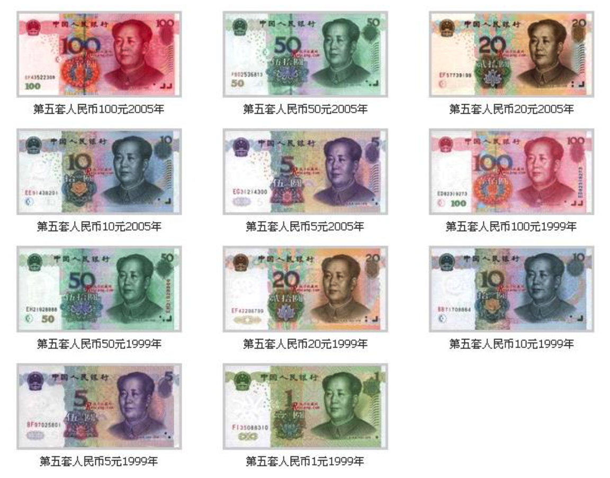

[TOC]

---

# 常量基本概念

---

##1.【理解】什么是常量?

- 常量，表示一些固定的数据，也就是不能改变的数据

---

##2.【掌握】常量分类

- 整型常量,也就是整常数。
    + 二进制
    + 十进制
    + 八进制
    + 十六进制

- 实型常量。
    + 单精度
    + 双精度

- 字符型常量。
    + 普通字符
    + 转义字符

- 字符串常量。
    + 将一个或者多个字符用双引号（""）括起来，这样构成的就是字符串常量。
    + 注意字符串常量和字符型常量是不一样的。

---

