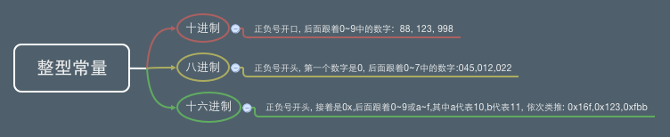
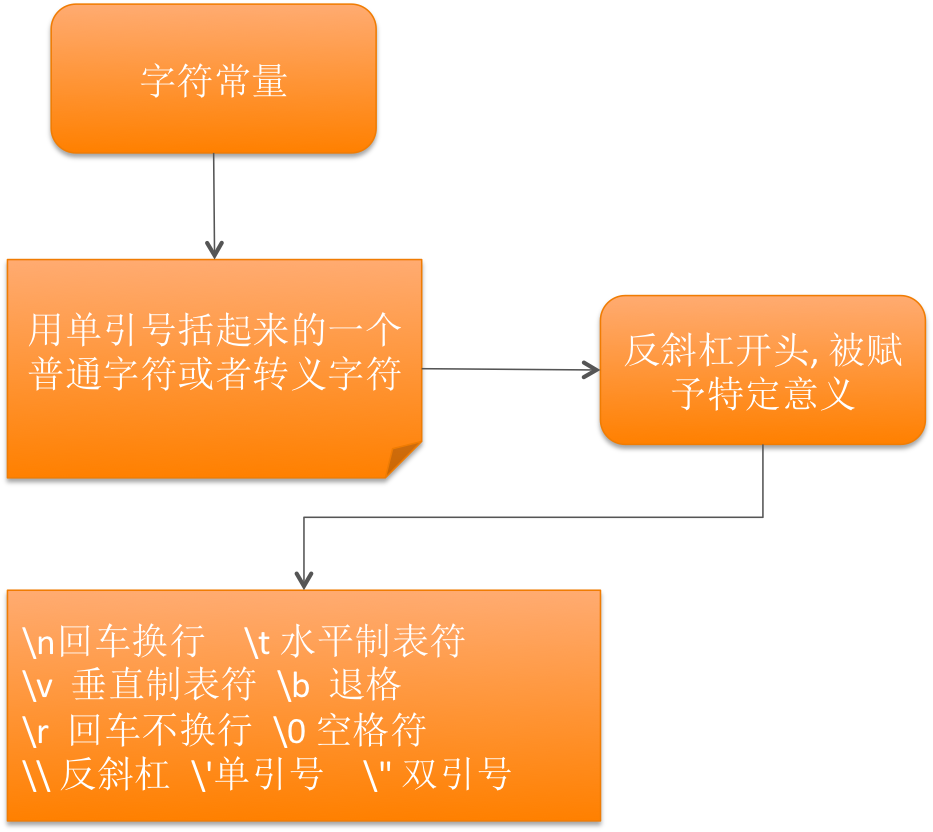
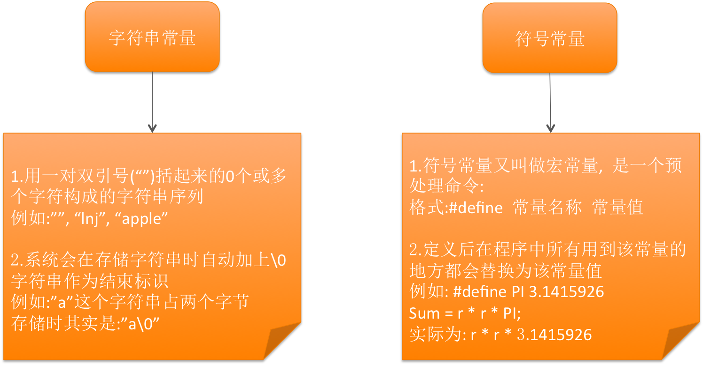

[TOC]

---

# 不同类型常量的表示方法


---

##1.【理解】整型常量

- 整型常量可以用三种样子:
    + 十进制整数。如356,-120,0。
    + 八进制整数。八进制形式的常量都以0开头,如0123,也就是十进制的83;-011,也就是十进 制的-9。
    + 十六进制整数。十六进制的常量都是以0x开头,如0x123,就是十进制的291。
    + 二进制整数。逢二进一 0b开头



---

##2.【理解】实型常量

- 实型常量又分两种:
    + 单精度小数:以f结尾
    + 双精度小数:十进制小数形式。这个我们应该很熟悉了,小学就学了的,不过注意:0.0也是实型 常量。


实型的另一种表示形式:

+ 指数形式。上过初中的都应该知道科学计数法吧,指数形式的常量就是科学计数法的另一种表 示,比如123000,用科学计数法表示为1.23×10的5次方,用C语言表示就是1.23e5或1.23E5,注意e或E的前面必须要有数字,而且e或E后面的数字一定要是整数。

---


##3.【理解】字符常量

- 字符型常量都是用''(单引号)括起来的,其表现形式可以有两种:
    + 一般形式。一个字符用''括起来,注意只能有一个字符。
    + 特殊形式。特殊形式都是以\开头,它们在屏幕上不会直接显示出来,而是根据其特定的功能来 显示的,这些特殊字符常量有:

```c
\n 换行,相当于敲一下回车。
\t 跳到下一个tab位置,相当于按一下键盘上的tab键。 \b 退格,相当于按一下backspace。
\r 回车。
\f 换页,光标移到到下页开头。
\\ 输出\字符,也就是在屏幕上显示一个\字符。
\' 输出'字符,也就是在屏幕上显示一个'字符。
\" 输出"字符,也就是在屏幕上显示一个"字符。
\ddd 1位到3位八进制数表示的字符。
例如:使用'\376',则在屏幕上显示一个黑色的方块。 \xhh 1位到2位十六进制数表示的字符。注意x不能丢了
```

---

---

##4.【理解】字符串常量

- 字符串常量与字符常量不同的地方是,字符串常量是用""把字符串括起来,所以'a'和"a"是不一 样的,而且系统会在字符串常量的末尾自动加一个字符串结束标志('\0')。
    + 
---

##5.【理解】自定义常量

- 格式: const 数据类型 常量名称 = 值
    + 例如: const int NUM = 998;

##5.【掌握】练习

- 10.6
- 19.0f
- 0.0
- ‘A’
- “男”
- “lnj”
- 294

---
