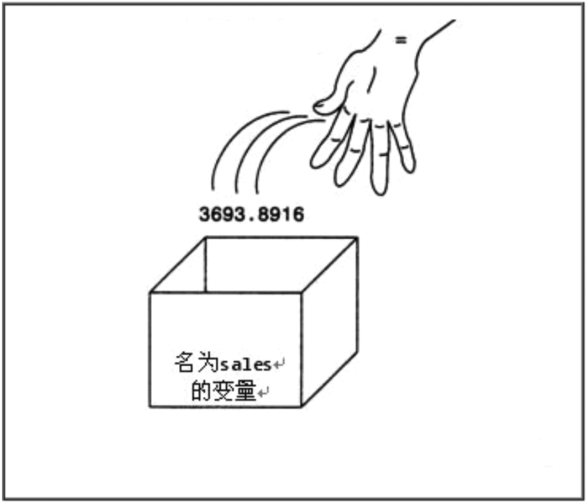

[TOC]

---

# 变量基本概念

---

##1.什么是变量?

- 表示的数据是可以经常修改的。当一个数据的值需要经常改变或者不确定时，就应该用变量来表示。
    + 例如:游戏积分

    + 例如:你去超市,放东西到储物柜的一格,他会给你一张纸条,你根据这个纸条才可以拿回自己的东西,储物柜的一格就是变量的内存空间,字条就是变量名,你拿和放就是修改变量名对应内存中的数据

    + 变量分为全局变量,局部变量。全局变量定义在函数外部,程序开始到结束都一直在,而局部变量定义在函数内部,只能供函数使用,在函数内部有效;

---

##2.如何定义变量
- 定义变量(声明), 任何变量在使用之前，必须先进行定义。

- 定义变量的目：在内存中分配一块存储空间给变量，方便以后存储数据。

- 如果定义了多个变量，就会为这多个变量分别分配不同的存储空间。

    + **格式1: 变量类型 变量名称 ;**
 ```c
    int a;
    float b;
    char ch;
 ```
+ **格式2:变量类型 变量名称,变量名称;**
+ 连续定义, 多个变量之间用逗号(,)号隔开

```c
    int a,b;
    int a,b,c,d;
```

- 不同类型的变量占用不同大小的存储空间。内存极其有限，分配适当的存储空间

---

- 变量明的命名的规范
- 变量名属于标识符,所以必须严格遵守标识符的命名原则
- 变量名要尽可能的望文知意、简洁

---
