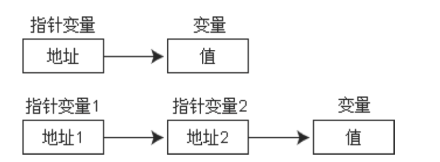
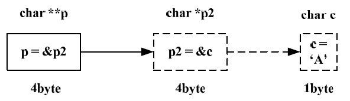

# 多级指针
##本小节知识点:
1. 【理解】二级指针介绍
2. 【理解】多级指针介绍

---

##1.二级指针介绍
- 如果一个指针变量存放的又是另一个指针变量的地址,则称这个指针变量为指向指针的指针变量。也称为“二级指针”



```c
    char c = 'a';
    char *cp;
    cp = &c;
    char **cp2;
    cp2 = &cp;
    printf("c = %c", **cp2);
```
---

##2.多级指针介绍
```c
int ***m1; 取值***m1
int *****m2 取值*****m2
```
---


