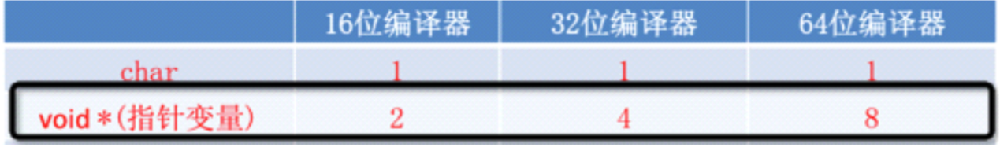

# 指针类型
##本小节知识点:
1. 【掌握】指针为什么要区分类型

##1.指针为什么要区分类型
- 在同一种编译器环境下,一个指针变量所占用的内存空间是固定的。比如,在16位编译器环境 下,任何一个指针变量都只占用8个字节,并不会随所指向变量的类型而改变。

- 虽然所有的指针都只占8个字节,但不同类型的变量却占不同的字节数。
    + 一个int占用4个字节，一个char占用1个字节，而一个double占用8字节；
    + 现在只有一个地址，我怎么才能知道要从这个地址开始向后访问多少个字节的存储空间呢，是4个，是1个，还是8个。
    + 所以指针变量需要它所指向的数据类型告诉它要访问多少个字节存储空间

---

