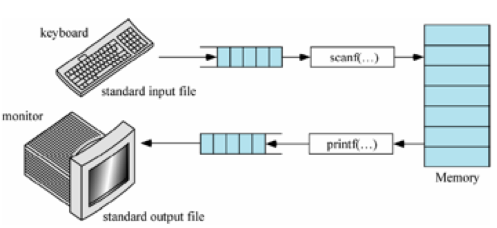
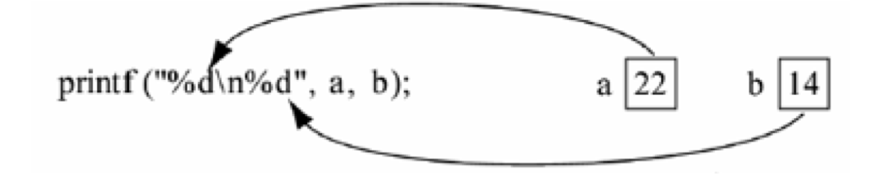

[TOC]

---

# Printf函数基本概念


---

##1.printf函数介绍

- printf函数是一个标准库函数,能够以精确的格式输出程序运算的结果。
    + printf函数的调用格式为:
    + printf("格式控制字符串",输出项列表);
    + 例如:```printf("%d,%d",a, b);```
    + 
    + 格式字符串
        * 是由格式字符(包括:转换说明符、标志、域宽、精度)和普通字符组成,转换说明符和百分号(%)一起使用,用来说明输出数据的数据类型、标志、长度和精度
    + 输出项列表
        * 可以是常量、变量和表达式,也可以没有输出项,这些输出项必须与格式控制字符串在类型和数量上完全对应,否则结果将不可预测。当有多个输出项时,各个输出项之间用逗号 ‘,’分隔

---

##2.格式控制符使用说明
- printf的格式控制的完整格式:
    + "% - 0 m.n l或h 格式字符"

- 下面对组成格式说明的各项加以说明:
    + %:表示格式说明的起始符号,不可缺少。
    + -:有-表示左对齐输出(右侧补空格),如省略表示右对齐输出(左侧补空格)。
    +  **0:有0表示指定空位填0,如省略表示指定空位不填。**
    +  m.n:m指域宽,即对应的输出项在输出设备上所占的字符数。N指精度。用于说明输出的实型 数的小数位数。对数值型的来说,未指定n时,隐含的精度为n=6位。
    +  l或h:l对整型指long型,对实型指double型。h用于将整型的格式字符修正为short型。

    + 格式字符(格式字符用以指定输出项的数据类型和输出格式)
        * d格式:用来输出十进制整数。有以下几种用法:
        * ```%d %hd %ld```
        * o格式:以无符号八进制形式输出整数
        * x格式:以无符号十六进制形式输出整数
        * u格式:以无符号十进制形式输出整数
        * c格式:输出一个字符
        * s格式:用来输出一个串。有几中用法
        * %s:例如:printf("%s","CHINA")输出"CHINA"字符串(不包括双引号)。
        * %ms:输出的字符串占m列,如字符串本身长度大于m,则突破获m的限制,将字符串全部输出。若串 长小于m,则左补空格。
        * %-ms:如果串长小于m,则在m列范围内,字符串向左靠,右补空格。
        * %m.ns:输出占m列,但只取字符串中左端n个字符。这n个字符输出在m列的右侧,左补空格,注 意:如果n未指定,默认为0。
        * %-m.ns:其中m、n含义同上,n个字符输出在m列范围的左侧,右补空格。如果n>m,则自动取n值,即保证n个字符正常输出,注意:如果n未指定,默认为0。
        	如果是sprintf(desc, "%m.ns", sour);
        	如果desc空间够的话,会在%m.ns 串 的结尾自动补null 字符,不同于strncpy。
        	例如 :sprintf(desc, "%.3s", "123456"); desc如果空间>=4字节的话,第4个字节将是null字 符。


---

##3.实型输出问题

- %f:不指定宽度,整数部分全部输出并输出6位小数。
```c
    // 默认输出6位小数
//    printf("%f", 3.1415926535f);
输出结果: 3.141593
```

- 指定保留多少位小数
```c
    // 通过%.nf方式,指定保留多少位小数
//    printf("%.2f", 3.1415926535f);
输出结果: 3.14
```

```c
逼格在哪里?
    // 指定保留多少位小数时, 可以通过*号占位, 以后赋值具体保留的小数位
//    printf("%.*f", 4,3.1415926535f);
输出结果: 3.1416
```

- 指定输出数值宽度(左端补空格)
```c
    // 通过%m方式, 指定输出数值宽度(左端补空格)
    printf("%9f", 3.1415926535f);
输出结果:  $3.141593  注意$代表空格
```


---
##4.实型精度问题
- 对于单精度数,使用%f格式符输出时,仅前7位是有效数字,小数6位.
- 对于双精度数,使用%lf格式符输出时,前15位是有效数字,小数6位

|进制|float|double|
|--|--|--|
|十进制有效位数|7位|15位|
|二进制有效位数|24位|53位|


- 有效数字的位数与指定输出的小数位数(%.7f)是两码事。
    + “有效数位为7”:是指此数据从第一个非零数字开始,误差不超过本数位半个单位的、精确可信 的数位是7位(包括小数点前的非零数位)。
    + %.7f:是指输出此数据的时候,小数点之后要显示7位数字(但是如果小数点前还有一些非零数 位,那么小数点后的这7位并不能保证都是精确可信的有效数位,)


- 一个练习引发的血案
    + 要求输出3.1415926535f所有小数

```c
    // 尝试通过指定保留位数
//    printf("%.10f", 3.1415926535f);
输出结果: 3.1415927410
    // float有效数字是7位, 多余位数则会显示垃圾数据(不准确)

    // 什么是有效位?
    printf("%.10f", 314159.26535f);
输出结果: 314159.2500000000
```
```c
    // 尝试指定宽度
//    printf("%12f", 3.1415926535f);
输出结果: $$$$3.141593 注意$代表空格
```
```c
    // 尝试指定宽度和保留位数
//    printf("%12.10f", 3.1415926535f);
输出结果: 3.1415927410
```
```c
// 要想完整输出必须使用double, 因为double类型精度小数点后6位，有效数字是15位
    double doubleValue = 3.1415926535; // 注意后面没有f
    printf("%.10lf", doubleValue);
输出结果:3.1415926535
```
---


