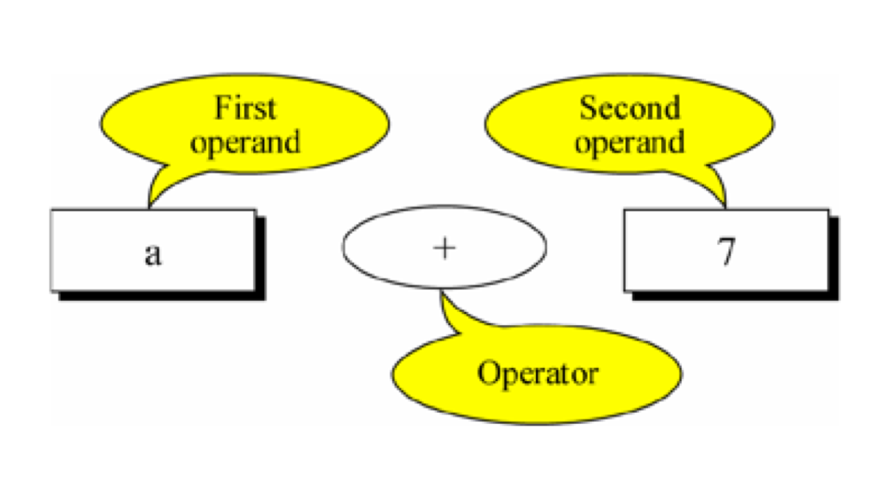

[TOC]

---

# 运算符的概念以及分类

---

## 1.【了解】运算符基本概念

- 运算符是告诉编译程序执行特定算术或逻辑操作的符号。
    + 例如告诉程序, 某两个数相加, 相减等

---

##2.【理解】运算符分类

- 按照功能划分:
    + 算术运算符
    + 关系运算符与逻辑运算符
    + 按位运算符

- 运算符根据参与运算的操作数的个数分为
    + 单目运算
        * 单目运算:只有一个操作数 如 : i++ ! sizeof
    + 双目运算
        * 双目运算:有两个操作数 如 : a+b
    + 三目运算
        * 三目预算:C语言中唯一的一个,也称为问号表达式 a>b ? 1 : 0

