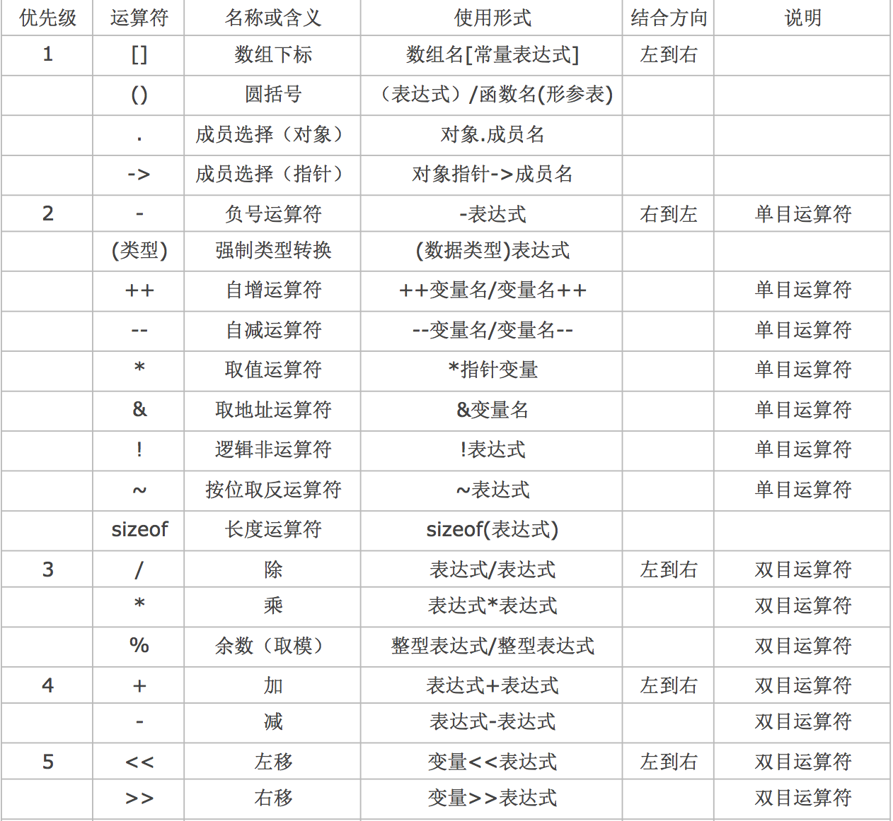
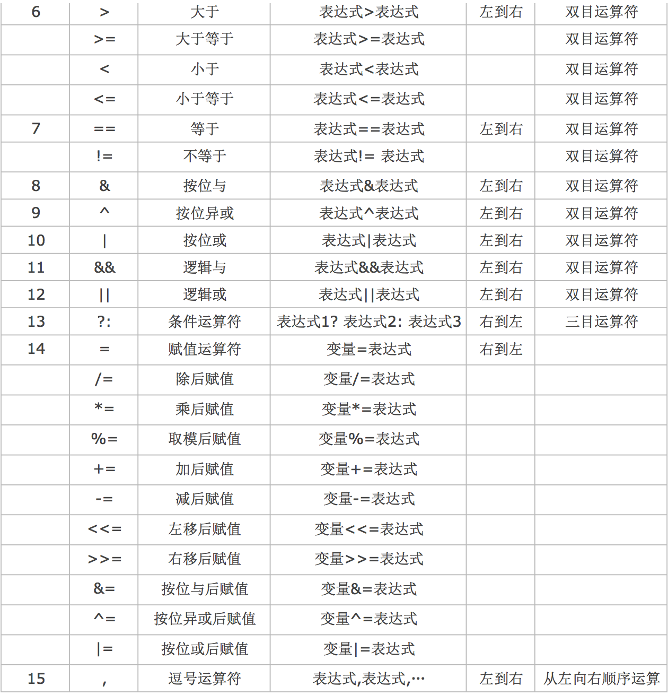

[TOC]

---

# 运算符的优先级以及结合性

---

##1.【理解】优先级

- C语言中,运算符的运算优先级共分为15 级。1 级最高,15 级最低。 在表达式中,优先级较高的先于优先级较低的进行运算。而在一个运算量两侧的运算符优先级相同时,则按运算符的 结合性所规定的结合方向处理。

 > **江哥提示:一般情况下不需要死记硬背优先级, 只需要记住()优先级最高即可**

---

##2.【理解】结合性

- C语言中各运算符的结合性分为两种,即左结合性(自左至右)和右结合性(自右至左)。
    + 算术运算符的结合性是自左至右,即先左后右。
- 例如表达式: x-y+z

	则y 应先与“-”号结合,执行 x-y 运算,然后再执行+z 的运算。这种自左至右的结合 方向就称为“左结合性”。

+ 而自右至左 的结合方向称为“右结合性”。
+ 最典型的右结合 性运算符是赋值运算符例如:如x=y=z
+ 由于“=”的 右结合性,应先执行y=z 再执行x=(y=z)运算。

---
