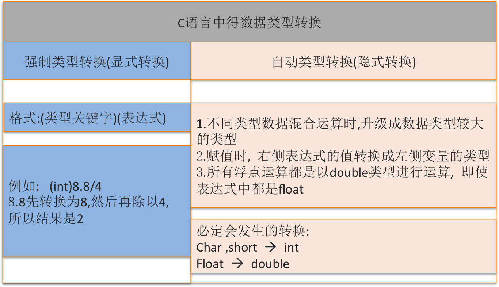

[TOC]

---

# 类型转换问题


---
##1.【掌握】类型转换问题

- 类型转换分为:
    + 隐式数据类型转换
    + 显示数据类型转换



- 自动转换(隐式转换):
- 自动转换发生在不同数据类型的量混合运算时,由编译系统自动完成。
- 自动转换遵循以下规则:
    + **相同数据类型的值才能进行运算（比如加法运算），而且运算结果依然是同一种数据类型。系统会自动对占用内存较少的类型做一个“自动类型提升”的操作**
    + 若参与运算量的类型不同,则先转换成同一类型,然后进行运算。
    + 转换按数据长度增加的方向进行,以保证精度不降低。如int型和long型运算时,先把int量转 成long型后再进行运算。
    + 所有的浮点运算都是以双精度进行的,即使仅含float单精度量运算的表达式,也要先转换成 double型,再作运算。
    + char型和short型参与运算时,必须先转换成int型。
    + 在赋值运算中,赋值号两边量的数据类型不同时,赋值号右边量的类型将转换为左边量的类型。如果右边量的数据类型长度比左边长时,将丢失一部分数据,这样会降低精度,丢失的部分 按四舍五入向前舍入。

```c
double
  ↑
 long
  ↑
unsigned
  ↑
 int
  ↑
char|short
```

```c
例如:
int i = 1;
i = i + 8.808
printf("%d", i);
输出结果: 9

按照隐式处理方式,在处理i = i + 8.808时
首先i转换为double型,然后进行相加,结果为double 型,再将double型转换为整型赋给i
```

- 强制类型转换(显示转换):
- 强制类型转换是通过类型转换运算来实现的
    + 其一般形式为:(类型说明符) (表达式)


``` c
(float) a; /* 把a转换为实型 */
(int)(x+y); /* 把x+y的结果转换为整型 */
```

```c
int i = 1;
i = i + (int)8.808
printf("%d", i);
输出结果: 9
这时直接将8.808转换成整型,然后与i相加,再把结果赋给i。

其实: 这样可把二次转换简化为一次转换。
int i = 1;
i = (int)(i + 8.808)
printf("%d", i);

或者让系统隐式转换
int i = 1;
i = i + 8.808
printf("%d", i);
```

- 强制类型转换注意点
    + 将大范围的数据赋值给小范围变量时，系统会自动做一个强制类型转换的操作，这样容易丢失精度
    + 类型说明符和表达式都必须加括号(单个变量可以不加括号),如把(int)(x+y)写成(int)x+y则成了把x转换成int型之后再与y相加了。
    + 无论是强制转换或是自动转换,都只是为了本次运算的需要而对变量的数据长度进行的临时性转换,而不改变数据说明时对该变量定义的类型。

```c
float floatValue = 10.1f;
int sum = 4 + (int)floatValue ;
printf("sum = %d", sum);// 输出14
//  floatValue本身的值并没有改变
printf("floatValue = %f", floatValue); // 输出10.100000
```


