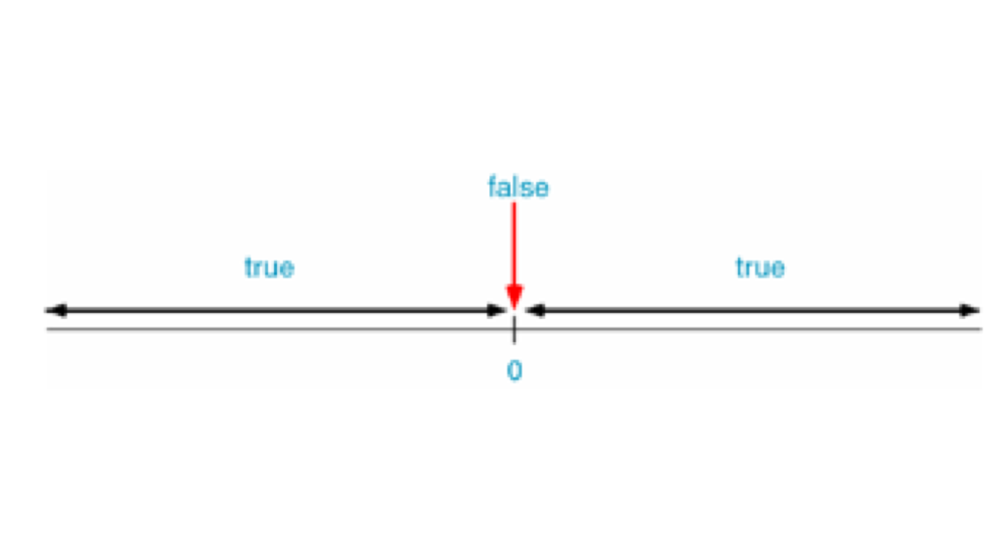

[TOC]

---

# 关系运算符


---

##1.【了解】为什么要学习关系运算符

- 默认情况下，我们在程序中写的每一句正确代码都会被执行。但很多时候，我们想在某个条件成立的情况下才执行某一段代码

- 这种情况的话可以使用条件语句来完成，但是学习条件语句之前，我们先来看一些更基础的知识：如何判断一个条件成不成立。

---

##2.【了解】C语言中的真假性

- 在C语言中，条件成立称为“真”，条件不成立称为“假”，因此，判断条件是否成立，就是判断条件的“真假”。

- 怎么判断真假呢？C语言规定，任何数值都有真假性，任何非0值都为“真”，只有0才为“假”。也就是说，108、-18、4.5、-10.5等都是“真”，0则是“假”。



---

##3.【掌握】关系运算符

- 在程序中经常需要比较两个量的大小关系,以决定程序下一步的工作。比较两个量的运算符称为关系运算符。

|序号||运算符|结合性|
|--|--|--|--|
|1|>|大于 如:a>b a>3 5>4 1>2|左结合|
|2|<|小于 如:a<c d<3 2<5|左结合|
|3|>=|大于等于 如: a>=1 d>=c|左结合|
|4|<=|小于等于 如: a<=0 i<=19|左结合|
|5|==|等于 i==3 a==b|左结合|
|6|!=|不等于 a!=b c!=5|左结合|

- 关系运算符的运算结果只有2种：如果条件成立，结果就为1，也就是“真”；如果条件不成立，结果就为0，也就是“假”。

```c
int a = 4,b=10;
int result = a>b; //0
result = a == b; //0
result = a<b; //1
result = a+b>b; //1
```
---


