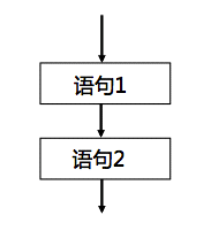
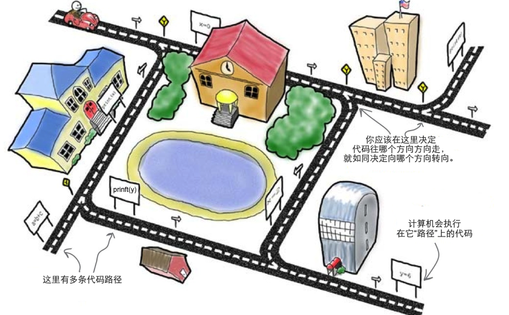
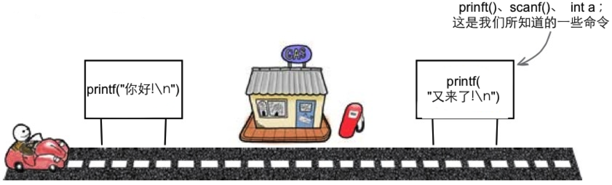
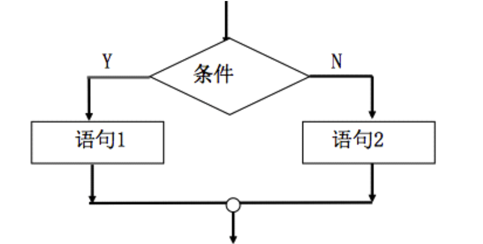
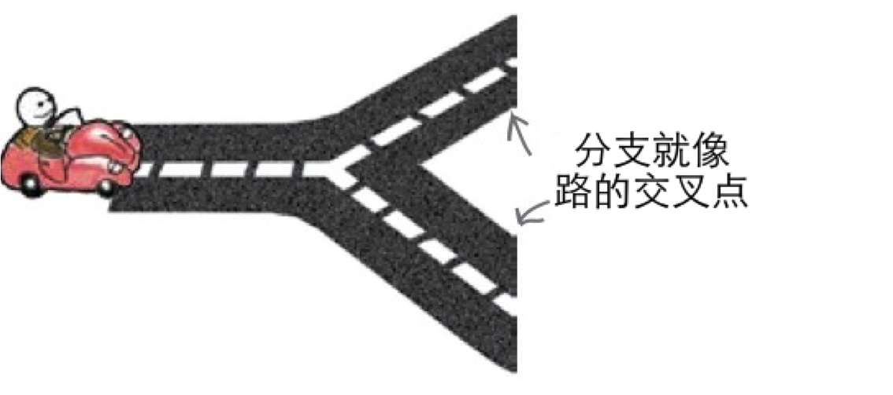

[TOC]

---

# 流程控制基本概念

---

##1.【了解】流程控制基本概念

- 默认情况下，程序的运行流程是这样的：运行程序后，系统会按书写从上至下顺序执行程序中的每一行代码,但是这并不能满足我们所有的开发需求

- 实际开发中:

- 为了方便我们控制程序的运行流程，C语言提供3种流程结构，不同的流程结构可以实现不同的运行流程。这3种流程结构分别是顺序、选择、循环三种基本控制结构构造.
-
    + 顺序结构：默认的流程结构。按照书写顺序从上至下执行每一条语句。
    +  
    +  

    + 选择结构：对给定的条件进行判断，再根据判断结果来决定执行哪一段代码。
    + 
    + 

    + 循环结构：在给定条件成立的情况下，反复执行某一段代码。
    + 
    + 

---

