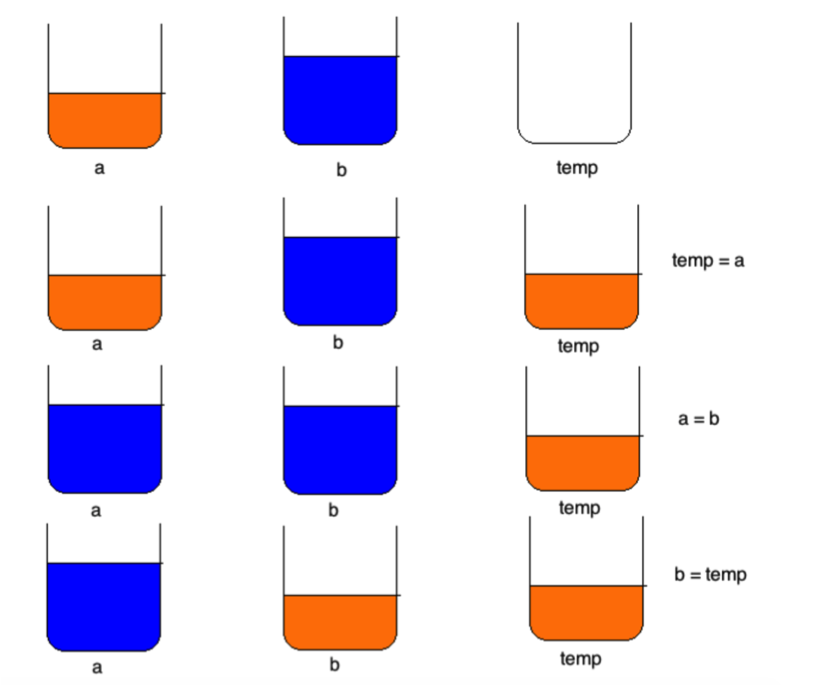

[TOC]

---

# 选择结构-if练习


---

##1.【理解】判断奇偶数

-  从键盘输入一个整数，判断其是否是偶数，如果是偶数就输出YES，否则输出NO；

```c
//    1.提示输入信息
    printf("输入一个整数\n");
//    2.接收输入信息
    int value;
    scanf("%d", &value);
//    3.判断是否能被2整除
    if (value%2 == 0) {
    //    输出偶数
        printf("yes");
    }else{
        printf("no");
    }
```
---
##2.【理解】输出对应星期

-  接收用户输入的1～7的整数，根据用户输入的整数，输出对应的星期几

```c
//    1.提示用户输入星期几
    printf("请输入星期几（1～7）\n");
//    2.接收用户输入的星期数
    int day;
    scanf("%d",&day);

//    3.输出对应的星期
     --》1.用屌丝做法 每天一个if
     --》2.用高帅富做法 if else if
    if(day == 1)
    {
        printf("星期1\n");
    }
    else if(day == 2)
    {
        printf("星期2\n");
    }
    else{
        printf("地球不属于你\n");
    }
```

---

##3.【理解】输出对应季节

- 接收用户输入的一个整数month代表月份，根据月份输出对应的季节

```c
//    1.提示用户输入月份
    printf("请输入月份（\n");
//    2.接收用户输入的星期数
    int month;
    scanf("%d",&month);
//      3.输出对应的月份
    if (month >=3 && month <=5) {
         printf("春季\n");
    }else if (month >=6 && month <=8)
    {
        printf("夏季\n");
    }else if (month >=9 && month <=11)
    {
        printf("秋季\n");
    }else if(month == 12 || month == 1 || month == 2)
    {
        printf("春季\n");
    }else
    {
        printf("地球不属于你\n");
    }

```
```c
    if(month >12 || month <1){
        printf("地球不属于你\n");
    }
    else if(month >=3 && month <=5)
    {
        printf("春季\n");
    }
    else if(month >=6 && month <=8)
    {
        printf("夏季\n");
    }
    else if(month >=9 && month <=11)
    {
        printf("秋季\n");
    }
    else
    {
        printf("冬季\n");
    }
```
---

##4.【理解】获取两个数最值

- 键盘输入两个整数，判断大小后输出较大的那个数

```c
    int num1, num2;
    printf("输入两个整数并用逗号隔开\n");
    scanf("%d,%d", &num1, &num2);

    if (num1 > num2) {
        printf("%d\n",num1);
    }else{
        printf("%d\n",num2);
    }

    printf("%d\n",num1 > num2 ? num1 : num2);
    三元运算符好处：可以简化if else代码
    弊端     ：因为是一个运算符所以运算完必要要有一个结果。  简单用三元 复杂用if(阅读性好)
```
---

##5.【理解】获取三个数最值

- 从键盘输入3个整数，判断大小后输出较大的那个数
- 方式1

```c
    int num1, num2, num3;
    printf("输入3个整数并用逗号隔开\n");
    scanf("%d,%d,%d", &num1, &num2, &num3);
    // 方式1
    int max;
    if (num1 > num2) {
        max = num1;
    }else{
        max = num2;
    }

    if (max < num3) {
        max = num3;
    }
    printf("%d\n",max);
```

- 方式2

```c
    int max1 = num1 > num2 ? num1 : num2;
    int max = max1 > num3 ? max1 : num3;
    printf("%d\n",max);
```

- 方式3

```c
    if (num1 >= num2 && num1 >= num3) {
        printf("%d\n",num1);
    }else if (num2 >= num1 && num2 >= num3) {
        printf("%d\n",num2);
    }else if (num3 >= num1 && num3 >= num2) {
        printf("%d\n",num3);
    }
```

- 方式4(先写不省略括号)

```c
   if (number1 > number2) {
        // 代表number1当前最大
        if (number1 > number3) {
            max = number1; // number1是最大
        }else
        {
            max = number3; // number3是最大
        }
    }else if (number2 > number3) // 因为if条件不满足, 所以此时此刻number2是最大的
    {
        // 代表number2当前最大
        max = number2;
    }else // 因为上面两个条件都不满足, 所以此时number3最大
    {
        max = number3;
    }
    printf("max = %i\n", max);
```
---
##6.【理解】排序

- 从键盘输入3个整数，排序后输出
- 方式1

```c
    int a, b, c;
    printf("输入3个整数并用逗号隔开\n");
    scanf("%d,%d,%d", &a, &b, &c);
    //     方式1 写出所有方式
    if (a >= b && b >=c) {
        printf("%d > %d > %d\n", a, b, c);
    }else if (a >= c && c >= b) {
        printf("%d > %d > %d\n", a, c, b);
    }else if (b >= a && a >= c) {
        printf("%d > %d > %d\n", b, a, c);
    }else if (b >= c && c >= a) {
        printf("%d > %d > %d\n", b, c, a);
    }else if (c >= a && a >= b) {
        printf("%d > %d > %d\n", c, a, b);
    }else if (c >= b && b >= a) {
        printf("%d > %d > %d\n", c, b, a);
    }
```

- 方式2

```c
    int a, b, c;
    printf("输入3个整数并用逗号隔开\n");
    scanf("%d,%d,%d", &a, &b, &c);
//    方式2（选择排序，画图讲解）
    int temp;
    if (a < b) {
        temp = a;
        a = b;
        b = temp;
    }
    if (a < c) {
        temp = a;
        a = c;
        c = temp;
    }
    if ( b < c) {
        temp = b;
        b = c;
        c = temp;
    }
    printf("%d > %d > %d\n", a, b, c);
```


---


