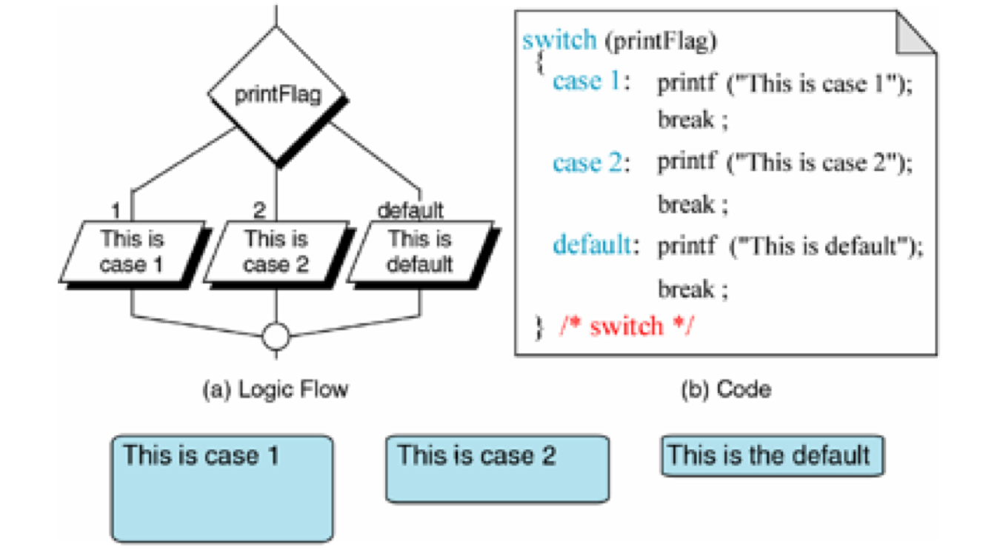
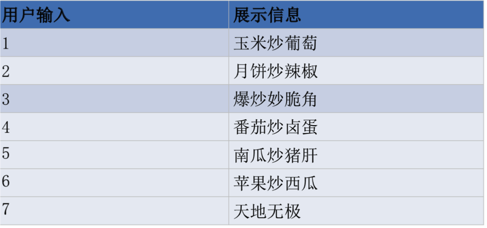

[TOC]

---

# 选择结构-Switch基本概念


---

##1.【掌握】Switch基本格式


```c
switch(表达式){
case 常量表达式1:
    语句1;
    break;
case 常量表达式2:
    语句2; ...
    break;
case 常量表达式n:
    语句n;
    break;
default:
    语句n+1;
    break;
}
```
- 其语义是:计算表达式的值。 并逐个与其后的常量表达式值相比较,当表达式的值与某个常量表 达式的值相等时, 即执行其后的语句,然后不再进行判断,继续执行后面所有case后的语句。如表达式的值与所有case后的常量表达式均不相同时,则执行default后的语句。

- 示例:接收用户输入,控制台打印菜名


 + 

```c
    int num;
    printf("输入一个1-7之间的数: ");
    scanf("%d",&num);
    switch (num){
        case 1:
            printf("玉米炒葡萄\n");
            break;
        case 2:
            printf("月饼炒辣椒\n");
            break;
        case 3:
            printf("爆炒妙脆角\n");
            break;
        case 4:
            printf("番茄炒卤蛋\n");
            break;
        case 5:
            printf("南瓜炒猪肝\n");
            break;
        case 6:
            printf("苹果炒西瓜\n");
            break;
        case 7:
            printf("天地无极\n");
            break;
        default:
            printf("error\n");
            break;
    }

```


