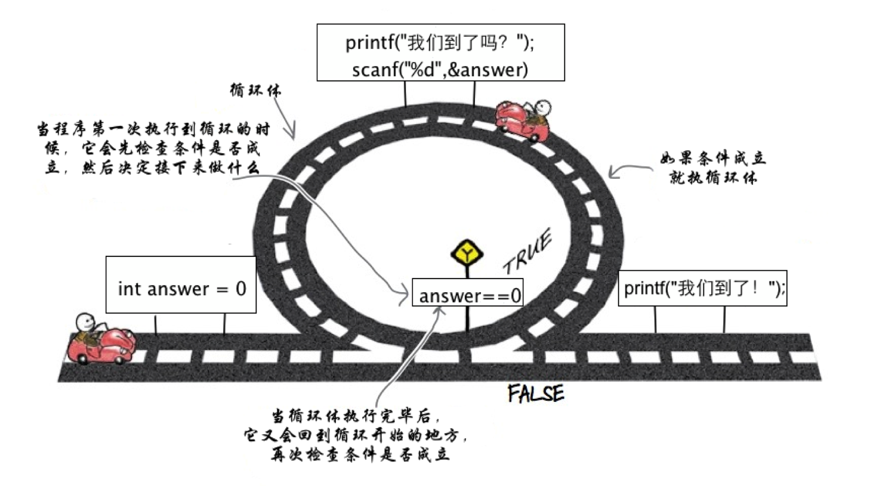
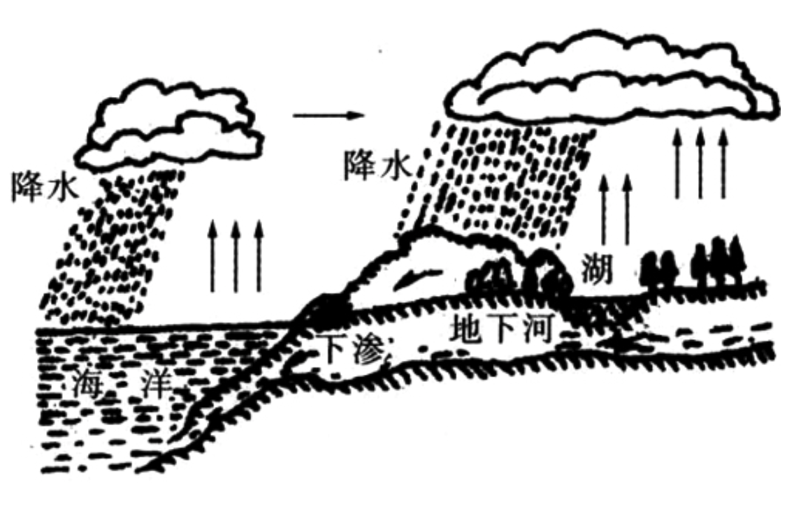
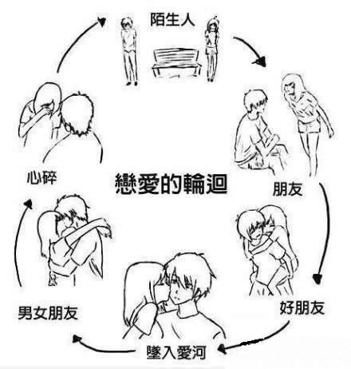
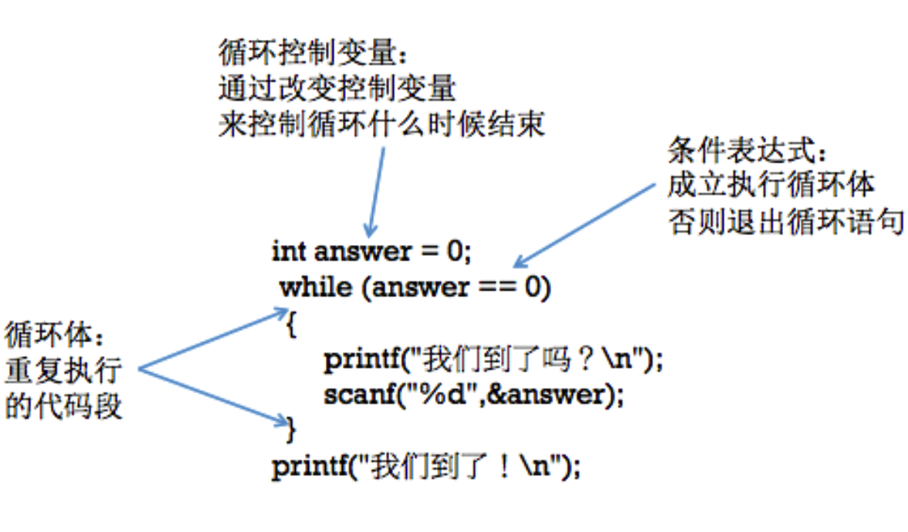

[TOC]

---

# 循环基本概念

---

##1.【了解】循环结构概述

- 循环结构是程序中一种很重要的结构。其特点是,在给定条件成立时,反复执行某程序段, 直到条件不成立为止。给定的条件称为循环条件,反复执行的程序段称为循环体。

- 循环结构简单来说就是:循环是一次又一次的执行相同的代码 块

- 显示生活中的循环
    + 
    + 

- C语言􏰀供了多种循环语句,可以组成各种不同形式的循环结构:
    + goto语句和if语句构成循环;
    + while语句;
    + do-while语句;
    + for语句;

---

##2.【理解】构成循环结构的几个条件

- 一般来说一个循环需要以下几部分构成:
    + 循环控制条件
        * 循环退出的主要依据,来控制循环到底什么时候退出
    + 循环体
        * 循环的过程中重复执行的代码段
    + 能够让循环结束的语句(递增、递减、真、假等)
        * 能够让循环条件为假的依据,否则退出循环
    + 

---

