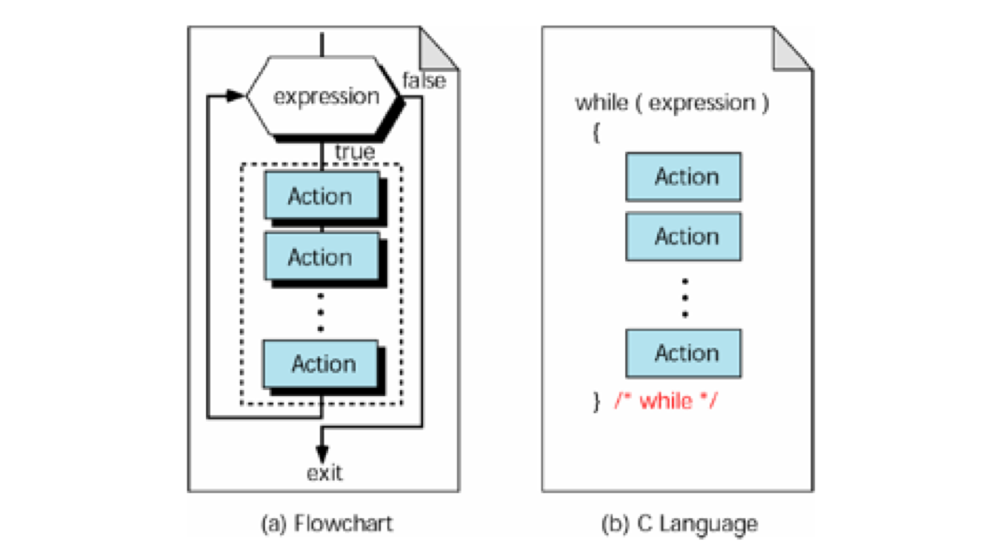

[TOC]

---

# while循环


---

##1.【掌握】while循环语法格式

```c
while ( 条件 )
 {
     语句1;
     语句2;
     ....
 }

```
---
##2.【掌握】while循环执行流程

- while语句语义:
    + 如果条件成立,就会执行循环体中的语句(“循环体”就是while后面大括号{}中的内 容)。然后再次判断条件,重复上述过程,直到条件不成立就结束while循环

- while循环特点:
    + **如果while中的条件一开始就不成立,那么循环体中的语句永远不会被执行**


---


