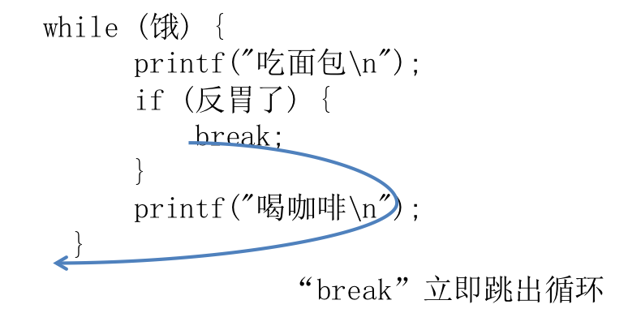

[TOC]

---

# break关键字


---

##1.【掌握】break关键字

- 使用场合：
    + switch
    + 循环结构



- 注意:
    + **break离开应用范围，存在是没有意义的。**
```c
if(1)
{
    break; // 没有意义
}
```
```c
+ **在多层循环中,一个break语句只向外跳一层**
```
```c
while(1)
{
    while(2)
    {
        break;// 只对while2有效, 不会影响while1
    }
}
```
- 在1990年，AT&T(美国电话电报公司)的电话系统的很长一段瘫痪了，造成60,000人，不能打电话也不能接电话，原因是什么呢？一个使用C语言的程序员，试图使用break来跳出if语句，但是break不是跳出if语句而是跳出整个循环；解决这个bug,让7千万次通话收到干扰，花费超过9个小时。

+ break下面不可以有语句，因为执行不到。

```c
while(2)
{
    break;
    printf("打我啊!");// 执行不到
}
```


