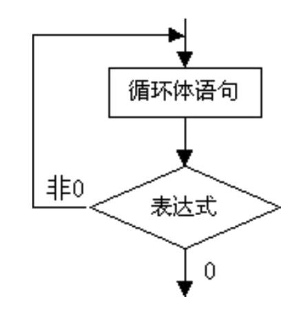

[TOC]

---

# dowhile循环基本概念


---

##1.【掌握】do-while循环语法格式

```c
 do {
     语句1;
     语句2;
     ....
 } while ( 条件 );

```
---

##2.【掌握】do-while循环执行流程

- do-while语句语义:
    + 当执行到do-while循环时，首先会执行一遍循环体中的语句（“循环体”就是do后面大括号{}中的内容）。接着判断while中的条件，如果条件成立，就执行循环体中的语句。然后再次判断条件，重复上述过程，直到条件不成立就结束while循环

- while循环特点:
    + **do-while循环的特点：不管while中的条件是否成立，循环体中的语句至少会被执行一遍**

- 使用场景
    + 口令校验

---


