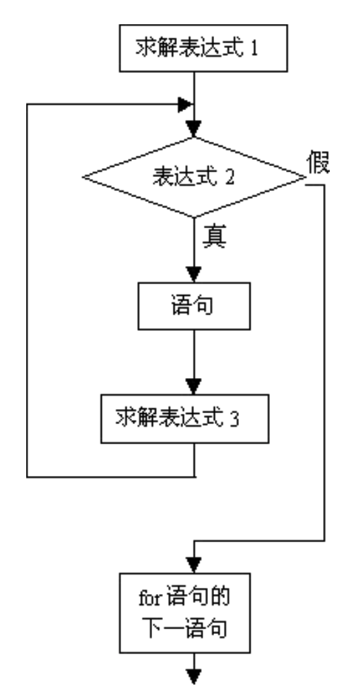

[TOC]


---

# for循环基本概念


---

##1.【掌握】for循环语法格式

- C语言中的for语句使用最为灵活,不仅可以用于循环次数已经确定的情况,而且可以用于循 环次数不确定而只给出循环结束条件的情况,它完全可以代替while语句。

```c
for(初始化表达式；循环条件表达式；循环后的操作表达式)
{
	执行语句；
}

```
---

##2.【掌握】for循环执行流程

-  for循环开始时，会先执行初始化表达式，而且在整个循环过程中只执行一次初始化表达式
- 接着判断循环条件表达式，如果条件成立，就会执行循环体中的语句（“循环体”就是for后面大括号{}中的内容）
- 循环体执行完毕后，接下来会执行循环后的操作表达式，然后再次判断条件，重复上述过程，直到条件不成立就结束for循环


---


