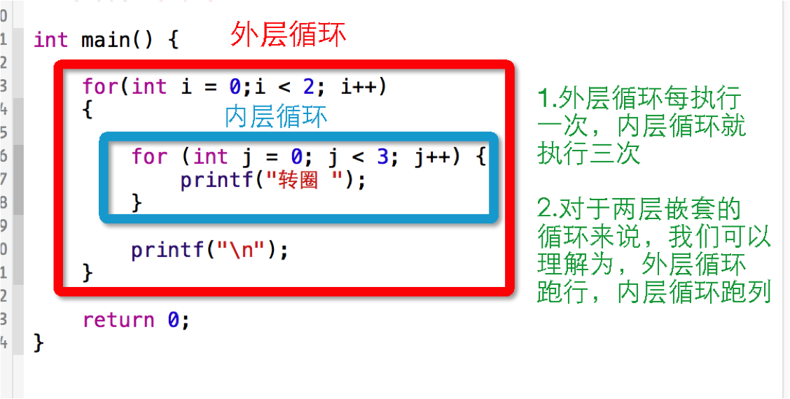

[TOC]

---

# 循环嵌套


---


##1.【掌握】for循环的嵌套
- 循环语句的循环体中存在其他的循环语句就是循环嵌套，称之为循环嵌套
    + 注意: 一般循环嵌套不超过三层
    + 外循环执行的次数 * 内循环执行的次数就是总共执行的次数


- 格式:
```c
while(条件表达式)
 {
    while((条件表达式)
     {
        语句；
        ...
     }
 }
```

```c
for (;;)
 {
     for (;;)
     {
         for (;;)
         {
             for (;;)
             {

             }

         }

     }
 }
```

```c
for (;;)
 {
     while((条件表达式)
     {
         语句；
         ...
     }
 }
```

```c
    while((条件表达式)
     {
        for (;;)
        {
            语句；
            ...
        }
    }
```

##2.【理解】打印好友列表

- 需求
```c
     好友列表1
            好友1
            好友2
     好友列表2
            好友1
            好友2
     好友列表3
            好友1
            好友2
```
- 实现
```c
    for (int i = 0; i < 4; i++) {
        printf("好友列表%d\n", i+1);
        for (int j = 0; j < 4; j++) {
            printf("    角色%d\n", j);
        }
    }
```


