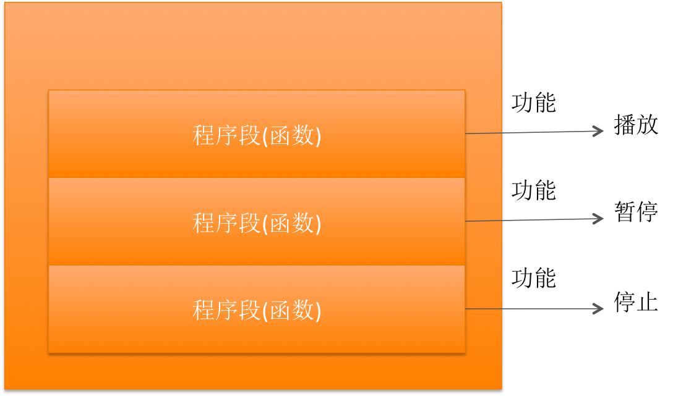

# 函数基本概念

##本小节知识点:
1. 【了解】函数的概述
2. 【了解】函数的分类

---

##1.函数的概述
- C源程序是由**函数组成**的。虽然在前面各章的程序中大都只有一个主函数main(),但实用程序 往往由多个函数组成。函数是C源程序的基本模块,通过对函数模块的调用实现特定的功能。

- C语言不仅􏰀供了极为丰富的库函数(如Turbo C,MS C都􏰀供了三百多个库函数),还允许用户建立自己定义的函数。**用户可把自己的算法编写成一个个相对独立的函数，然后再需要的时候调用它。** 可以说C程序的全部工作都是由各式各样的函数完成的,所以也把C语言称为**函数式语言**.

- 比如你用C语言编写了一个MP3播放器程序，那么它的程序结构如下图所示：

    + 你应该把实现某个功能所需的代码都写在函数中。比如有个函数的功能是播放MP3，那么播放MP3的代码都应该写到这个函数中。
    + 当调用（执行）一个函数时，计算机就会按顺序执行函数中的所有代码，从而展示函数所实现的功能。

---

##2.函数的分类
- 在C语言中可从不同的角度对函数分类
- 从函数定义的角度看,函数可分为库函数和用户定义函数两种。 stdio.h stdlib.h
    + 库函数:由C系统􏰀供,用户无须定义,也不必在程序中作类型说明,只需在程序前包含有该函数原型的头文件即可在程序中直接调用。在前面各章的例题中反复用到printf、scanf、getchar、putchar、gets、puts、strcat等函数均属此类。
    + 用户定义函数:由用户按需要写的函数。对于用户自定义函数,不仅要在程序中定义函数本身,而且在主调函数模块中还必须对该被调函数进行类型说明,然后才能使用。

- C语言的函数兼有其它语言中的函数和过程两种功能,从这个角度看,又可把函数分为有返回值函数和无返回值函数两种。
    + 有返回值函数:此类函数被调用执行完后将向调用者返回一个执行结果,称为函数返回值。如数学函数即属于此类函数。由用户定义的这种要返回函数值的函数,必须在函数定义和函数说明中明确返回值的类型。
    + 无返回值函数:此类函数用于完成某项特定的处理任务,执行完成后不向调用者返回函数值。这类函数类似于其它语言的过程。由于函数无须返回值,用户在定义此类函数时可指定它的返回 为“空类型”,空类型的说明符为“void”。

- 从主调函数和被调函数之间数据传送的角度看又可分为无参函数和有参函数两种。
    + 无参函数:函数定义、函数说明及函数调用中均不带参数。主调函数和被调函数之间不进行参数传送。此类函数通常用来完成一组指定的功能,可以返回或不返回函数值。
    + 有参函数:也称为带参函数。在函数定义及函数说明时都有参数,称为形式参数(简称为形参)。在函数调用时也必须给出参数,称为实际参数(简称为实参)。进行函数调用时,主调函数将把实参的值传送给形参,供被调函数使用。

-  C语言􏰀供了极为丰富的库函数,这些库函数又可从功能角度作以下分类。
    + 字符类型分类函数:用于对字符按ASCII码分类:字母,数字,控制字符,分隔符,大小 写字母等。
    + 转换函数:用于字符或字符串的转换;在字符量和各类数字量(整型,实型等)之间进行 转换;在大、小写之间进行转换。
    + 目录路径函数:用于文件目录和路径操作。
    + 诊断函数:用于内部错误检测。
    + 图形函数:用于屏幕管理和各种图形功能。
    + 输入输出函数:用于完成输入输出功能。
    + 接口函数:用于与DOS,BIOS和硬件的接口。
    + 字符串函数:用于字符串操作和处理。
    + 内存管理函数:用于内存管理。
    + 数学函数:用于数学函数计算。
    + 日期和时间函数:用于日期,时间转换操作。
    + 进程控制函数:用于进程管理和控制。
    + 其它函数:用于其它各种功能。
    + 以上各类函数不仅数量多,而且有的还需要硬件知识才会使用,因此要想全部掌握则需要一个较长的学习过程。应首先掌握一些最基本、最常用的函数,再逐步深入。由于课时关系,我们只介绍了很少一部分库函数,其余部分读者可根据需要查阅C语言函数手册。
    + 还应该指出的是,在C语言中,所有的函数定义,包括主函数main在内,都是平行的。也就是说,在一个函数的函数体内,不能再定义另一个函数,即不能嵌套定义。但是函数之间允许相互调用,也允许嵌套调用。习惯上把调用者称为主调函数。函数还可以自己调用自己,称为递归调用。
    + main 函数是主函数,它可以调用其它函数,而不允许被其它函数调用。因此,C程序的执行总是从main函数开始,完成对其它函数的调用后再返回到main函数,最后由main函数结束整个程 序。一个C源程序必须有,也只能有一个主函数main。

---

