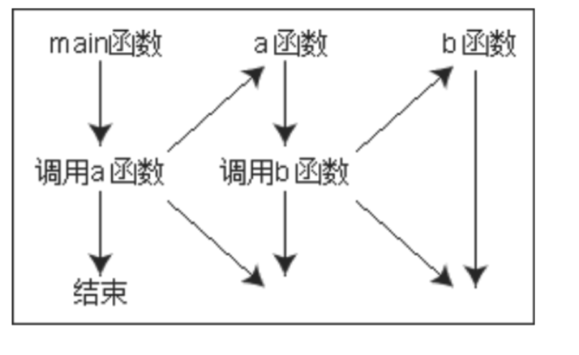

# 函数的调用
##本小节知识点:
1. 【理解】函数的调用
2. 【掌握】函数的嵌套调用

---


##1.函数的调用
- 函数调用的一般形式为
    + 函数名(实际参数表);
    + 对无参函数调用时则无实际参数表。
    + 实际参数表中的参数可以是常数,变量或其它构造类型数据及表达式。
    + 多个参数各实参之间用逗号分隔。

- 函数表达式
    + 函数作为表达式中的一项出现在表达式中,以函数返回值参与表达式的运算。这种方式要求函数 是有返回值的。

```c
int z=0;
z = max(23, 80) + 1; // 函数表达式
```

- 函数语句
    + 函数调用的一般形式加上分号即构成函数语句。

```c
printf("%d",a);
scanf("%d",&b);
```

- 函数实参
    + 函数作为另一个函数调用的实际参数出现。这种情况是把该函数的返回值作为实参进行传送,因 此要求该函数必须是有返回值的。

```c
printf("%d\n",max(20, 30));
```

-
---


##2.函数的嵌套调用
- C语言中不允许作嵌套的函数定义。因此各函数之间是平行的,不存在上一级函数和下一级函数的问题。但是C语言允许在一个函数的定义中出现对另一个函数的调用。这样就出现了函数的嵌套调用。即在被调函数中又调用其它函数。这与其它语言的子程序嵌套的情形是类似的。其关系可表



---


