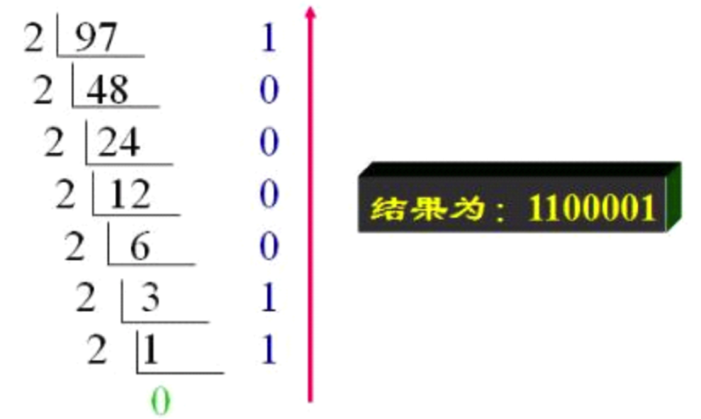
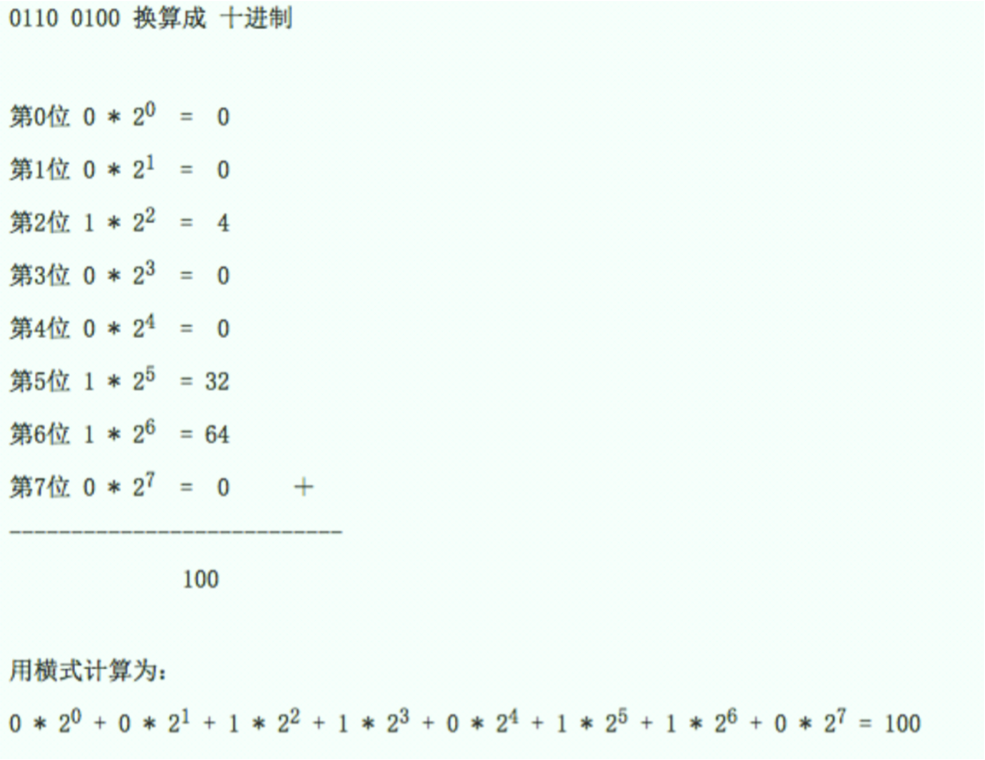
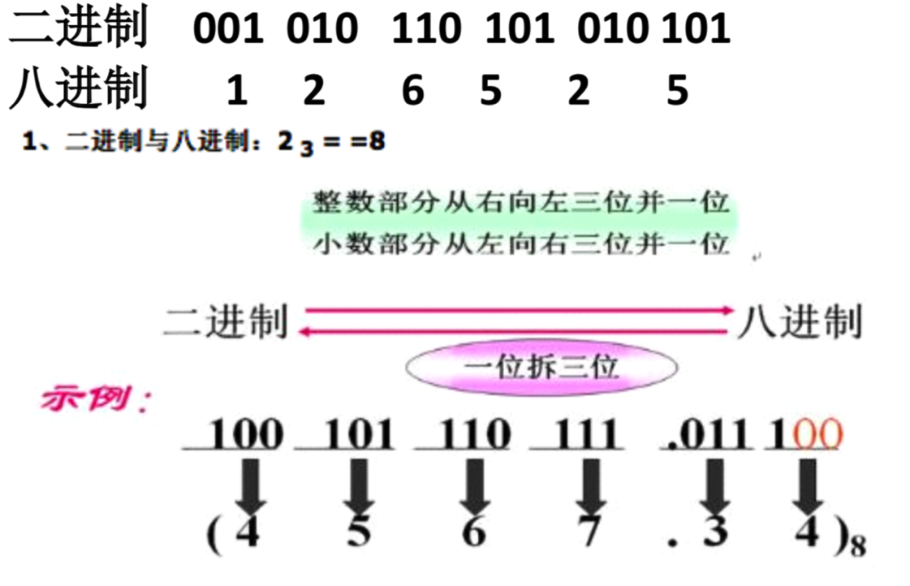
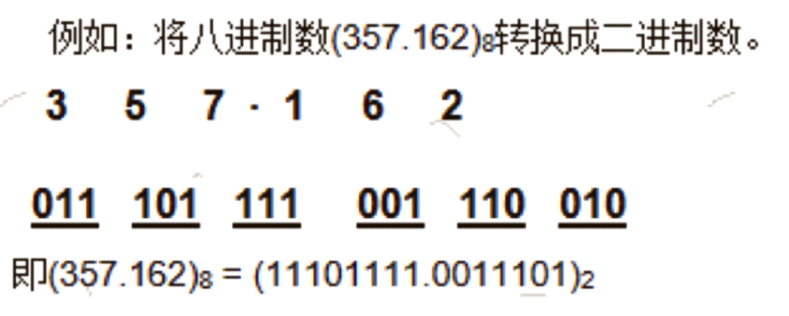
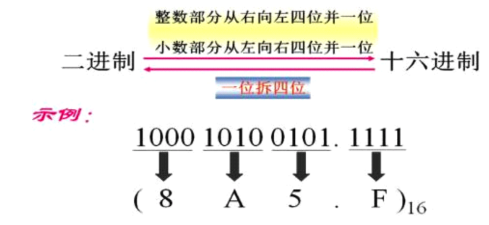

# 进制转换
##本小节知识点:
1. 【掌握】10 进制转 2 进制
2. 【掌握】2 进制转 10 进制
3. 【掌握】2 进制转 8 进制
4. 【掌握】8 进制转 2 进制
5. 【掌握】2 进制转 16 进制
6. 【掌握】16 进制转 2 进制

---

##1.10 进制转 2 进制
- 方法:
    + 除2取余, 余数倒序得到的序列就是二进制表示形式

- 例如:将十进制(97) 10转换为二进制数


---

##2.2 进制转 10 进制
- 方法:
    + 每一位二进制进制位的值 * 2的(当前二进制进制位索引)
    >+ 索引从0开始, 从右至左
    
    + 将所有位求出的值相加



```c
例如: 二进制11转换为10进制
0b1011 = 1 * 2^0 + 1 * 2^1 + 0 * 2^2 + 1 * 2^3
       = 1 * 1 + 1 * 2 + 0 * 4 + 1 * 8
       = 1 + 2 + 0 + 8
       = 11

```
---

##3.2 进制转 8 进制
- 三个二进制位代表一个八进制位, 因为3个二进制位的最大值是7，而八进制是逢八进一


```c
0b11110011 = 0b 011 110 011
           = 0363

```
---

##4.8 进制转 2 进制
- 方法:
    + 每一位八进制位的值 * 8的(当前二进制进制位索引)
    >+ 索引从0开始, 从右至左
    
    + 将所有位求出的值相加


```c
027 = 7 * 8^0 + 2 * 8^1
    = 7 * 1 + 2 * 8
    = 23

```
---

##3.2 进制转 16 进制
- 四个二进制位代表一个十六进制位，因为4个二进制位的最大值是15，而十六进制是逢十六进一



```c
例如: 二进制243转换为16进制
0b11110011 = 0b 1111 0011
           = 0xF3

```
---

##4.16 进制转 2 进制
- 将16进制的每一位拆成4为二进制位

```c
例如:
0x25 =0b 0010 0101
     =0b100101

```
---


