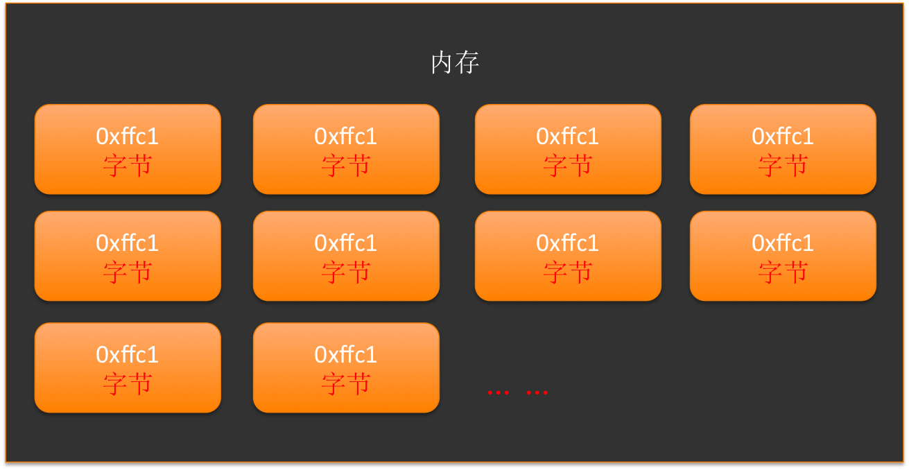
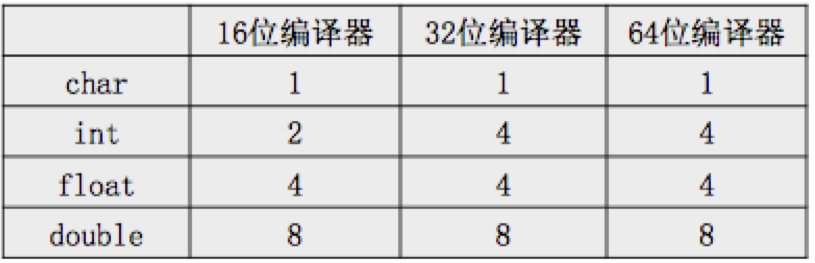
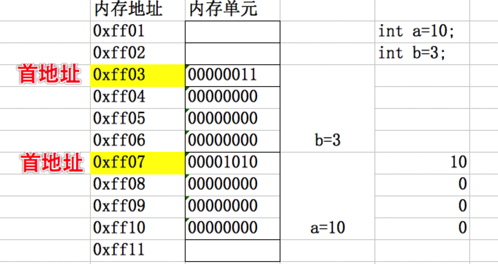

# 变量内存分析
##本小节知识点:
1. 【掌握】字节和地址
2. 【掌握】变量的存储
3. 【掌握】变量的存储规则

##1.字节和地址
- 为了更好地理解变量在内存中的存储细节，先来认识一下内存中的“字节”和“地址”。
    + 内存以“字节为单位”

    + 里面的每个小框框就代表着内存中的一个字节，白色数字就是每个字节的地址。可以发现，内存中相邻字节的地址是连续的
    + 一个字节只有8位，所能表示的数据范围是非常有限的，因此，范围较大的数据就要占用多个字节，也就是说，不同类型的数据所占用的字节数是不一样的


##2.变量的存储
- 一个变量所占用的存储空间，不仅跟变量类型有关，而且还跟编译器环境有关系。同一种类型的变量，在不同编译器环境下所占用的存储空间又是不一样的

- 下面的表格描述了在不同编译器环境下的存储空间占用情况

- 变量存储单元的第一个字节的地址就是该变量的地址
- 任何变量在内存中都是以二进制的形式存储。一个负数的二进制形式，其实就是对它的正数的二进制形式进行取反后再+1。（取反的意思就是0变1、1变0）

---

##3. 变量在内存中存储的原则
- %p 输出一个地址

```c
    int a = 10;
    int b = 20;
    printf("a = %p\n", &a);
    printf("b = %p\n", &b);
输出结果:
a = 0x7fff5fbff78c
b = 0x7fff5fbff788
```
- 先分配字节地址大内存,然后分配字节地址小的内存(内存寻址是由大到小)
    +  因为内存寻址是由大到小，所以先定义的变量的内存地址会比后定义的大
    +  number1地址 > number2
- 变量的首地址,是变量所占存储空间字节地址最小的那个地址


- 低位保存在低地址字节上,高位保存在高地址字节上

```c
10的二进制: 0b00000000 00000000 00000000 00001010
            高字节←                       →低字节
```
---


