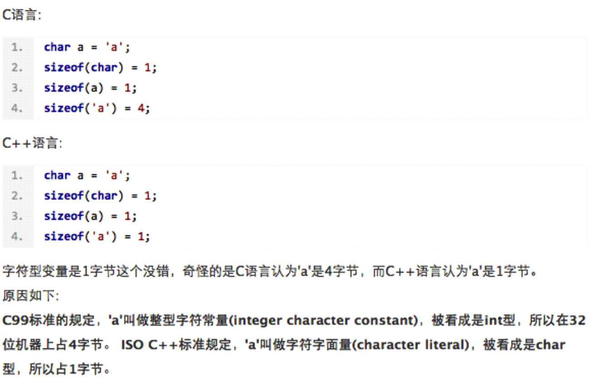

# char类型
##本小节知识点:
1. 【理解】char类型基本概念
2. 【掌握】char型数据存储原理
3. 【掌握】char型使用注意事项
4. 【掌握】练习
---


##1.char类型基本概念
- char是C语言中比较灵活的一种数据类型，称为“字符型”。它是用来存储字符的，因此可以将一个字符常量赋值给一个字符型变量

- 1个字符型变量占用1个字节，共8位，因此取值范围是-2^7~2^7-1。在这个范围内，你完全可以将字符型变量当做整型变量来使用

- 在某些字符前面加上”\”形成的字符，称为“转义字符”，比如\n、\t、\0


---

##2.char型数据存储原理


- char a='a' ----->取出'a'的ASCII码值,97,然后转换2进制,存储在一个字节中
---

##3.char型使用注意事项
- 当把一个字符赋值给一个char类型变量,那么系统首先查这个字符所对应的ASCII码,然后把这个ASCII值放到变量中

```c
char c = 'a';
printf("%d\n",c);
输出结果: 97
```

- 根据变量中存储的ASCII值,去查ASCII表中对应字符,然后把这个字符打印控制台上,整形和 字符型可以互相转换。

```c
int c = 97;
printf("%c\n",c);
输出结果:a
```

- 字符型变量不能用来存储汉字
    + char c = '我'; char字节,一个中文字符占3字节(unicode表),所有char不可以存储中文

- 不支持多个字符,多个字符是字符串

```c
char c = 'ac'; // 错误写法
printf("%c\n",c);
```
---

##4.练习
- 输入一个小写字母,要求转换成大写输出
- 分析

```c
a ....z 对应ASCII表中的值97...122
A 65 a 97 差了32
```

- 实现

```c
char toLower(char c){
    char ch;
    if (c>='a'&&c<='z') {
        ch= c-32;
    }
    return ch;
}
```


