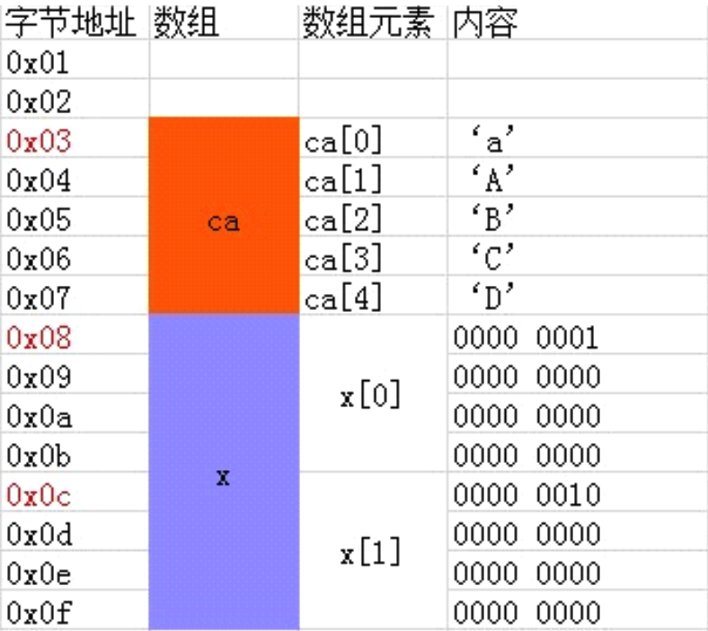
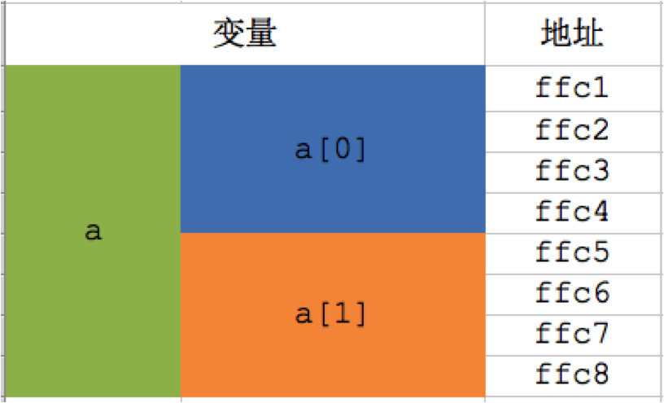
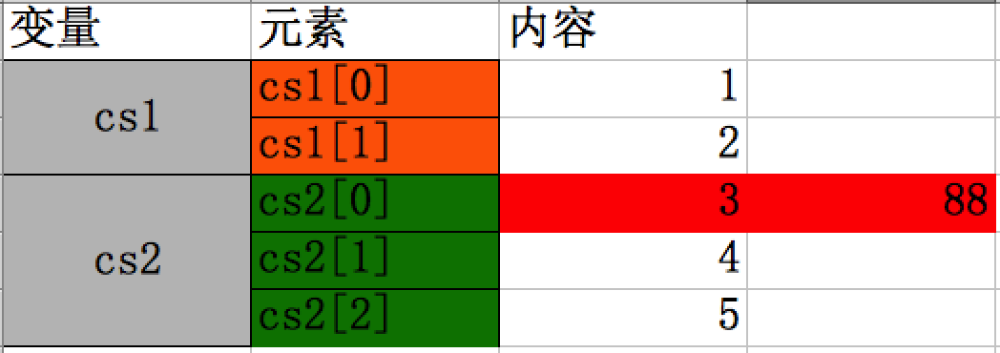

# 数组的内存分配
##本小节知识点:
1. 【掌握】数组内部存储细节
2. 【理解】数组的地址
3. 【理解】数组的越界问题

---

##1.数组内部存储细节
- 存储方式:
    + 1)计算机会给数组分配一块连续的存储空间
    + 2)数组名代表数组的首地址,从首地址位置,依次存入数组的第1个、第2个....、第n个元素
    + 3)每个元素占用相同的字节数(取决于数组类型)
    + 4)并且数组中元素之间的地址是连续。

- 示例
```c
模拟该数组的内存存储细节如下: int x[2]={1,2};
int ca[5]={'a','A','B','C','D'};
```

   
---

> 
>
> + 注意:字符在内存中是以对应ASCII值的二进制形式存储的,而非上表的形式。 在这个例子中,数组x的地址为它的首元素的地址0x08,数组ca的地址为0x03。


##2.数组的地址
- 在内存中,内存从大到小进行寻址,为数组分配了存储空间后,数组的元素自然的从上往下排列 存储,整个数组的地址为首元素的地址。

    + 数组a的地址是ffc1，a[0]的地址是ffc1，a[1]的地址是ffc5
    + 因此a == &a[0]，即第一个元素的地址就是整个数组的地址

---

##3.数组的越界问题
- 数组越界导致的问题
    + 约错对象
    + 程序崩溃

```c
    char cs1[2] = {1, 2};
    char cs2[3] = {3, 4, 5};
    cs2[3] = 88; // 注意:这句访问到了不属于cs1的内存
    printf("cs1[0] = %d\n", cs1[0] );
输出结果: 88
```


---


