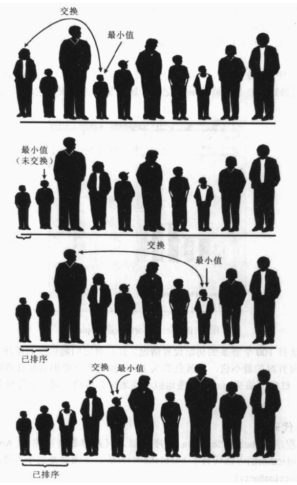
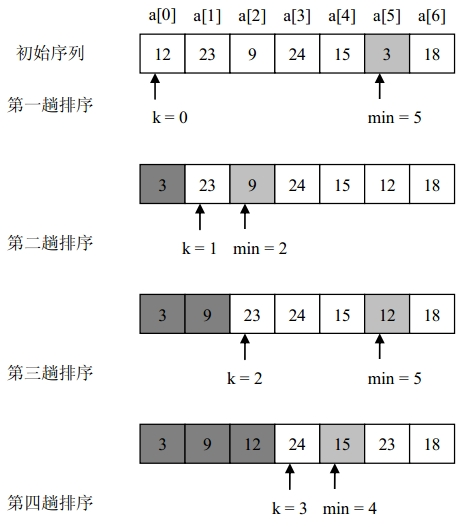
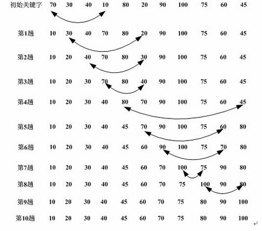

# 选择排序
##本小节知识点:
1. 【了解】选择排序
2. 【掌握】选择排序的基本思想
3. 【了解】练习

---

##1.选择排序
- 选择排序(Selection sort)是一种简单直观的排序算法。它的工作原理如下。首先在未排序序列中找到最小元素,存放到排序序列的起始位置,然后,再从剩余未排序元素中继续寻找最小元 素,然后放到排序序列末尾。以此类推,直到所有元素均排序完毕。

---

##2.选择排序的基本思想
- 第一趟排序在所有待排序的n个记录中选出关键字最小的记录,将它与数据表中的第一个记录交换位置,使关键字最小的记录处于数据表的最前端;第二趟在剩下的n-1个记录中再选出关键字最 小的记录,将其与数据表中的第二个记录交换位置,使关键字次小的记录处于数据表的第二个位置;重复这样的操作,依次选出数据表中关键字第三小、第四小...的元素,将它们分别换到数据表的第三、第四...个位置上。排序共进行n-1趟,最终可实现数据表的升序排列。

- 示例

---

##3.练习
- 输入一组无序数据,使用选择排序法进行排序,并输出。

---

