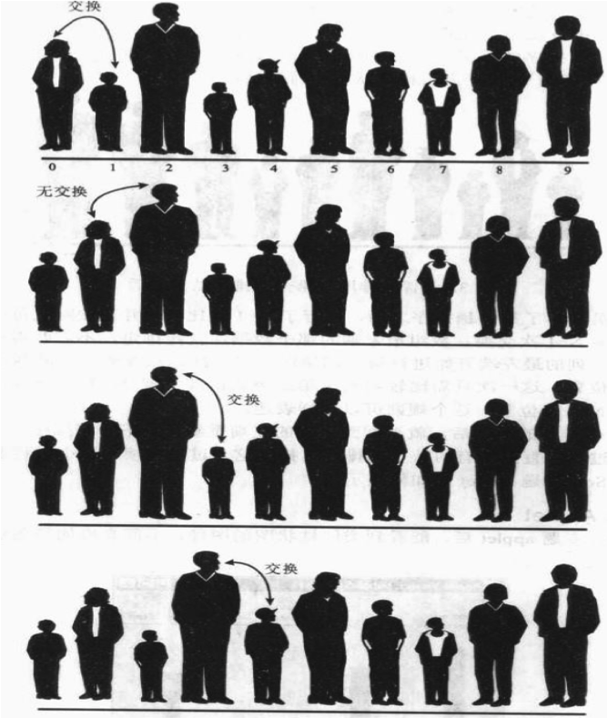

# 冒泡排序
##本小节知识点:
1. 【了解】冒泡排序
2. 【掌握】冒泡排序的步骤
3. 【了解】练习

---

##1.冒泡排序
- 冒泡排序(Bubble Sort,台湾译为:泡沫排序或气泡排序)是一种简单的排序算法。它重复 地走访过要排序的数列,一次比较两个元素,如果他们的顺序错误就把他们交换过来。走访数列的工作是重复地进行直到没有再需要交换,也就是说该数列已经排序完成。这个算法的名字由来 是因为越小的元素会经由交换慢慢“浮”到数列的顶端。

- 冒泡排序 分为: 大数下沉 小数上浮
---

##2.冒泡排序
- 1)比较相邻的元素。如果第一个比第二个大,就交换他们两个。
- 2)对每一对相邻元素作同样的工作,从开始第一对到结尾的最后一对。在这一点,最后的元素应 该会是最大的数。
- 3)针对所有的元素重复以上的步骤,除了最后一个。
- 4)持续每次对越来越少的元素重复上面的步骤,直到没有任何一对数字需要比较。

- 示例:

---

##3.练习
- 输入一组无序数据,使用冒泡排序法进行排序,并输出。

