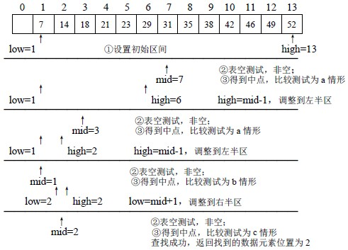

# 折半查找
##本小节知识点:
1. 【掌握】基本思路
2. 【掌握】实现步骤
3. 【了解】练习

---

##1.基本思路
- 在有序表中,取中间元素作为比较对象,若给定值与中间元素的要查找的数相等,则查找成功;
若给定值小于中间元素的要查找的数,则在中间元素的左半区继续查找;

- 若给定值大于中间元素的要查找的数,则在中间元素的右半区继续查找。不断重复上述查找过 程,直到查找成功,或所查找的区域无数据元素,查找失败。
---

##2.实现步骤
- 在有序表中,取中间元素作为比较对象,若给定值与中间元素的要查找的数相等,则查找成功;
- 若给定值小于中间元素的要查找的数,则在中间元素的左半区继续查找;
- 若给定值大于中间元素的要查找的数,则在中间元素的右半区继续查找。不断重复上述查找过 程,直到查找成功,或所查找的区域无数据元素,查找失败。

- 示例:

---

##3.练习
- 输入一组有序数据,使用折半查找法查找一个数据,并输出其位 置。