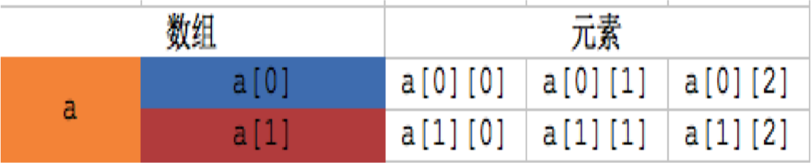
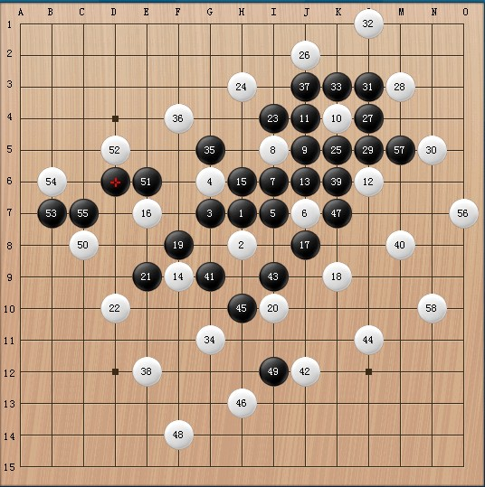
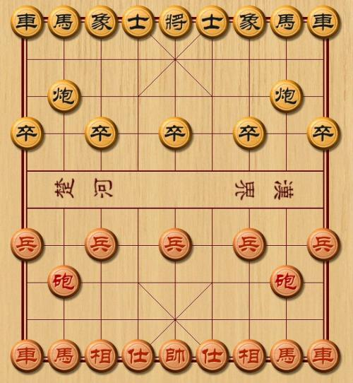

# 二维数组基本概念
##本小节知识点:
1. 【了解】二维数组的基本概念
2. 【掌握】二维数组的定义
3. 【掌握】二维数组的初始化
4. 【了解】二维数组的应用

---

##1.二维数组的基本概念
- 所谓多维数组就是一个一维数组的每个元素又被声明为一 维数组,从而构成二维数组. 可以说二维数组是特殊的一维数组。

- 示例
    + int a[2][3]
    + 可以看作由一维数组a[0]和一维数组a[1]组成，这两个一维数组都包含了3个int类型的元素

---

##2.二维数组的定义
- 格式:
    + 数据类型 数组名[一维数组的个数][一维数组的元素个数]
        *  数据类型 数组名[行数][列数]
    + 其中"一维数组的个数"表示当前二维数组中包含多少个一维数组
    + 其中"一维数组的元素个数"表示当前前二维数组中每个一维数组元素的个数

---

##3.二维数组的初始化
- 二维数的初始化可分为两种:
    + 定义的同时初始化
        * 按行分段赋值
        * 按行连续赋值
    + 先定义后初始化

- 定义的同时初始化
```c
int a[2][3]={ {80,75,92}, {61,65,71}};
```
- 先定义后初始化
```c
int a[2][3];
a[0][0] = 80;
a[0][1] = 75;
a[0][2] = 92;
a[1][0] = 61;
a[1][1] = 65;
a[1][2] = 71;
```
- 按行分段赋值
```c
int a[2][3]={ {80,75,92}, {61,65,71}};
```
- 按行连续赋值
```c
int a[2][3]={ 80,75,92,61,65,71};
```

- 其它写法
    + 完全初始化,可以省略第一维的长度
```c
int a[][3]={{1,2,3},{4,5,6}};
int a[][3]={1,2,3,4,5,6};
```
+ 部分初始化,可以省略第一维的长度
    * 为初始化的部分默认为0


```c
int a[][3]={{1},{4,5}};
int a[][3]={1,2,3,4};
```
> + 注意: 有些人可能想不明白，为什么可以省略行数，但不可以省略列数。也有人可能会问，可不可以只指定行数，但是省略列数？

其实这个问题很简单，如果我们这样写：
int a[2][] = {1, 2, 3, 4, 5, 6}; // 错误写法
大家都知道，二维数组会先存放第1行的元素，由于不确定列数，也就是不确定第1行要存放多少个元素，所以这里会产生很多种情况，可能1、2是属于第1行的，也可能1、2、3、4是第一行的，甚至1、2、3、4、5、6全部都是属于第1行的

+ 指定元素的初始化
    * 未初始化的部分默认为0

```c
int a[2][3]={[1][2]=10};
int a[2][3]={[1]={1,2,3}}
```
---

##3.二维数组的应用
- 生活中的应用


- 游戏中的应用







