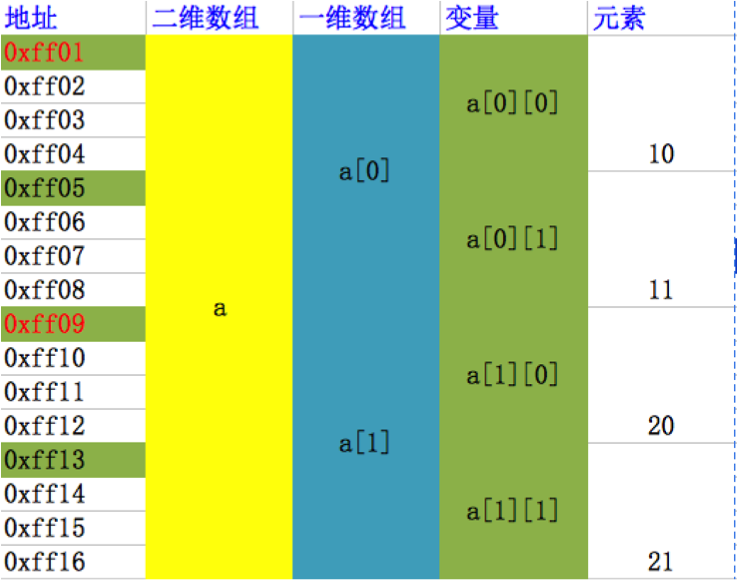
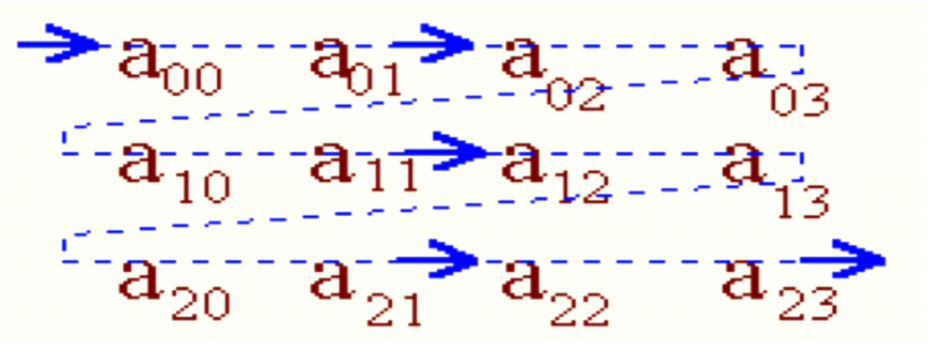

# 二维数组的遍历和存储
##本小节知识点:
1. 【掌握】二维数组的遍历
2. 【掌握】二维数组的存储

---


##1.二维数组的遍历
- 二维数组a[3][4],可分解为三个一维数组,其数组名分别为:
```c
a[0]
a[1]
a[2]
```
+ 这三个一维数组都有4个元素,例如:一维数组a[0]的 元素为a[0][0],a[0][1],a[0][2],a[0][3]。必须强调的是,a[0],a[1],a[2]不能当作下标变量使用,它们是数组名,不是一个单纯的下标变量
+ 所以遍历二维数组无非就是先取出二维数组中得一维数组, 然后再从一维数组中取出每个元素的值

- 示例
```c
    char cs[2][3] = {
        {'a', 'b', 'c'},
        {'d', 'e', 'f'}
    };
    printf("%c", cs[0][0]);// 第一个[0]取出一维数组, 第二个[0]取出一维数组中对应的元素
```
```c
    char cs[2][3] = {
        {'a', 'b', 'c'},
        {'d', 'e', 'f'}
    };
    for (int i = 0; i < 2; i++) { // 外循环取出一维数组
        // i
        for (int j = 0; j < 3; j++) {// 内循环取出一维数组的每个元素
            printf("%c", cs[i][j]);
        }
        printf("\n");
    }
```
---

##2.二维数组的存储
- 存储方式:
    + 1)计算机会给二维数组分配一块连续的存储空间
    + 2)数组名代表数组的首地址,从首地址位置,依次存入第1行、第2行、.....
    + 3)每一行存储方式,从行首地址还是,依次存储行的第1个元素、第2个元素、第3个元素......
    + 4)每个元素占用相同的字节数(取决于数组类型)
    + 5)并且数组中元素之间的地址是连续。




- 二维数组的存放顺序是按行存放的，先存放第一行的元素，再存放第2行的元素。


---
