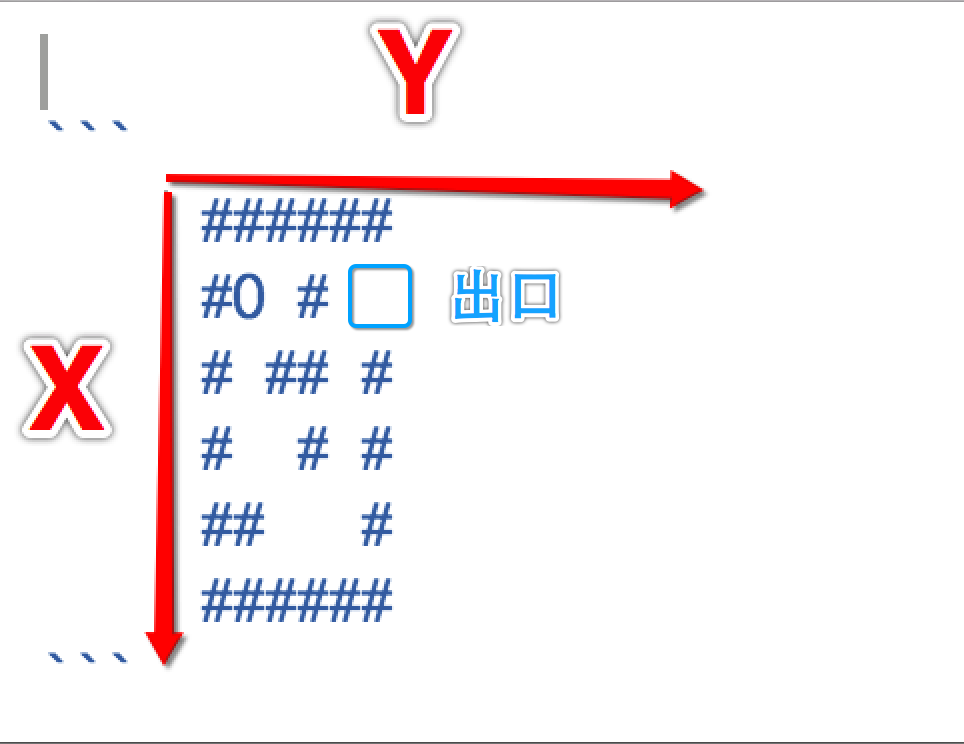

# 《迷宫》游戏玩法及实现思路
##本小节知识点:
1. 【了解】定义二维数组存放地图
2. 【了解】编写程序控制方向
3. 【了解】移动小人
4. 【了解】判断是否走出迷宫


游戏说明:玩家通过键盘录入 w,s,a,d控制小人向不同方向移动,其中w代表向上移动,s代表向 下移动,a代表向左移动,d 代表向右移动,当小人移动到出口位置,玩家胜利
---

##1.定义二维数组存放地图
- 说明: # 代表 墙 O代表小人 ‘ ’ 代表路
-


```c
     ######
     #O #
     # ## #
     #  # #
     ##   #
     ######
```
- 规定地图的方向


---


##2.编写程序控制方向
- 当输入w或者W, 小人向上移动
    + x-1
- 当输入s 或者S, 小人向下
    + x+1
- 当输入a或者A, 小人向左
    + y-1
- 当输入d或者D, 小人向右
    + y+1
---

##3.移动小人
- 用变量记录小人当前的位置
    + 1)如果小人将要移动的位置是墙,则无法移动
    + 2)如果小人将要移动的位置是路,则可以移动

- 移动的核心思想:
    + 让小人‘0’和路 ‘ ’ 交换位置
    >+ 注意小人的位置要重新调整

---

##4.判断是否走出迷宫

- 如果小人所在的位置的 Y==5


---


