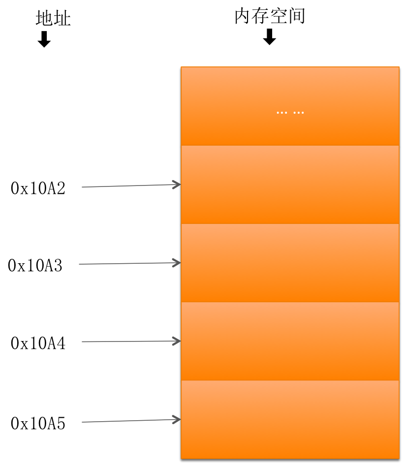

# 指针基本概念

##本小节知识点:
1. 【理解】什么是地址
2. 【理解】什么是指针

---
##1.什么是地址
- 生活中的地址:


- 内存地址:

- 地址与内存单元中的数据是两个完全不同的概念
    + 地址如同房间编号
    + 内存单元如同房间
    + 内存单元中存放着数据

- 变量地址:
    + 系统分配给"变量"的"内存单元"的起始地址
```c
如:
char c = 'a'; // 占用1个字节
那么变量c的地址为:0x10A5

int n = 250; // 占用4个字节
那么变量c的地址为:0x10A1
```
##2.什么是指针
- 在计算机中所有数据都存储在内存单元中,而每个内存单元都有一个对应的地址, 只要通过这个地址就能找到对应单元中存储的数据. 由于通过地址能找到所需的变量单元，可以说，地址指向该变量单元。因此，将地址形象化的称为“指针”

- 内存单元的指针(地址)和内存单元的内容是两个不同的概念。


---


