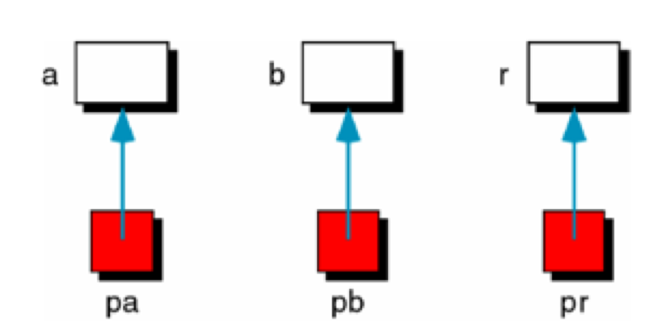
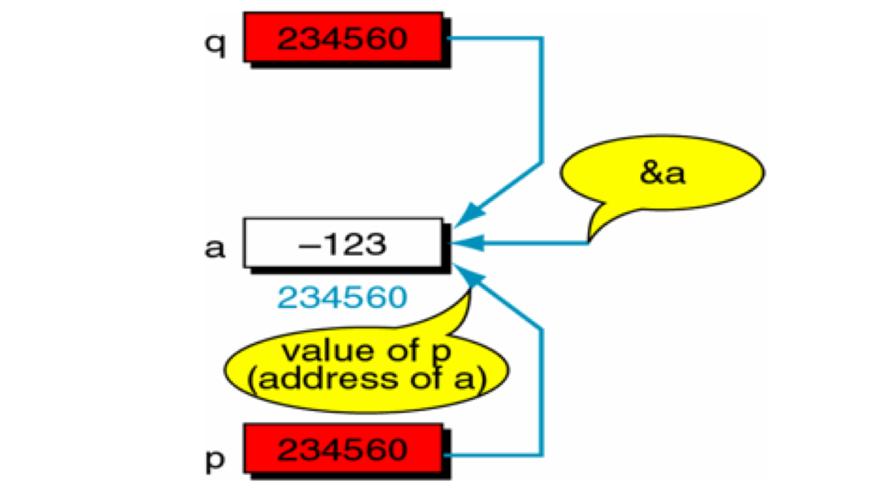
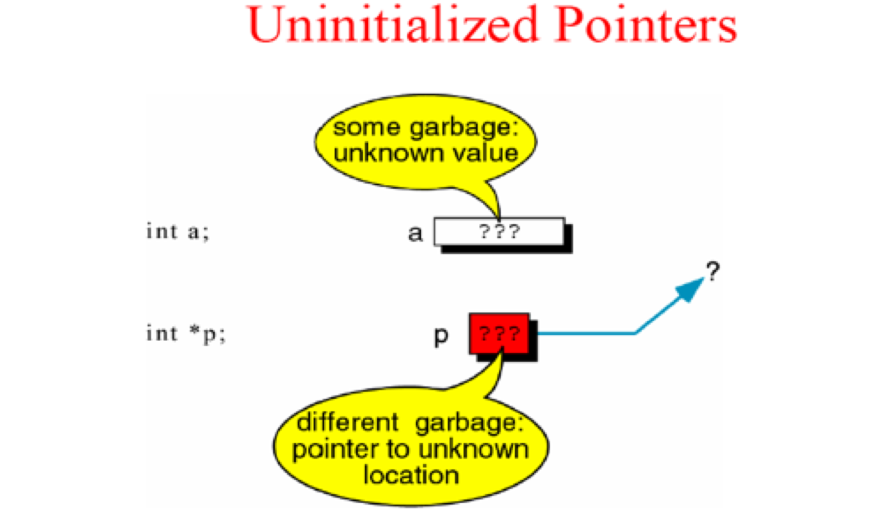
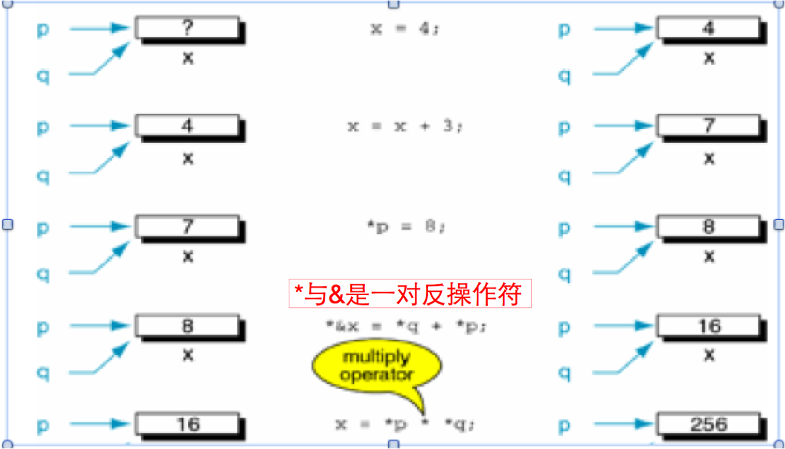

# 指针变量初始化
##本小节知识点:
1. 【掌握】指针变量的初始化方法
2. 【掌握】访问指针所指向的存储空间

---

##1.指针变量的初始化方法
- 指针变量初始化的方法有两种:定义的同时进行初始化和先定义后初始化

    + 定义的同时进行初始化
```c
int a = 5;
int *p = &a;
```

+ 先定义后初始化

```c
int a = 5;
int *p;
p=&a;
```

+ 把指针初始化为NULL

```c
int *p=NULL;
int *q=0;
```


- 不合法的初始化:
    + 指针变量不能被赋值一个整数值(因为我们不知道这个整形常量是内存哪块地址
```c
int *p;
p =  250; // 错误写法
```
+ 被赋值的指针变量前不能再加“*”

```c
int *p;
*p=&a; //错误写法
```

- 注意:
- 多个指针变量可以指向同一个地址

- 指针的指向是可以改变的
```c
int a = 5;
int *p = &a;
int b = 10;
p = &b; // 修改指针指向
```
- 指针没有初始化里面是一个垃圾值,这时候我们这是一个野指针
    + 野指针可能会导致程序崩溃
    + 野指针访问你不该访问数据
    + 所以指针必须初始化才可以访问其所指向存储区域


---

##2.访问指针所指向的存储空间
- C语言中提􏰀供了地址运算符&来表示变量的地址。其一般形式为:
    + &变量名;
- C语言中提供了*来定义指针变量和访问指针变量指向的内存存储空间
    + 在定义变量的时候 * 是一个类型说明符,说明定义的这个变量是一个指针变量
```c
int *p=NULL; // 定义指针变量
```
```c
+ 在不是定义变量的时候 *是一个操作符,访问指针所指向存储空间
```
```c
int a = 5;
int *p = &a;
printf("a = %d", *p); // 访问指针变量
```

---


