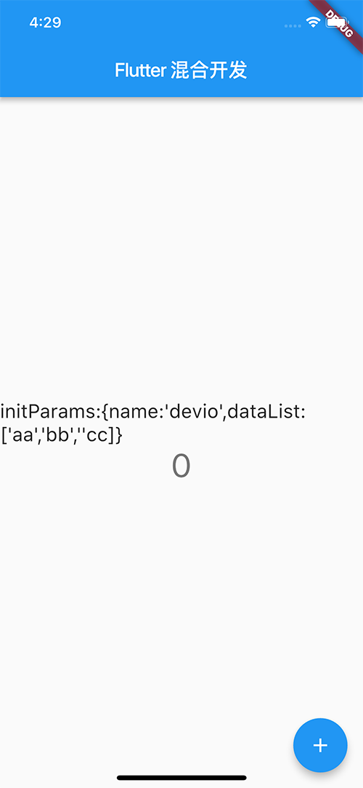

# 【重要】Flutter与iOS混合开发实战 辅导文档-持续更新

[文档来源](https://coding.imooc.com/learn/questiondetail/150168.html)

> v11.3

辅导文档不断更新中，欢迎登陆课程仓库首页与课程问答区查看最新辅导文档。

- 更新说明：
  - 适配Flutter >= v1.10.14

在Flutter的应用场景中，有时候一个APP只有部分页面是由Flutter实现的，比如：我们常用的闲鱼App，它宝贝详情页面是由Flutter实现的，这种开发模式被称为混合开发。

### 混合开发的一些其他应用场景：

1. 在原有项目中加入Flutter页面，在Flutter项目中加入原生页面


2. 原生页面中嵌入Flutter模块


3. Flutter页面中嵌入原生模块


以上这些都属于Flutter混合开发的范畴，那么如何进行Flutter混合开发呢？

在这篇文章中我将向大家介绍Flutter混合开发的流程，需要掌握的技术，以及一些经验技巧，与该文章配套的还有Flutter与iOS 混合开发讲解的视频教程。

Flutter混合开发的教程我们分为上下两篇，上篇主要介绍**如何在现有的iOS应用上进行Flutter混合开发，下篇主要介绍如何在现有的iOS应用上进行Flutter混合开发**。

**将Flutter集成到现有的iOS应用中需要如下几个主要步骤：**

1. 首先，创建Flutter module；
2. 为已存在的iOS应用添加Flutter module依赖；
3. 在Object-c中调用Flutter module；
4. 编写Dart代码；
5. 运行项目；
6. 热重启/重新加载；
7. 调试Dart代码；
8. 发布应用；
9. 升职加薪、迎娶白富美，走向人生巅峰！；

```
- flutter_hybrid
	- flutter_module
	- FlutterHybridAndroid 
	- FlutterHybridiOS
```

flutter_hybrid下面分别是flutter模块，原生Android模块，与原生iOS模块，并且这三个模块时并列结构，也可参考这块的课程代码的课程代码

### 1. 创建Flutter module
在做混合开发之前我们首先需要创建一个Flutter module。

假如你的Native项目是这样的：`xxx/flutter_hybrid/FlutterHybridiOS`：

```
$ cd xxx/flutter_hybrid/
$ flutter create -t module flutter_module
```
上面代码会切换到你的iOS项目的上一级目录，并创建一个flutter模块：
```
//flutter_module/
.android
.gitignore
.idea
.ios
.metadata
.packages
build
flutter_module_android.iml
flutter_module.iml
lib
pubspec.lock
pubspec.yaml
README.md
test
```
上面是`flutter_module`中的文件结构，你会发现它里面包含.android与.ios，这两个文件夹是隐藏文件，也是这个flutter_module宿主工程：

- `android` - `flutter_module的Android` 宿主工程；
- `ios` - `flutter_module` 的iOS宿主工程；
- `lib` - `flutter_module的Dart` 部分的代码；
- `pubspec.yaml` - `flutter_module` 的项目依赖配置文件；

因为宿主工程的存在，我们这个 `flutter_module` 在不加额外的配置的情况下是可以独立运行的，通过安装了Flutter与Dart插件的AndroidStudio打开这个flutter_module项目，通过运行按钮是可以直接运行它的。

### 2.为已存在的iOS应用添加Flutter module依赖

接下来我们需要配置我们iOS项目的Flutter module依赖，接下来的配置需要用到CocoaPods，如果你还没有用到CocoaPods，可以参考https://cocoapods.org/上面的说明来安装CocoaPods。

##### 2.1在Podfile文件中添加flutter依赖
如果你的iOS项目中没有Podfile文件可以通过：

```
pod init
```
初始化一个。

**接下来添加一下脚本：**
通过 `flutter doctor` 命令查看你的Flutter版本，不同Flutter版本需要添加的配置是不同的：

以下是`Flutter >= v1.10.14` 版本添加的配置：
—Flutter >= v1.10.14版本配置START—

```
# Step1
flutter_application_path = 'path/to/my_flutter/'
load File.join(flutter_application_path, '.ios', 'Flutter', 'podhelper.rb')
# Step2
install_all_flutter_pods(flutter_application_path)

```


例如：

下面是来自 `Podfile` 的参考配置：

```
# Step1：添加
flutter_application_path = '../flutter_module/'
load File.join(flutter_application_path, '.ios', 'Flutter', 'podhelper.rb')
target 'FlutterHybridiOS' do
  # Step2 添加
  install_all_flutter_pods(flutter_application_path)

  target 'FlutterHybridiOSTests' do
    inherit! :search_paths
    # Pods for testing
  end

  target 'FlutterHybridiOSUITests' do
    inherit! :search_paths
    # Pods for testing
  end

end
```

—Flutter >= v1.10.14版本配置END—

实例源码下载

老版本Flutter需要添加的配置：
—老版本Flutter配置START—

```
 flutter_application_path = 'path/to/my_flutter/'
  eval(File.read(File.join(flutter_application_path, '.ios', 'Flutter', 'podhelper.rb')), binding)
```

例如：

```
target 'FlutterHybridiOS' do
  flutter_application_path = '../flutter_module/'
  eval(File.read(File.join(flutter_application_path, '.ios', 'Flutter', 'podhelper.rb')), binding)

  target 'FlutterHybridiOSTests' do
    inherit! :search_paths
  end

  target 'FlutterHybridiOSUITests' do
    inherit! :search_paths
  end

end
```

除此之外，老版本flutter还需要添加 build phase以构建Dart代码


根据上图的提示创建一个build phase，然后展开Run Script并添加下面配置：

```
"$FLUTTER_ROOT/packages/flutter_tools/bin/xcode_backend.sh" build
"$FLUTTER_ROOT/packages/flutter_tools/bin/xcode_backend.sh" embed

```


最后记得根据上图的提示，将Run Script到紧挨着Target Dependencies phase的下面，接下来就可以通过⌘B构建你的项目了。

—老版本Flutter配置END—

##### 2.2安装依赖

在iOS项目的根目录运行：
```
pod install
```

你会看到：

```
pod install 
Analyzing dependencies
Fetching podspec for `Flutter` from `../flutter_module/.ios/Flutter/engine`
Fetching podspec for `FlutterPluginRegistrant` from `../flutter_module/.ios/Flutter/FlutterPluginRegistrant`
Downloading dependencies
Installing Flutter (1.0.0)
Installing FlutterPluginRegistrant (0.0.1)
Generating Pods project
Integrating client project

[!] Please close any current Xcode sessions and use `FlutterHybridiOS.xcworkspace` for this project from now on.
Sending stats
Pod installation complete! There are 2 dependencies from the Podfile and 2 total pods installed.

[!] Automatically assigning platform `ios` with version `12.1` on target `FlutterHybridiOS` because no platform was specified. Please specify a platform for this target in your Podfile. See `https://guides.cocoapods.org/syntax/podfile.html#platform`.

```

当你在flutter_module/pubspec.yaml添加一个Flutter插件时，需要在flutter_module目录下运行：

flutter packages get
来刷新`podhelper.rb` 脚本中插件列表，然后在iOS目录下运行：

```
pod install
``` 
这样以来 `podhelper.rb` 脚本才能确保你的插件和Flutter.framework能够添加到你的iOS项目中。

##### 2.3禁用Bitcode

目前Flutter还不支持Bitcode，所以集成了Flutter的iOS项目需要禁用Bitcode：

用XCode打开你的项目如：`xxx.xcworkspace`：

然后在：
```
Build Settings->Build Options->Enable Bitcode 
```
中禁用Bitcode：


> 如果在这个过程中遇到问题可以查看Under the hood文档。

### 3.在Object-c中调用Flutter module

至此，我们已经为我们的iOS项目添加了Flutter所必须的依赖，接下来我们来看如何在Object-c中调用Flutter模块：

在Object-c中调用Flutter模块有两种方式：

- 直接使用FlutterViewController的方式；
- 使用FlutterEngine的方式；

##### 3.1直接使用 `FlutterViewController`的方式

```
// ⁨flutter_hybrid⁩ ▸ ⁨FlutterHybridiOS⁩ ▸ ⁨FlutterHybridiOS⁩ ▸ ViewController.m 

#import <Flutter/Flutter.h>
#import "AppDelegate.h"
#import "ViewController.h"
#import <FlutterPluginRegistrant/GeneratedPluginRegistrant.h> // 如果你需要用到Flutter插件时

FlutterViewController *flutterViewController = [FlutterViewController new];
GeneratedPluginRegistrant.register(with: flutterViewController);//如果你需要用到Flutter插件时
[flutterViewController setInitialRoute:@"route1"];
    
[self presentViewController:flutterViewController animated:true completion:nil];
```


通过这种方式我们可以使用flutterViewController setInitialRoute的方法为传递了字符串“route1”来告诉Dart代码在Flutter视图中显示哪个小部件。 Flutter模块项目的lib/main.dart文件需要通过window.defaultRouteName来获取Native指定要显示的路由名，以确定要创建哪个窗口小部件并传递给runApp：

```
import 'dart:ui';
import 'package:flutter/material.dart';

void main() => runApp(_widgetForRoute(window.defaultRouteName));

Widget _widgetForRoute(String route) {
  switch (route) {
    case 'route1':
      return SomeWidget(...);
    case 'route2':
      return SomeOtherWidget(...);
    default:
      return Center(
        child: Text('Unknown route: $route', textDirection: TextDirection.ltr),
      );
  }
}
```


##### 3.2使用FlutterEngine的方式

```
AppDelegate.h

#import <UIKit/UIKit.h>
#import <Flutter/Flutter.h>

@interface AppDelegate : FlutterAppDelegate
@property (nonatomic,strong) FlutterEngine *flutterEngine;
@end
AppDelegate.m

#import <FlutterPluginRegistrant/GeneratedPluginRegistrant.h> // 如果你需要用到Flutter插件时
#include "AppDelegate.h"

@implementation AppDelegate


- (BOOL)application:(UIApplication *)application
    didFinishLaunchingWithOptions:(NSDictionary *)launchOptions {
  self.flutterEngine = [[FlutterEngine alloc] initWithName:@"io.flutter" project:nil];
  [self.flutterEngine runWithEntrypoint:nil];
  [GeneratedPluginRegistrant registerWithRegistry:self.flutterEngine]; //如果你需要用到Flutter插件时
  return [super application:application didFinishLaunchingWithOptions:launchOptions];
}
@end
```


如果你的项目的AppDelegate.h已经有了别的集成，那么可惨参考实现FlutterAppLifeCycleProvider的方式进行配置。

> ViewController.m
```
// ⁨flutter_hybrid⁩ ▸ ⁨FlutterHybridiOS⁩ ▸ ⁨FlutterHybridiOS⁩ ▸ ViewController.m 

 FlutterEngine *flutterEngine = [(AppDelegate *)[[UIApplication sharedApplication] delegate] flutterEngine];
    FlutterViewController *flutterViewController = [[FlutterViewController alloc] initWithEngine:flutterEngine nibName:nil bundle:nil];
    [self presentViewController:flutterViewController animated:false completion:nil];

```

因为我们在AppDelegate.m中提前初始化了FlutterEngine，所以这种方式打开一个Flutter模块的速度要比第一种方式要快一些。

##### 3.3调用Flutter module时传递数据

在上文中，我们无论是通过直接使用FlutterViewController的方式还是通过FlutterEngine的方式，都允许我们在加载Flutter module时传递一个String类型的initialRoute参数，从参数名字它是用作路由名的，但是既然Flutter给我们开了这个口子，那我们是不是可以搞点事情啊，传递点我们想传的其他参数呢，比如：

```
 [flutterViewController setInitialRoute:@"{name:'devio',dataList:['aa','bb',''cc]}"];
```

然后在Flutter module通过如下方式获取：

```
import 'dart:ui';//要使用window对象必须引入

String initParams=window.defaultRouteName;
//序列化成Dart obj 敢你想干的
...
```

通过上述方案的讲解是不是给大家分享了一个新的思路呢。

> 注意使用FlutterEngine的方式中调用setInitialRoute会无效，你会发现Dart拿到的永远是“/”，这个是Fltter SDK的一个Bug，所以如果必须依赖setInitialRoute那么请使用方式一的形式；

### 4.编写Dart代码
接下来就是在编写Flutter module中的lib下编写Dart带了，快去Enjoy Coding吧！！！

### 5.运行项目
接下来，我们就可以运行它了，经过上述步骤，我们就可以以运行普通iOS项目的方式来通过XCode运行一个集成了Flutter的iOS项目了。



### 6.热重启/重新加载


大家知道我们在做Flutter开发的时候，它带有热重启/重新加载的功能，但是你可能会发现，混合开发中在iOS项目中集成了Flutter项目，Flutter的热重启/重新加载功能好像失效了，那怎么启用混合开发汇总Flutter的热重启/重新加载呢：

- 打开一个模拟器，或连接一个设备到电脑上；
- 关闭我们的APP，然后运行`flutter attach`；

```
$ cd flutter_hybrid/flutter_module
$ flutter attach
Checking for advertised Dart observatories...
Waiting for a connection from Flutter on iPhone X...
```

> 注意如果，你同时有多个模拟器或连接的设备，运行`flutter attach`会提示你选择一个设备：

```
Android SDK built for x86 • emulator-5554                        • android-x86 • Android 8.1.0 (API 27) (emulator)
iPhone X                  • 3E3FA943-715F-482F-B003-D46F5902C56C • ios         • iOS 12.1 (simulator)
```

接下来我们需要`flutter attach -d`来指定一个设备：
```
 flutter attach -d 'emulator-5554'
```
注意`-d`后面跟的设备ID。

- 运行APP，然后你会看到：

```
$ flutter attach
More than one device connected; please specify a device with the '-d <deviceId>' flag, or use '-d all' to act on all devices.

Android SDK built for x86 • emulator-5554                        • android-x86 • Android 8.1.0 (API 27) (emulator)
iPhone X                  • 3E3FA943-715F-482F-B003-D46F5902C56C • ios         • iOS 12.1 (simulator)
jphdeMacBook-Pro:flutter_module jph$ flutter attach -d '3E3FA943-715F-482F-B003-D46F5902C56C'
Checking for advertised Dart observatories...
Waiting for a connection from Flutter on iPhone X...
Done.
Syncing files to device iPhone X...                              1,613ms

?  To hot reload changes while running, press "r". To hot restart (and rebuild state), press "R".
An Observatory debugger and profiler on iPhone X is available at: http://127.0.0.1:64108/
For a more detailed help message, press "h". To detach, press "d"; to quit, press "q".

```

说明连接成功了，接下来就可以通过上面的提示来进行热加载/热重启了，在终端输入：

- r : 热加载；
- R : 热重启；
- h : 获取帮助；
- d : 断开连接；

### 7.调试Dart代码
混合开发的模式下，如何更好更高效的调试我们的代码呢，接下来我就跟大家分享一种混合开发模式下高效调试代码的方式：

- **关闭APP(这步很关键)**
- 点击AndroidStudio的`Flutter Attach`按钮(需要首先安装Flutter与Dart插件)
- 启动APP


接下来就可以像调试普通Flutter项目一样来调试混合开发的模式下的Dart代码了。

> 除了以上步骤不同之外，接下来的调试和我们之前课程中的Flutter调试技巧都是通用的，需要的同学可以学习下我们前面的课程；

**还有一点需要注意：**

> 大家在运行iOS工程时一定要用XCode运行，因为Flutter模式下的AndroidStudio运行的是Flutter module下的.ios中的iOS工程。

### 8.发布应用

发布iOS应用我们需要有一个99美元的账号用于将App上传到AppStore，或者是299美元的企业级账号用于将App发布到自己公司的服务器或第三方公司的服务器。

接下来我们就需要进行申请APPID ➜ 在Tunes Connect创建应用 ➜ 打包程序 ➜ 将应用提交到app store等几大步骤。

因为官方文档中有详细的说明，在这我就不再重复了。

更多Flutter混合开发的实用技巧,可学习与此文章配套的视频课程：《FLutter与iOS 混合开发讲解》

### 参考

基于Flutter1.x开发携程网App
Add Flutter to existing apps
93573de