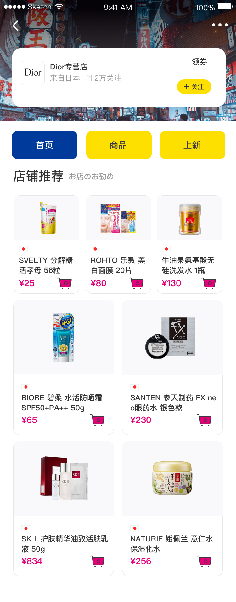

# 移动web开发之rem布局

#### 训练案例

##### 训练描述

整体利用rem来实现以上布局  

注：从首页、商品、上新导航出开始写，上面的背景和店家介绍不用写

页面所用到的图标在当前目录的店家图标里

##### 训练提示

1、首先搭建项目基本文件夹

2、因为要利用rem来实现，所以先把rem的适配处理好，如果利用媒体查询，需要自己利用媒体查询在不同屏幕分配根元素的字体大小不同

3、如果利用淘宝的js，要把js引入进来

4、开始进行页面的结构划分，整体分为两部分，导航和店家推荐

5、导航可以利用ul包裹li或者div包裹a都是可以的，看自己心情

6、首先可以给父元素一些padding值让父元素的内容整体向里收缩一些，当然要将px转为rem

7、因为每个子元素在一行所以要浮动，并且设置子元素的宽和高，宽和高也是一样将px转为rem

9、店家推荐布局可以分为两部分

10、一部分是上面的一行三个

11、一部分是下面的一行两个