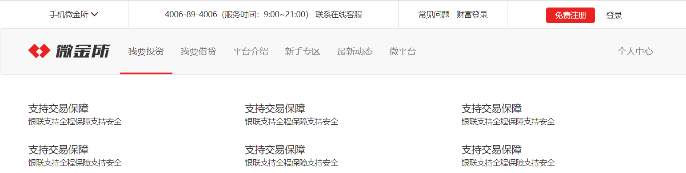
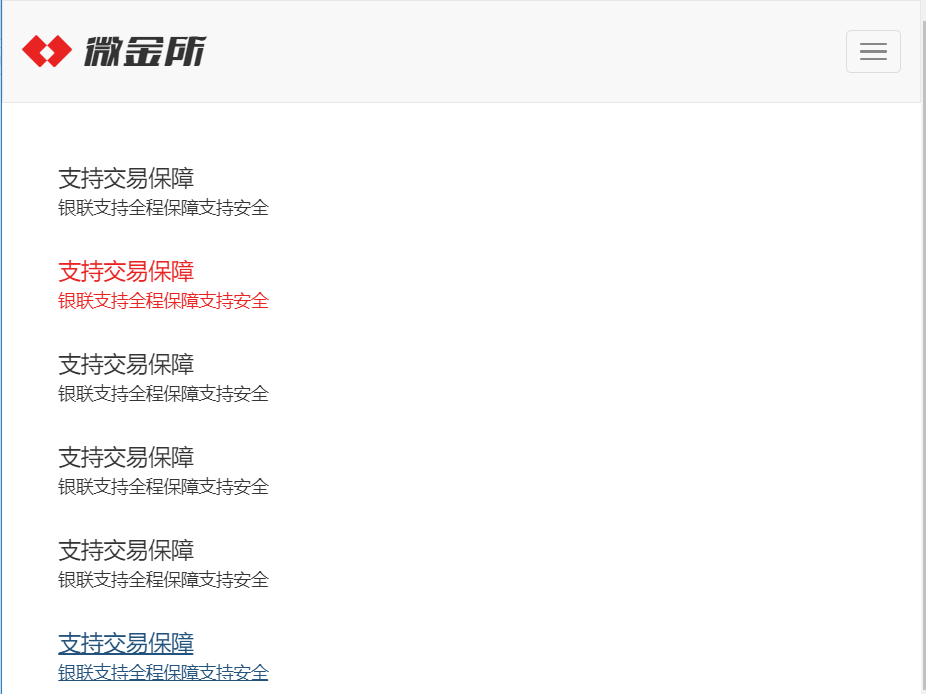

# 移动web响应式布局

### 训练案例

中等屏幕到大屏幕的状态



小屏幕下的状态


超小屏幕下的状态



### 训练提示

1、创建文件夹结构  

2、创建 html 骨架结构 

```
<!DOCTYPE html>
<html lang="zh-CN">
  <head>
    <meta charset="utf-8">
    <meta http-equiv="X-UA-Compatible" content="IE=edge">
    <meta name="viewport" content="width=device-width, initial-scale=1">
    <!-- 上述3个meta标签*必须*放在最前面，任何其他内容都*必须*跟随其后！ -->
    <title>Bootstrap 101 Template</title>

    <!-- Bootstrap -->
    <link href="css/bootstrap.min.css" rel="stylesheet">

    <!-- HTML5 shim and Respond.js for IE8 support of HTML5 elements and media queries -->
    <!-- WARNING: Respond.js doesn't work if you view the page via file:// -->
    <!--[if lt IE 9]>
      <script src="//cdn.bootcss.com/html5shiv/3.7.2/html5shiv.min.js"></script>
      <script src="//cdn.bootcss.com/respond.js/1.4.2/respond.min.js"></script>
    <![endif]-->
  </head>
  <body>
    <h1>你好，世界！</h1>

    <!-- jQuery (necessary for Bootstrap's JavaScript plugins) -->
    <script src="//cdn.bootcss.com/jquery/1.11.3/jquery.min.js"></script>
    <!-- Include all compiled plugins (below), or include individual files as needed -->
    <script src="js/bootstrap.min.js"></script>
  </body>
</html>
```

3、引入样式

4、开始写内容和结构

5、结构分为头部、导航、信息三部分

6、首先看头部：头部最外层应该用container容器包裹，里面利用栅格布局分为四部分，第一部分占据2等份，第二部分占据5等份，第三部分占据2等份，第四部分占据3等份

7、然后在给每一部分填充内容都很简单，第一部分的向下箭头可用bootstrap提供的glyphicon glyphicon-menu-down

8、因为头部只在中等屏幕和大屏幕显示所以可以给头部设置hidden-xs hidden-sm

9、接下来为导航条，导航条也是在bootstrap中的组件→导航条将代码复制出来

```
<nav class="navbar navbar-default">
  <div class="container-fluid">
    <!-- Brand and toggle get grouped for better mobile display -->
    <div class="navbar-header">
      <button type="button" class="navbar-toggle collapsed" data-toggle="collapse" data-target="#bs-example-navbar-collapse-1" aria-expanded="false">
        <span class="sr-only">Toggle navigation</span>
        <span class="icon-bar"></span>
        <span class="icon-bar"></span>
        <span class="icon-bar"></span>
      </button>
      <a class="navbar-brand" href="#">Brand</a>
    </div>

    <!-- Collect the nav links, forms, and other content for toggling -->
    <div class="collapse navbar-collapse" id="bs-example-navbar-collapse-1">
      <ul class="nav navbar-nav">
        <li class="active"><a href="#">Link <span class="sr-only">(current)</span></a></li>
        <li><a href="#">Link</a></li>
        <li class="dropdown">
          <a href="#" class="dropdown-toggle" data-toggle="dropdown" role="button" aria-haspopup="true" aria-expanded="false">Dropdown <span class="caret"></span></a>
          <ul class="dropdown-menu">
            <li><a href="#">Action</a></li>
            <li><a href="#">Another action</a></li>
            <li><a href="#">Something else here</a></li>
            <li role="separator" class="divider"></li>
            <li><a href="#">Separated link</a></li>
            <li role="separator" class="divider"></li>
            <li><a href="#">One more separated link</a></li>
          </ul>
        </li>
      </ul>
      <form class="navbar-form navbar-left" role="search">
        <div class="form-group">
          <input type="text" class="form-control" placeholder="Search">
        </div>
        <button type="submit" class="btn btn-default">Submit</button>
      </form>
      <ul class="nav navbar-nav navbar-right">
        <li><a href="#">Link</a></li>
        <li class="dropdown">
          <a href="#" class="dropdown-toggle" data-toggle="dropdown" role="button" aria-haspopup="true" aria-expanded="false">Dropdown <span class="caret"></span></a>
          <ul class="dropdown-menu">
            <li><a href="#">Action</a></li>
            <li><a href="#">Another action</a></li>
            <li><a href="#">Something else here</a></li>
            <li role="separator" class="divider"></li>
            <li><a href="#">Separated link</a></li>
          </ul>
        </li>
      </ul>
    </div><!-- /.navbar-collapse -->
  </div><!-- /.container-fluid -->
</nav>
```


复制出来后基本大致效果搞定了，接下来需要将样式修改成我们自己的，无非修改高、行高、背景色、a的默认样式、a的hover效果改成自己想要的、注意修改样式需要自己添加类名，然后根据自己的类名去覆盖样式

左侧的logo可用色块代替即可

10、最后的信息块可以看出当在中等屏幕以上是一行三个（.col-md-4）、小屏幕是一行两个（.col-sm-6）、超小屏幕是一行一个（.col-xs-12），所以这里可以肯定用栅格布局来实现，最外层套一层container子盒子利用栅格布局实现，子盒子需要添加的类名为.col-md-4 .col-sm-6 .col-xs-12（注：如果在某个屏幕没有设置默认也是12），所以也可以直接写.col-md-4 .col-sm-6 

11、里面的结构是上下，上面一个h3加文字，下面用p标签加文字，再处理一下细节即可