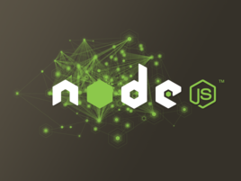
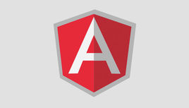

# 1.javaScript的基本介绍

---
# 2.1.javaScript的基本介绍

介绍

`
JavaScript一种直译式脚本语言，是一种动态类型、弱类型、基于原型的语言，内置支持类型。它的解释器被称为JavaScript引擎，为浏览器的一部分，广泛用于客户端的脚本语言，最早是在HTML（标准通用标记语言下的一个应用）网页上使用，用来给HTML网页增加动态功能。
`

参考资料:

```javascript

1.0、javascript中文网

http://www.javascriptcn.com/

1.1、菜鸟教程

http://www.runoob.com/js/js-tutorial.html

1.2、w3c官方网址

http://www.w3school.com.cn/js/

```

深入篇之面向对象：

```javascript

http://www.cnblogs.com/dolphinX/p/4385862.html

http://www.ibm.com/developerworks/cn/web/1304_zengyz_jsoo/

http://www.php100.com/html/it/biancheng/2015/0212/8619.html

http://www.cnblogs.com/jikey/p/3600308.html
```


历史

`
在1995年时，由Netscape公司的Brendan Eich，在网景导航者浏览器上首次设计实现而成。因为Netscape与Sun合作，Netscape管理层希望它外观看起来像Java，因此取名为JavaScript。但实际上它的语法风格与Self及Scheme较为接近。
`

`
为了取得技术优势，微软推出了JScript，CEnvi推出ScriptEase，与JavaScript同样可在浏览器上运行。为了统一规格，因为JavaScript兼容于ECMA标准，因此也称为ECMAScript。
`

基本特点

`
javaScript是一种属于网络的脚本语言,已经被广泛用于Web应用开发,常用来为网页添加各式各样的动态功能,为用户提供更流畅美观的浏览效果。通常JavaScript脚本是通过嵌入在HTML中来实现自身的功能的。
`

主要表现为:

`
1.是一种解释性脚本语言（代码不进行预编译）。
2.主要用来向HTML（标准通用标记语言下的一个应用）页面添加交互行为。
3.可以直接嵌入HTML页面，但写成单独的js文件有利于结构和行为的分离。
4.跨平台特性，在绝大多数浏览器的支持下，可以在多种平台下运行（如Windows、Linux、Mac、Android、iOS等）。
`

延伸版本:

1.基于服务器端的开发:NodeJS




介绍:

`Node.js是一个Javascript运行环境(runtime)。实际上它是对Google V8引擎进行了封装。V8引擎执行Javascript的速度非常快，性能非常好。Node.js对一些特殊用例进行了优化，提供了替代的API，使得V8在非浏览器环境下运行得更好。
   Node.js是一个基于Chrome JavaScript运行时建立的平台， 用于方便地搭建响应速度快、易于扩展的网络应用。Node.js 使用事件驱动， 非阻塞I/O模型而得以轻量和高效，非常适合在分布式设备上运行数据密集型的实时应用。`
```html
https://nodejs.org/en/
```
参考资料:
```javascript

中文官网:

http://nodejs.cn/

菜鸟教程:
http://www.runoob.com/nodejs/nodejs-tutorial.html
```

2.前端优秀JS框架：AngularJS



介绍:
`
AngularJS 诞生于2009年，由Misko Hevery 等人创建，后为Google所收购。是一款优秀的前端JS框架，已经被用于Google的多款产品当中。AngularJS有着诸多特性，最为核心的是：MVVM、模块化、自动化双向数据绑定、语义化标签、依赖注入等等
`

```javascript
https://docs.angularjs.org/
```

参考资料:

```javascript
中文网:

http://www.apjs.net/

菜鸟教程:

http://www.runoob.com/angularjs/angularjs-tutorial.html


```


