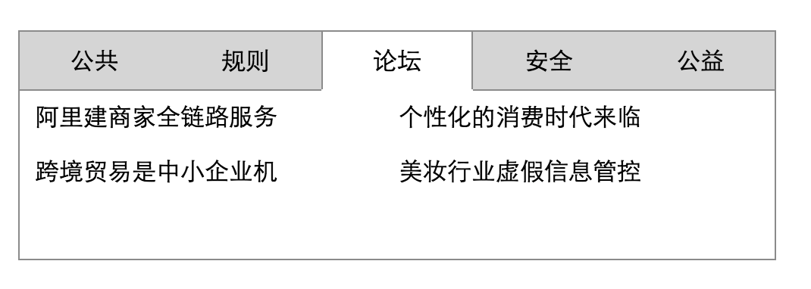

# 15.javascript之DOM文档学习之综合案例-高仿淘宝Tab选项卡

---
### 3.6javascript之DOM文档学习之综合案例-高仿淘宝Tab选项卡
`在很多知名甚至小的网站都会采用tab选项卡的效果，因为此效果可以使用一个非常小的空间来进行扩展更多的东西，而且简单直观`

如图:



具体示例代码:

html代码

```html
<!DOCTYPE html>
<html lang="en">
<head>
    <meta charset="UTF-8">
    <title>Tab选项卡</title>
</head>
<body>
    <!--tab选项卡-->
    <div id="tab">
        <!--头部-->
        <div id="tab_header">
            <ul>
                <li class="selected">公共</li>
                <li>规则</li>
                <li>论坛</li>
                <li>安全</li>
                <li>公益</li>
            </ul>
        </div>
        <!--身体-->
        <div id="tab_content">
            <div class="dom" style="display: block">
                <ul>
                    <li>
                        <a href="#">数据七夕:金牛爱送玫瑰</a>
                    </li>
                    <li>
                        <a href="#">阿里打造"互联网监管"</a>
                    </li>
                    <li>
                        <a href="#">10万家店60万新品</a>
                    </li>
                    <li>
                        <a href="#">全球最大网上时装周</a>
                    </li>
                </ul>
            </div>
            <div class="dom">
                <ul>
                    <li>
                        <a href="#">“全额返现”要管控啦</a>
                    </li>
                    <li>
                        <a href="#">淘宝新规发布汇总(7月)</a>
                    </li>
                    <li>
                        <a href="#">炒信规则调整意见反馈</a>
                    </li>
                    <li>
                        <a href="#">质量相关规则近期变更</a>
                    </li>
                </ul>
            </div>
            <div class="dom">
                <ul>
                    <li>
                        <a href="#">阿里建商家全链路服务</a>
                    </li>
                    <li>
                        <a href="#">个性化的消费时代来临</a>
                    </li>
                    <li>
                        <a href="#">跨境贸易是中小企业机</a>
                    </li>
                    <li>
                        <a href="#">美妆行业虚假信息管控</a>
                    </li>
                </ul>
            </div>
            <div class="dom">
                <ul>
                    <li>
                        <a href="#">接次文件，毁了一家店</a>
                    </li>
                    <li>
                        <a href="#">账号安全神器阿里钱盾</a>
                    </li>
                    <li>
                        <a href="#">新版阿里110上线了</a>
                    </li>
                    <li>
                        <a href="#">卖家学违禁避免被处罚</a>
                    </li>
                </ul>
            </div>
            <div class="dom">
                <ul>
                    <li>
                        <a href="#">为了公益high起来</a>
                    </li>
                    <li>
                        <a href="#">魔豆妈妈在线申请</a>
                    </li>
                </ul>
            </div>
        </div>
    </div>

<script src="js/index.js"></script>
</body>
</html>
```
css代码:
```css
    <link rel="stylesheet" href="css/index.css">
```
javascript代码

```javascript
(function () {


/*此处使用$符号封装一个函数名其实为了铺垫第四天学习的jquery框架**/

   // 封装一个函数  $函数名  == 值比较  === 包括类型比较 和 值比较
    function $(id) {
        return typeof id === 'string' ?  document.getElementById(id) : id;
    }


  // 当页面加载完毕
  window.onload = function () {
      // 1. 拿到所有的标题 li标签 和 li标签对应的内容
      // var lis = document.getElementById('tab_header').getElementsByTagName('li');
      var lis = $('tab_header').getElementsByTagName('li');
      var contents = $('tab_content').getElementsByClassName('dom');
      // console.log(lis, contents);

      // 2. 判断  判断是否一一对象，如果不是，直接return掉没有继续的必要了
      if(lis.length != contents.length) return;

      // 3. 遍历
      for(var i=0; i<lis.length; i++){
          // 3.1 取出单独的每一个li标签
          var li = lis[i];

          // 3.2 绑定id   通过id属性给每一节节点绑定一个唯一的id
          li.id = i;
          // console.log(li);

          // 3.3 监听鼠标在li上面的移动
          li.onmousemove = function () {

              // 如何让所有的li标签的class全部清掉
              for(var j=0; j<lis.length; j++){
                  lis[j].className = '';

                  contents[j].style.display = 'none';
              }

              // 让当前的li被选中
              this.className = 'selected';

              // 让li对应的contents中的div显示出来
              contents[this.id].style.display = 'block';

          }
      }
  };

}());
```
