- [day11-特殊文件、日志技术、多线程](#day11-特殊文件日志技术多线程)
  - [一、属性文件](#一属性文件)
    - [1.1 特殊文件概述](#11-特殊文件概述)
    - [1.2 Properties属性文件](#12-properties属性文件)
  - [二、XML文件](#二xml文件)
    - [2.1 XML文件概述](#21-xml文件概述)
    - [2.2 XML解析1](#22-xml解析1)
    - [2.3 XML解析2](#23-xml解析2)
    - [2.4 XML文件写入](#24-xml文件写入)
    - [2.5 XML约束（了解）](#25-xml约束了解)
  - [三、日志技术](#三日志技术)
    - [3.1 日志概述](#31-日志概述)
    - [3.2 日志的体系](#32-日志的体系)
    - [3.3 Logback快速入门](#33-logback快速入门)
    - [3.4 日志配置文件](#34-日志配置文件)
    - [3.5 配置日志级别](#35-配置日志级别)
  - [三、多线程](#三多线程)
    - [4.1 线程创建方式1](#41-线程创建方式1)
    - [4.2 线程创建方式2](#42-线程创建方式2)
    - [4.3 线程创建方式2—匿名内部类](#43-线程创建方式2匿名内部类)
    - [4.4 线程的创建方式3](#44-线程的创建方式3)


# day11-特殊文件、日志技术、多线程

## 一、属性文件

### 1.1 特殊文件概述

同学们，前面我们学习了IO流，我们知道IO流是用来读、写文件中的数据。但是我们接触到的文件都是普通的文本文件，普通的文本文件里面的数据是没有任何格式规范的，用户可以随意编写，如下图所示。

像这种普通的文本文件，没有任何规律可言，不方便程序对文件中的数据信息处理。

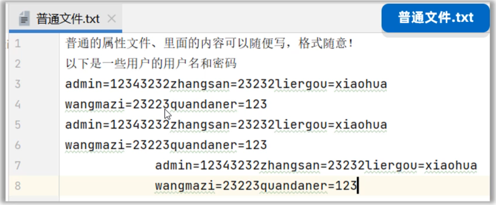

在以后的Java开发过程中还会遇到一些特殊的文本文件，这些文件是有一些格式要求的，方便程序对文件中的数据进行处理。

比如，后面我们会用到两种特殊的文本文件，一种是properties文件，还有一种是xml文件。如下图所示。

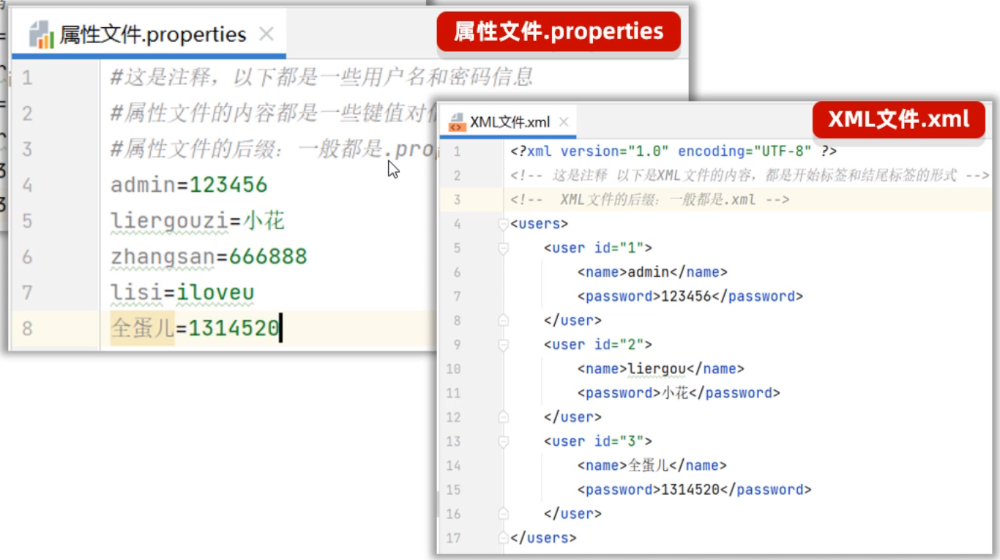

- 后缀为.properties的文件，称之为属性文件，它可以很方便的存储一些类似于键值对的数据。经常当做软件的配置文件使用。
- 而xml文件能够表示更加复杂的数据关系，比如要表示多个用户的用户名、密码、家乡、性别等。在后面，也经常当做软件的配置文件使用。

现在，学习特殊的文件主要学习什么呢？ 主要学习以下的三点


### 1.2 Properties属性文件

接下来，我们先学习Properties这种属性文件。首先我们要掌握属性文件的格式：

1. 属性文件后缀以`.properties`结尾
2. 属性文件里面的每一行都是一个键值对，键和值中间用=隔开。比如: `admin=123456` 
3. `#`表示这样是注释信息，是用来解释这一行配置是什么意思。
4. 每一行末尾不要习惯性加分号，以及空格等字符；不然会把分号，空格会当做值的一部分。
5. 键不能重复，值可以重复

如下图所示

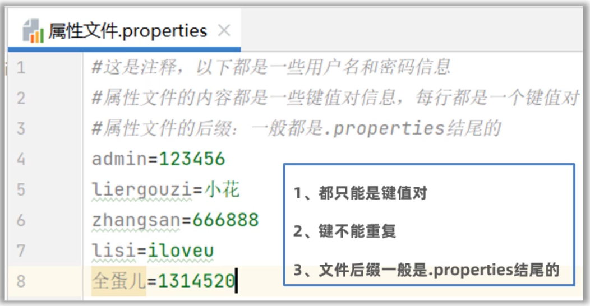

接下来，我们学习如何读取属性文件中的数据。这里需要给同学们，介绍一个来叫Properties.

```java
1.Properties是什么？
	Properties是Map接口下面的一个实现类，所以Properties也是一种双列集合，用来存储键值对。	  但是一般不会把它当做集合来使用。
	
2.Properties核心作用？
	Properties类的对象，用来表示属性文件，可以用来读取属性文件中的键值对。
```

- **使用Properties读取属性文件中的键值对**，需要用到的方法如下。


实用Properties读取属性文件的步骤如下

```java
1、创建一个Properties的对象出来（键值对集合，空容器）
2、调用load(字符输入流/字节输入流)方法，开始加载属性文件中的键值对数据到properties对象中去
3、调用getProperty(键)方法，根据键取值
```

代码如下：

```java
/**
 * 目标：掌握使用Properties类读取属性文件中的键值对信息。
 */
public class PropertiesTest1 {
    public static void main(String[] args) throws Exception {
        // 1、创建一个Properties的对象出来（键值对集合，空容器）
        Properties properties = new Properties();
        System.out.println(properties);

        // 2、开始加载属性文件中的键值对数据到properties对象中去
        properties.load(new FileReader("properties-xml-log-app\\src\\users.properties"));
        System.out.println(properties);

        // 3、根据键取值
        System.out.println(properties.getProperty("赵敏"));
        System.out.println(properties.getProperty("张无忌"));

        // 4、遍历全部的键和值。
        //获取键的集合
        Set<String> keys = properties.stringPropertyNames();
        for (String key : keys) {
            //再根据键获取值
            String value = properties.getProperty(key);
            System.out.println(key + "---->" + value);
        }
		
        properties.forEach((k, v) -> {
            System.out.println(k + "---->" + v);
        });
    }
}
```

- **使用Properties往属性文件中写键值对**，需要用到的方法如下


往Properties属性文件中写键值对的步骤如下

```java
1、先准备一个.properties属性文件，按照格式写几个键值对
1、创建Properties对象出来，
2、调用setProperty存储一些键值对数据
3、调用store(字符输出流/字节输出流, 注释)，将Properties集合中的键和值写到文件中
	注意：第二个参数是注释，必须得加；
```

先准备一个`users.properties`属性文件，如下图所示


接下来，编写代码读取上面的属性文件。代码如下：

```java
public class PropertiesTest2 {
    public static void main(String[] args) throws Exception {
        // 1、创建Properties对象出来，先用它存储一些键值对数据
        Properties properties = new Properties();
        properties.setProperty("张无忌", "minmin");
        properties.setProperty("殷素素", "cuishan");
        properties.setProperty("张翠山", "susu");

        // 2、把properties对象中的键值对数据存入到属性文件中去
        properties.store(new FileWriter("properties-xml-log-app/src/users2.properties")
                         , "i saved many users!");

    }
}
```

运行上面的代码，`user2.properties` 配置文件打开效果如下图所示。


## 二、XML文件

同学们，在上一节我们学习了properties属性文件。接下来我们再学习一种在开发中经常使用的文件，叫做xml文件。我们先来给同学们介绍一下，什么是xml文件，然后再来学习如何读取xml文件中的数据。

### 2.1 XML文件概述

**首先，我们来认识一下，什么是XML？**

XML是可扩展的标记语言，意思是它是由一些标签组成	的，而这些标签是自己定义的。本质上一种数据格式，可以用来表示复杂的数据关系。

XML文件有如下的特点：

- XML中的`<标签名>` 称为一个标签或者一个元素，一般是成对出现的。
- XML中的标签名可以自己定义（可扩展），但是必须要正确的嵌套
- XML中只能有一个根标签。
- XML标准中可以有属性
- XML必须第一行有一个文档声明，格式是固定的`<?xml version="1.0" encoding="UTF-8"?>`
- XML文件必须是以.xml为后缀结尾

如下图所示

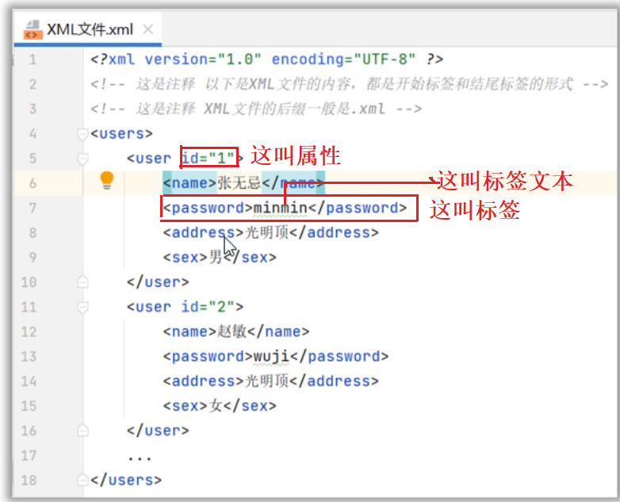

**接下，同学们可以跟着步骤新建一个XML文件，试试！**


```xml
<?xml version="1.0" encoding="UTF-8" ?>
<!-- 注释：以上抬头声明必须放在第一行，必须有 -->
<!--  根标签只能有一个 -->
<users>
    <user id="1" desc="第一个用户">
        <name>张无忌</name>
        <sex>男</sex>
        <地址>光明顶</地址>
        <password>minmin</password>
    </user>
    <people>很多人</people>
    <user id="2">
        <name>敏敏</name>
        <sex>女</sex>
        <地址>光明顶</地址>
        <password>wuji</password>
    </user>
</users>
```

上面XML文件中的数据格式是最为常见的，标签有属性、文本、还有合理的嵌套。XML文件中除了写以上的数据格式之外，还有一些特殊的字符不能直接写。

- 像 `<,>,& `等这些符号不能出现在标签的文本中，因为标签格式本身就有<>，会和标签格式冲突。

  如果标签文本中有这些特殊字符，需要用一些占位符代替。

  ```txt
  &lt;  表示 <
  &gt;  表示 >
  &amp; 表示 &
  &apos; 表示 '
  &quot; 表示 "
  ```

  ```xml
  <data> 3 &lt; 2 &amp;&amp; 5 &gt; 4 </data>
  ```

- 如果在标签文本中，出现大量的特殊字符，不想使用特殊字符，此时可以用CDATA区，格式如下

  ```xml
  <data1>
      <![CDATA[
     		3 < 2 && 5 > 4
      ]]>
  </data1>
  ```


**最后，给同学们聊聊，XML在实际开发中有什么作用？**

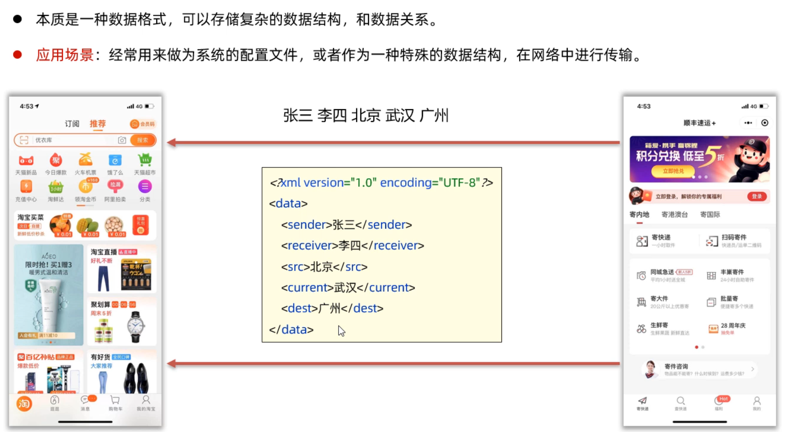

关于XML是什么，以及XML的格式，还有XML有什么作用，就先认识到这里。


### 2.2 XML解析1

使用程序读取XML文件中的数据，称之为XML解析。这里并不需要我们自己写IO流代码去读取xml文件中的数据。其实有很多开源的，好用的XML解析框架，最知名的是DOM4J（第三方开发的）

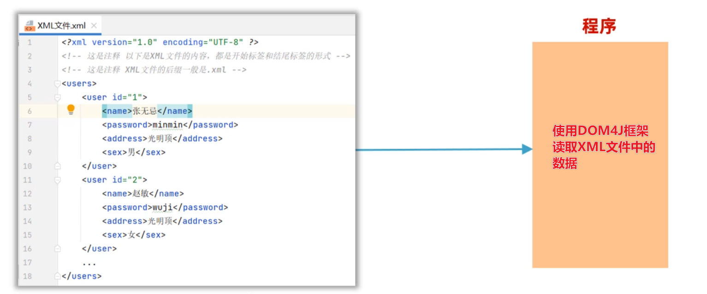

由于DOM4J是第三方提供的，所以需要把第三方提供的Jar包导入到自己的项目中来，才可以使用。具体步骤如下：


DOM4J解析XML文件的思想是：文档对象模型（意思是把整个XML文档、每一个标签、每一个属性都等都当做对象来看待）。Dowument对象表示真个XML文档、Element对象表示标签（元素）、Attribute对象表示属性、标签中的内容就是文本

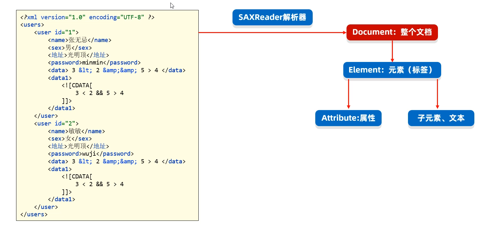

DOM4J解析XML需要用到的方法如下图所示


XML解析的过程，是从根元素开始，从外层往里层解析。 我们先把Document对象，和根元素获取出来

```java
public class Dom4JTest1 {
    public static void main(String[] args) throws Exception {
        // 1、创建一个Dom4J框架提供的解析器对象
        SAXReader saxReader = new SAXReader();

        // 2、使用saxReader对象把需要解析的XML文件读成一个Document对象。
        Document document =
                saxReader.read("properties-xml-log-app\\src\\helloworld.xml");

        // 3、从文档对象中解析XML文件的全部数据了
        Element root = document.getRootElement();
        System.out.println(root.getName());
    }
}
```

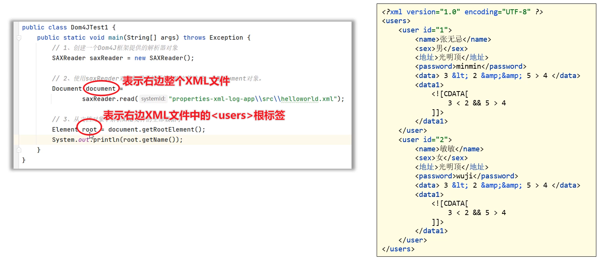 

### 2.3 XML解析2

获取到XML文件的根元素之后，接下来，就可以用根元素在获取到它里面的子元素（包括子标签、表属性等）。需要用到的方法如下图所示

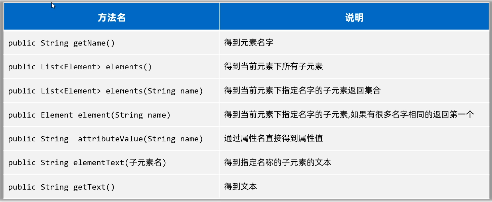

接下来，把上面的方法先一个一个的演示一下。

```java
public class Dom4JTest1 {
    public static void main(String[] args) throws Exception {
        // 1、创建一个Dom4J框架提供的解析器对象
        SAXReader saxReader = new SAXReader();

        // 2、使用saxReader对象把需要解析的XML文件读成一个Document对象。
        Document document =
                saxReader.read("properties-xml-log-app\\src\\helloworld.xml");

        // 3、从文档对象中解析XML文件的全部数据了
        Element root = document.getRootElement();
        System.out.println(root.getName());

        // 4、获取根元素下的全部一级子元素。
        // List<Element> elements = root.elements();
        List<Element> elements = root.elements("user");
        for (Element element : elements) {
            System.out.println(element.getName());
        }

        // 5、获取当前元素下的某个子元素。
        Element people = root.element("people");
        System.out.println(people.getText());

        // 如果下面有很多子元素user，默认获取第一个。
        Element user = root.element("user");
        System.out.println(user.elementText("name"));

        // 6、获取元素的属性信息呢？
        System.out.println(user.attributeValue("id"));
        Attribute id = user.attribute("id");
        System.out.println(id.getName());
        System.out.println(id.getValue());

        List<Attribute> attributes = user.attributes();
        for (Attribute attribute : attributes) {
            System.out.println(attribute.getName() + "=" + attribute.getValue());
        }

        // 7、如何获取全部的文本内容:获取当前元素下的子元素文本值
        System.out.println(user.elementText("name"));
        System.out.println(user.elementText("地址"));
        System.out.println(user.elementTextTrim("地址")); // 取出文本去除前后空格
        System.out.println(user.elementText("password"));

        Element data = user.element("data");
        System.out.println(data.getText());
        System.out.println(data.getTextTrim()); // 取出文本去除前后空格
    }
}
```


### 2.4 XML文件写入

在前面我们已经学习了XML解析，意思就是使用程序把XML文件中的数据读取出来。反过来能不能往XML文件中写入数据呢？ 答案是可以的。

DOM4J也提供了往XML文件中写标签的方法，但是用起来比较麻烦。这里不建议使用

我们自己使用StringBuilder按照标签的格式拼接，然后再使用BufferedWriter写到XML文件中去就可以了。

```java
public class Dom4JTest2 {
    public static void main(String[] args) {
        // 1、使用一个StringBuilder对象来拼接XML格式的数据。
        StringBuilder sb = new StringBuilder();
        sb.append("<?xml version=\"1.0\" encoding=\"UTF-8\" ?>\r\n");
        sb.append("<book>\r\n");
        sb.append("\t<name>").append("从入门到跑路").append("</name>\r\n");
        sb.append("\t<author>").append("dlei").append("</author>\r\n");
        sb.append("\t<price>").append(999.99).append("</price>\r\n");
        sb.append("</book>");

        try (
                BufferedWriter bw = new BufferedWriter(new FileWriter("properties-xml-log-app/src/book.xml"));
                ){
            bw.write(sb.toString());
        } catch (Exception e) {
            e.printStackTrace();
        }

    }
}
```

### 2.5 XML约束（了解）

各位小伙伴，关于XML还有最后一个知识需要大家了解一下。这个知识叫做约束XML文件的编写，我讲这个知识的目的是因为同学们以后在开发过程中会遇到这个知识，但是这个代码不需要大家写，了解一下就可以了。

**首先，说一些什么是XML约束？**

XML约束指的是限制XML文件中的标签或者属性，只能按照规定的格式写。

比如我在项目中，想约束一个XML文件中的标签只能写<书>、<书名>、<作者>、<售价>这几个标签，如果写其他标签就报错。

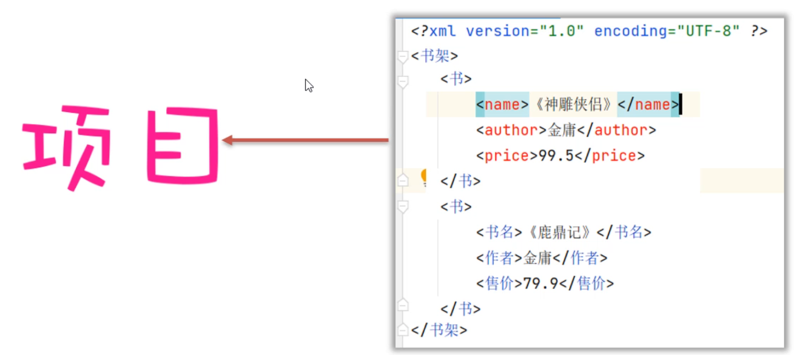


怎么才能达到上面的效果呢？有两种约束技术，一种是DTD约束、一种是Schame约束。

- DTD约束案例

  如下图所示book.xml中引入了DTD约束文件，book.xml文件中的标签就受到DTD文件的约束

  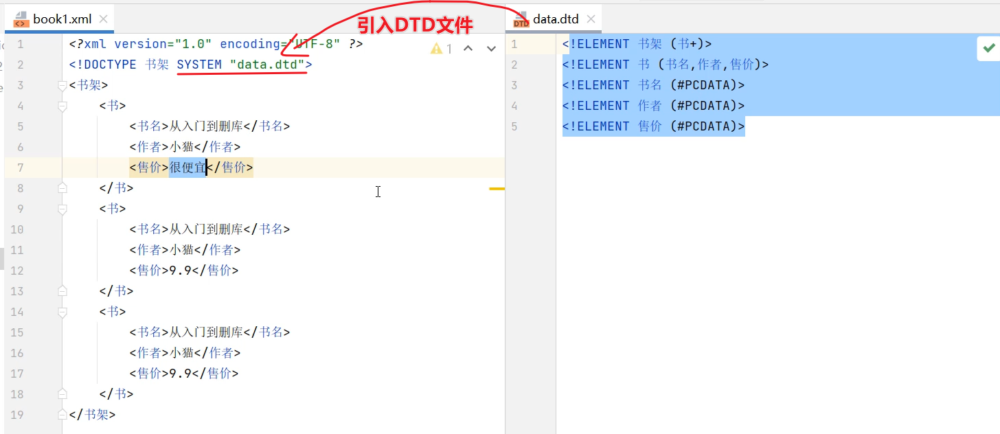

  DTD文件解释

  ```
  <!ELEMENT 书架(书+)>   表示根标签是<书架>，并且书架中有子标签<书>
  <!ELEMENT 书(书名、作者、售价)> 表示书是一个标签，且书中有子标签<书名>、<作者>、<售价>
  <!ELEMENT 书名(#PCDATA)>	表示<书名>是一个标签，且<书名>里面是普通文本
  <!ELEMENT 作者(#PCDATA)>	表示<作者>是一个标签，且<作者>里面是普通文本
  <!ELEMENT 售价(#PCDATA)>	表示<售价>是一个标签，且<售价>里面是普通文本
  ```

  

- Schame约束案例

  如下图所示，左边的book2.xml文件就受到右边schame文件（.xsd结尾的文件）的约束。

  

  

## 三、日志技术

### 3.1 日志概述

好的同学们，接下来我们学习一个将来我们会用到的一个技术，叫做日志技术。首先同学们肯定想知道什么是日志？

想搞清楚什么是日志，其实可以通过下面几个问题来了解的。

- 系统系统能记住某些数据被谁操作，比如被谁删除了？
- 想分析用户浏览系统的具体情况，比如挖掘用户的具体喜好？
- 当系统在开发中或者上线后出现了Bug，崩溃了，该通过什么去分析，定位Bug?

而日志就可以帮我们解决以上的问题。所以日志就好比生活中的日记，日记可以记录生活中的点点滴滴；而程序中的日志，通常就是一个文件，里面记录了程序运行过程中产生的各种数据。

日志技术有如下好处

1. 日志可以将系统执行的信息，方便的记录到指定位置，可以是控制台、可以是文件、可以是数据库中。
2. 日志可以随时以开关的形式控制启停，无需侵入到源代码中去修改。

### 3.2 日志的体系

在上一节给同学们介绍了，什么是日志，日志能干什么。接下来需要给同学们介绍一下有哪些日志技术，以及日志的体系。

大家注意了在行内，其实有很多日志框架给开发者使用。所谓日志框架就是由一些牛人或者第三方公司已经做好的实现代码，后来者就可以直接拿过去使用。

日志框架有很多种，比如有JUL（java.util.logging）、Log4j、logback等。但是这些日志框架如果使用的API方法都不一样的话，使用者的学习成本就很高。为了降低程序员的学习压力，行内提供了一套日志接口，然后所有的日志框架都按照日志接口的API来实现就可以了。

这样程序员只要会一套日志框架，那么其他的也就可以通过用，甚至可以在多套日志框架之间来回切换。比较常用的日志框架，和日志接口的关系如下图所示


**这里推荐同学们使用Logback日志框架，也在行业中最为广泛使用的。**

**Logback日志分为哪几个模块**

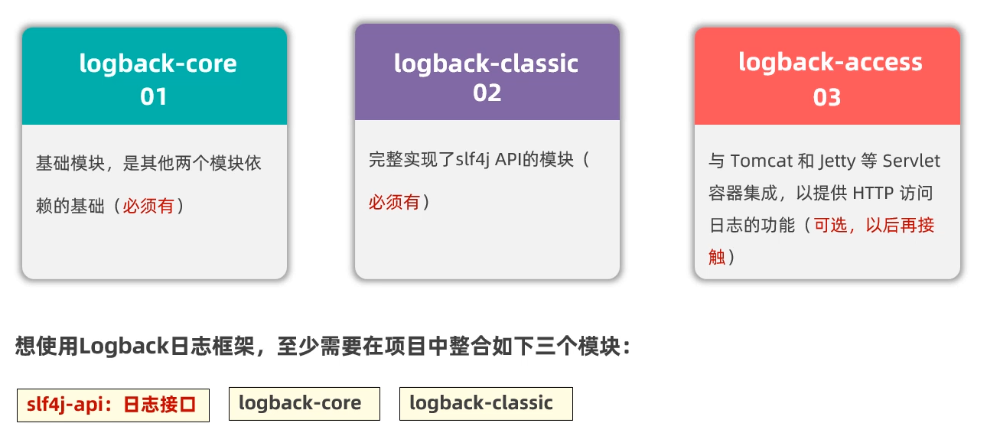


### 3.3 Logback快速入门

接下来，就带领同学们快速使用一下Logback日志框架，使用Logback记录几条日志信息到文件中去和将日志信息打印在控制台上。

由于Logback是第三方提供的技术，所以首先需要啊将Jar包引入到项目中，具体步骤如下

1. 在资料中找到`slftj-api.jar、logback-core.jar、logback-classes.jar` 这三个jar包，复制一下

2. 在当前模块下面新建一个lib文件夹，把刚刚复制的三个jar包都粘贴到此处

3. 从资料中找到`logback.xml`配置文件，将此文件复制粘贴到src目录下（必须是src目录）

4. 然后就可以开始写代码了，在代码中创建一个日志记录日对象

   ```java
   public static final Logger LOGGER = LoggerFactory.getLogger("当前类名");
   ```

5. 开始记录日志，代码如下

   ```java
   public class LogBackTest {
       // 创建一个Logger日志对象
       public static final Logger LOGGER = LoggerFactory.getLogger("LogBackTest");
   
       public static void main(String[] args) {
           //while (true) {
               try {
                   LOGGER.info("chu法方法开始执行~~~");
                   chu(10, 0);
                   LOGGER.info("chu法方法执行成功~~~");
               } catch (Exception e) {
                   LOGGER.error("chu法方法执行失败了，出现了bug~~~");
               }
           //}
       }
   
       public static void chu(int a, int b){
           LOGGER.debug("参数a:" + a);
           LOGGER.debug("参数b:" + b);
           int c = a / b;
           LOGGER.info("结果是：" + c);
       }
   }
   ```

当我们运行程序时，就可以看到控制台记录的日志


同时在文件中，也有一份这样的日志信息。文件在哪里内，从配置文件中去找


打开`D:/log/itheima-data.log`看一下文件中是否有记录日志吧！！


关于Logback的快速入门我们就做完了。至于日志的配置文件中，其他的配置是什么含义我们下一节再继续学习。


### 3.4 日志配置文件

Logback提供了一个核心配置文件logback.xml，日志框架在记录日志时会读取配置文件中的配置信息，从而记录日志的形式。具体可以做哪些配置呢？

```java
1. 可以配置日志输出的位置是文件、还是控制台
2. 可以配置日志输出的格式
3. 还可以配置日志关闭和开启、以及哪些日志输出哪些日志不输出。
```

- **如下图所示，控制日志往文件中输出，还是往控制台输出**

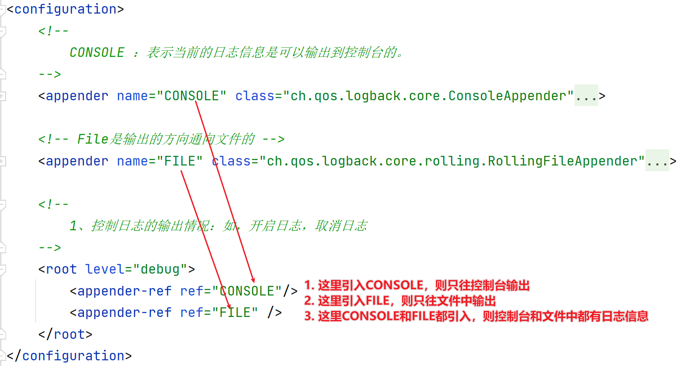

- **如下图所示，控制打开和关闭日志**


- **如下图所示，控制日志的输出的格式**

  日志格式是由一些特殊的符号组成，可以根据需要删减不想看到的部分。比如不想看到线程名那就不要[%thread]。但是不建议同学们更改这些格式，因为这些都是日志很基本的信息。


### 3.5 配置日志级别


- 在哪里配置日志级别呢？如下图所示


- Logback只输出大于或者等于核心配置文件配置的日志级别信息。小于配置级别的日志信息，不被记录。

  ```java
  配置的是trace，则trace、debug、info、warn、error级别的日志都被输出
  配置的是debug, 则debug、info、warn、error级别的日志被输出
  配置的是info,则info、warn、error级别的日志被输出
  ...
  ```

  

## 三、多线程

同学们，接下来我们来学习一个全新而且非常重要的知识，叫做多线程。首先和同学们聊聊什么是线程？**线程其实是程序中的一条执行路径。**

 我们之前写过的程序，其实都是单线程程序，如下图代码，如果前面的for循环没有执行完，for循环下面的代码是不会执行的。

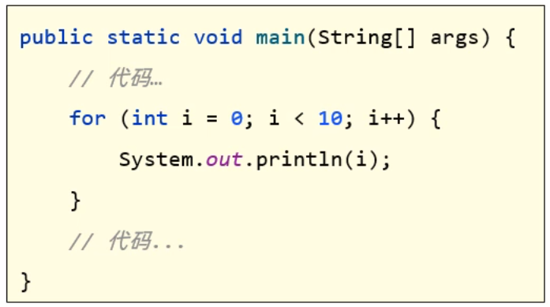

**怎样的程序才是多线程程序呢？** 如下图所示，12306网站就是支持多线程的，因为同时可以有很多人一起进入网站购票，而且每一个人互不影响。再比如百度网盘，可以同时下载或者上传多个文件。这些程序中其实就有多条执行路径，每一条执行执行路径就是一条线程，所以这样的程序就是多线程程序。


认识了什么是多线程程序，那如何使用Java创建线程呢？ Java提供了几种创建线程的方式，下一节再一种一种的学习。

### 4.1 线程创建方式1

Java为开发者提供了一个类叫做Thread，此类的对象用来表示线程。创建线程并执行线程的步骤如下

```java
1.定义一个子类继承Thread类，并重写run方法
2.创建Thread的子类对象
3.调用start方法启动线程（启动线程后，会自动执行run方法中的代码）
```

代码如下

```java
public class MyThread extends Thread{
    // 2、必须重写Thread类的run方法
    @Override
    public void run() {
        // 描述线程的执行任务。
        for (int i = 1; i <= 5; i++) {
            System.out.println("子线程MyThread输出：" + i);
        }
    }
}
```

再定义一个测试类，在测试类中创建MyThread线程对象，并启动线程

```java
public class ThreadTest1 {
    // main方法是由一条默认的主线程负责执行。
    public static void main(String[] args) {
        // 3、创建MyThread线程类的对象代表一个线程
        Thread t = new MyThread();
        // 4、启动线程（自动执行run方法的）
        t.start(); 

        for (int i = 1; i <= 5; i++) {
            System.out.println("主线程main输出：" + i);
        }
    }
}
```

打印结果如下图所示，我们会发现MyThread和main线程在相互抢夺CPU的执行权（**注意：哪一个线程先执行，哪一个线程后执行，目前我们是无法控制的，每次输出结果都会不一样**）

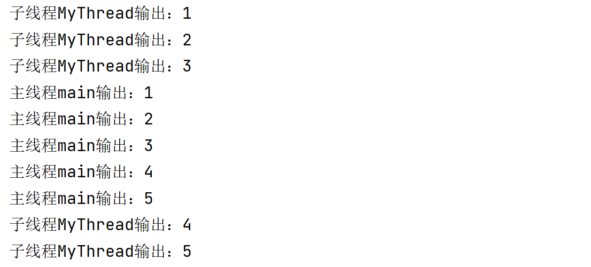

**最后我们还需要注意一点**：不能直接去调用run方法，如果直接调用run方法就不认为是一条线程启动了，而是把Thread当做一个普通对象，此时run方法中的执行的代码会成为主线程的一部分。此时执行结果是这样的。


### 4.2 线程创建方式2

接下来我们学习线程的第二种创建方式。Java为开发者提供了一个Runnable接口，该接口中只有一个run方法，意思就是通过Runnable接口的实现类对象专门来表示线程要执行的任务。具体步骤如下

```java
1.先写一个Runnable接口的实现类，重写run方法(这里面就是线程要执行的代码)
2.再创建一个Runnable实现类的对象
3.创建一个Thread对象，把Runnable实现类的对象传递给Thread
4.调用Thread对象的start()方法启动线程（启动后会自动执行Runnable里面的run方法）
```

代码如下：先准备一个Runnable接口的实现类

```java
/**
 * 1、定义一个任务类，实现Runnable接口
 */
public class MyRunnable implements Runnable{
    // 2、重写runnable的run方法
    @Override
    public void run() {
        // 线程要执行的任务。
        for (int i = 1; i <= 5; i++) {
            System.out.println("子线程输出 ===》" + i);
        }
    }
}
```

再写一个测试类，在测试类中创建线程对象，并执行线程

```java
public class ThreadTest2 {
    public static void main(String[] args) {
        // 3、创建任务对象。
        Runnable target = new MyRunnable();
        // 4、把任务对象交给一个线程对象处理。
        //  public Thread(Runnable target)
        new Thread(target).start();

        for (int i = 1; i <= 5; i++) {
            System.out.println("主线程main输出 ===》" + i);
        }
    }
}
```

运行上面代码，结果如下图所示**（注意：没有出现下面交替执行的效果，也是正常的）**

```java
主线程main输出 ===》1
主线程main输出 ===》2
主线程main输出 ===》3
子线程输出 ===》1
子线程输出 ===》2
子线程输出 ===》3
子线程输出 ===》4
子线程输出 ===》5
主线程main输出 ===》4
主线程main输出 ===》5
```


### 4.3 线程创建方式2—匿名内部类

同学们注意了，现在这种写法不是新知识。只是将前面第二种方式用匿名内部类改写一下。因为同学们在看别人写的代码时，有可能会看到这种写法。你知道是怎么回事就可以了。

刚刚我们学习的第二种线程的创建方式，需要写一个Runnable接口的实现类，然后再把Runnable实现类的对象传递给Thread对象。

**现在我不想写Runnable实现类，于是可以直接创建Runnable接口的匿名内部类对象，传递给Thread对象。**

代码如下

```java
public class ThreadTest2_2 {
    public static void main(String[] args) {
        // 1、直接创建Runnable接口的匿名内部类形式（任务对象）
        Runnable target = new Runnable() {
            @Override
            public void run() {
                for (int i = 1; i <= 5; i++) {
                    System.out.println("子线程1输出：" + i);
                }
            }
        };
        new Thread(target).start();

        // 简化形式1：
        new Thread(new Runnable() {
            @Override
            public void run() {
                for (int i = 1; i <= 5; i++) {
                    System.out.println("子线程2输出：" + i);
                }
            }
        }).start();

        // 简化形式2：
        new Thread(() -> {
                for (int i = 1; i <= 5; i++) {
                    System.out.println("子线程3输出：" + i);
                }
        }).start();

        for (int i = 1; i <= 5; i++) {
            System.out.println("主线程main输出：" + i);
        }
    }
}
```


### 4.4 线程的创建方式3

接下来，我们学习线程的第三种创建方式。已经有两种了为什么还有要第三种呢？ 这样，我们先分析一下前面两种都存在的一个问题。然后再引出第三种可以解决这个问题。

- 假设线程执行完毕之后有一些数据需要返回，前面两种方式重写的run方法均没有返回结果。

  ```java
  public void run(){
      ...线程执行的代码...
  }
  ```

- JDK5提供了Callable接口和FutureTask类来创建线程，它最大的优点就是有返回值。

  在Callable接口中有一个call方法，重写call方法就是线程要执行的代码，它是有返回值的

  ```java
  public T call(){
      ...线程执行的代码...
      return 结果;
  }
  ```

**第三种创建线程的方式，步骤如下**

```java
1.先定义一个Callable接口的实现类，重写call方法
2.创建Callable实现类的对象
3.创建FutureTask类的对象，将Callable对象传递给FutureTask
4.创建Thread对象，将Future对象传递给Thread
5.调用Thread的start()方法启动线程(启动后会自动执行call方法)
   等call()方法执行完之后，会自动将返回值结果封装到FutrueTask对象中
   
6.调用FutrueTask对的get()方法获取返回结果
```

代码如下：先准备一个Callable接口的实现类

```java
/**
 * 1、让子类继承Thread线程类。
 */
public class MyThread extends Thread{
    // 2、必须重写Thread类的run方法
    @Override
    public void run() {
        // 描述线程的执行任务。
        for (int i = 1; i <= 5; i++) {
            System.out.println("子线程MyThread输出：" + i);
        }
    }
}
```

再定义一个测试类，在测试类中创建线程并启动线程，还要获取返回结果

```java
public class ThreadTest3 {
    public static void main(String[] args) throws Exception {
        // 3、创建一个Callable的对象
        Callable<String> call = new MyCallable(100);
        // 4、把Callable的对象封装成一个FutureTask对象（任务对象）
        // 未来任务对象的作用？
        // 1、是一个任务对象，实现了Runnable对象.
        // 2、可以在线程执行完毕之后，用未来任务对象调用get方法获取线程执行完毕后的结果。
        FutureTask<String> f1  = new FutureTask<>(call);
        // 5、把任务对象交给一个Thread对象
        new Thread(f1).start();


        Callable<String> call2 = new MyCallable(200);
        FutureTask<String> f2  = new FutureTask<>(call2);
        new Thread(f2).start();


        // 6、获取线程执行完毕后返回的结果。
        // 注意：如果执行到这儿，假如上面的线程还没有执行完毕
        // 这里的代码会暂停，等待上面线程执行完毕后才会获取结果。
        String rs = f1.get();
        System.out.println(rs);

        String rs2 = f2.get();
        System.out.println(rs2);
    }
}
```


