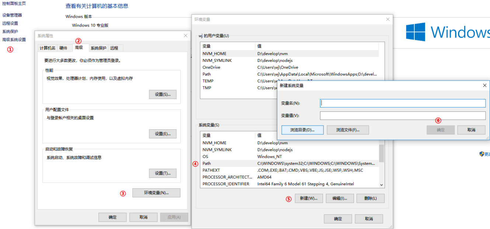
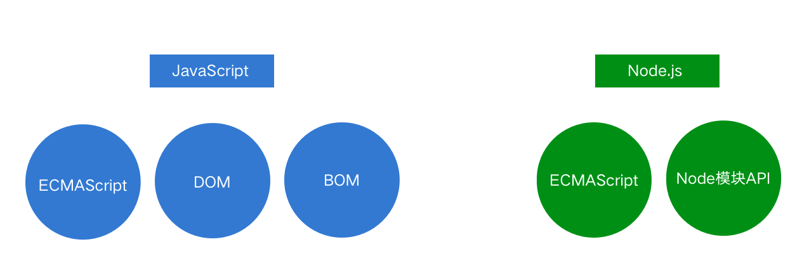

[TOC]

---

# [Node.js 基础](https://nodejs.jakeyu.top)

## 1. Node开发概述

http://javascript.ruanyifeng.com/nodejs/npm.html

[node.js 学习网站node.js 基础教程](https://nodejs.jakeyu.top)

### 1.1 为什么要学习服务器端开发基础

- 能够和后端程序员更加紧密的配合
- 网站业务逻辑前置，学习前端技术需要后端技术支撑（Ajax）
- 扩宽知识视野，能够站在更高的角度审视整个项目

### 1.2 服务器端开发要做的事情

- 实现网站的业务逻辑
- 数据的增删改查

### 1.3 为什么选择Node

- 使用JavaScript语法开发后端应用
- 一些公司要求前端工程师掌握Node开发
- 生态系统活跃，有大量开源库可以使用
- 前端开发工具大多基于Node开发

### 1.4 Node是什么

- [Node](http://nodejs.cn/download/)是一个基于Chrome V8引擎的JavaScript代码运行环境。

### 1.5 运行环境

- 浏览器（软件）能够运行JavaScript代码，浏览器就是JavaScript代码的运行环境
- Node（软件）能够运行JavaScript代码，Node就是JavaScript代码的运行环境

## 2. Node运行环境搭建 

### 2.1 Node.js运行环境安装 

- [官网：https://nodejs.org/en/](https://nodejs.org/en/)
- LTS = Long Term Support 长期支持版 稳定版
- Current 拥有最新特性 实验版

### 2.2 Node环境安装失败解决办法 

-	1. 错误代号2502、2503
	- 失败原因: 系统账户权限不足;
	- 解决方法:
		- 以管理员身份运行`powershell`命令行工具
		- 输入运行安装包命令 `msiexec /package node`安装包位置

	
- 2. 执行命令报错
	- 失败原因：Node安装目录写入环境变量失败
	- 解决办法：将Node安装目录添加到环境变量中

### 2.3 PATH环境变量 (Windows 系统添加方法)

- 存储系统中的目录，在命令行中执行命令的时候系统会自动去这些目录中查找命令的位置。

## 3. Node.js快速入门

### 3.1 Node.js 的组成

- JavaScript 由三部分组成，ECMAScript，DOM，BOM。
- Node.js是由ECMAScript及Node 环境提供的一些附加API组成的，包括文件、网络、路径等等一些更加强大的 API。

### 3.2 Node.js基础语法

- 所有ECMAScript语法在Node环境中都可以使用。
- 在Node环境下执行代码，使用Node命令执行后缀为.js的文件即可

### 3.3 Node.js全局对象global

- 在浏览器中全局对象是window，在Node中全局对象是global。
- Node中全局对象下有以下方法，可以在任何地方使用，global可以省略。
	- `console.log()`     在控制台中输出
	- `setTimeout()`     设置超时定时器
	- `clearTimeout()`  清除超时时定时器
	- `setInterval()`      设置间歇定时器
	- `clearInterval()`   清除间歇定时器

### 4. Node 服务器运行

- 终端进入 `node.js` 对应文件夹
- 在终端中输入 `node 文件.js` 即可启动服务器(前提是在post 端口没有被占用)
- 或者可以在终端中输入 `nodemon 文件.js` , 如果是 项目一般有index.js, 则可以直接用`node`或者`nodemon` 即可;
- 停止node 服务器
	- `ps -ef | grep node`
	- `kill  id` (id 是端口号)