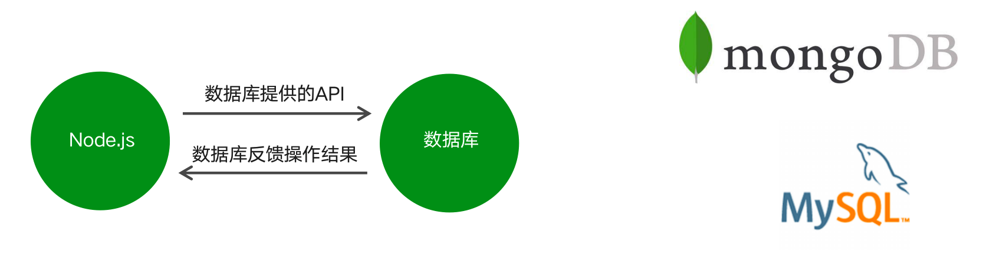
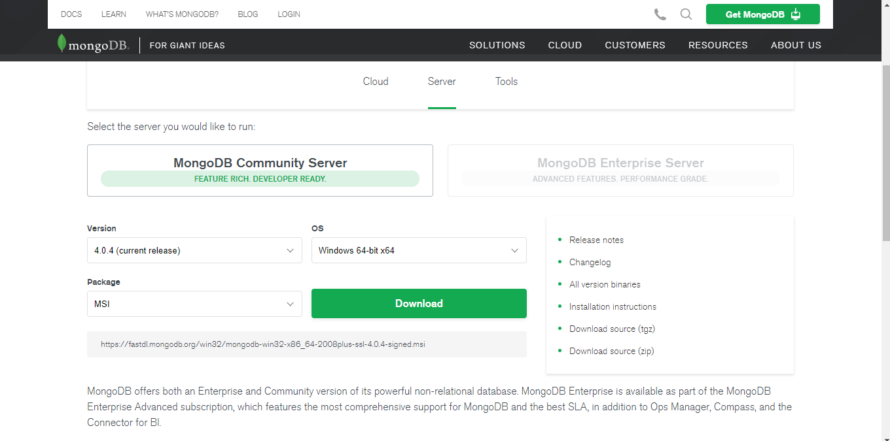
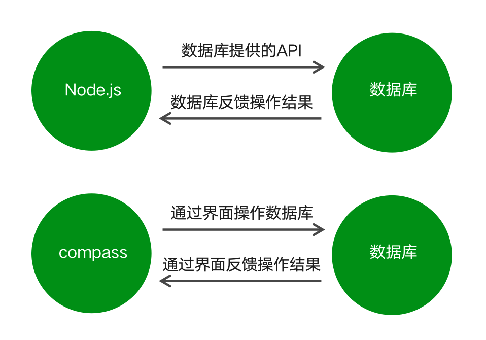
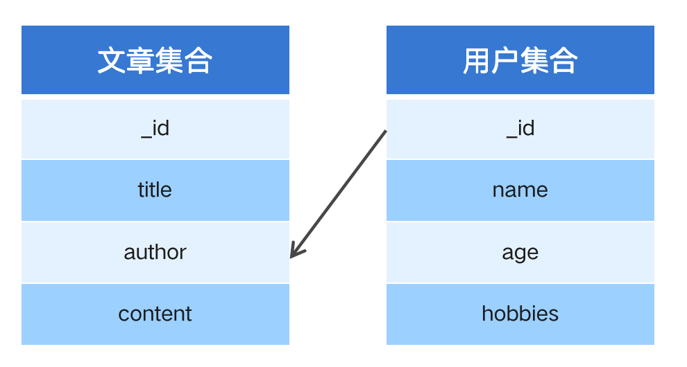

[TOC]

---

# MongoDB数据库

## 1. 数据库概述及环境搭建

### 1.1 为什么要使用数据库

> 动态网站中的数据都是存储在数据库中的
> 数据库可以用来持久存储客户端通过表单收集的用户信息
> 数据库软件本身可以对数据进行高效的管理

[http://www.czxy.com/article?id=1](http://www.czxy.com/article?id=1)
[http://www.czxy.com/article?id=2](http://www.czxy.com/article?id=2)

### 1.2 什么是数据库

- 数据库即存储数据的仓库，可以将数据进行有序的分门别类的存储。它是独立于语言之外的软件，可以通过API去操作它。
- 常见的数据库软件有：mysql、mongoDB、oracle。



### 1.3 MongoDB数据库下载安装

[下载地址：https://www.mongodb.com/download-center/community](https://www.mongodb.com/download-center/community)




### 1.4 MongoDB可视化软件

- MongoDB可视化操作软件，是使用图形界面操作数据库的一种方式。



### 1.5 数据库相关概念

- 在一个数据库软件中可以包含多个数据仓库，在每个数据仓库中可以包含多个数据集合，每个数据集合中可以包含多条文档（具体的数据）。

|术语| 解释说明| 备注|
|:---|:----|:----|
|**database**|数据库，mongoDB数据库软件中可以建立多个数据库 ||
|**collection**|集合，一组数据的集合，可以理解为JavaScript中的数组||
|**document**|文档，一条具体的数据，可以理解为JavaScript中的对象||
|**field**|字段，文档中的属性名称，可以理解为JavaScript中的对象属性||

### 1.6 Mongoose第三方包

- 使用Node.js操作MongoDB数据库需要依赖Node.js第三方包mongoose
- 使用npm install mongoose命令下载

### 1.7 启动MongoDB

- 在命令行工具中运行net start mongoDB即可启动MongoDB，否则MongoDB将无法连接。

### 1.8 数据库连接

- 使用mongoose提供的connect方法即可连接数据库。

```js
 mongoose.connect('mongodb://localhost/playground')
     .then(() => console.log('数据库连接成功'))
     .catch(err => console.log('数据库连接失败', err));
```

### 1.9 创建数据库

- 在MongoDB中不需要显式创建数据库，如果正在使用的数据库不存在，MongoDB会自动创建。

## 2. MongoDB增删改查操作

### 2.1 创建集合

- 创建集合分为两步，一是对对集合设定规则，二是创建集合，创建mongoose.Schema构造函数的实例即可创建集合。

```js
  // 设定集合规则
 const courseSchema = new mongoose.Schema({
     name: String,
     author: String,
     isPublished: Boolean
 });
  // 创建集合并应用规则
 const Course = mongoose.model('Course', courseSchema); // courses
```

### 2.2 创建文档

- 创建文档实际上就是向集合中插入数据。
- 分为两步：
	- 创建集合实例。
	- 调用实例对象下的save方法将数据保存到数据库中。

```js
  // 创建集合实例
 const course = new Course({
     name: 'Node.js course',
     author: '黑马讲师',
     tags: ['node', 'backend'],
     isPublished: true
 });
  // 将数据保存到数据库中
 course.save();
```

```js
Course.create({name: 'JavaScript基础', author: '黑马讲师', isPublish: true}, (err, doc) => { 
     //  错误对象
    console.log(err)
     //  当前插入的文档
    console.log(doc)
});
```

```js
Course.create({name: 'JavaScript基础', author: '黑马讲师', isPublish: true})
      .then(doc => console.log(doc))
      .catch(err => console.log(err))
```

### 2.3 mongoDB数据库导入数据

- `mongoimport` `–d` `数据库名称` `–c` `集合名称` `–file` `要导入的数据文件`
- 找到mongodb数据库的安装目录，将安装目录下的bin目录放置在环境变量中。

### 2.4 查询文档

```js
//  根据条件查找文档（条件为空则查找所有文档）
Course.find().then(result => console.log(result))
```

```js
// 返回文档集合
[{
    _id: 5c0917ed37ec9b03c07cf95f,
    name: 'node.js基础',
    author: '黑马讲师‘
},{
     _id: 5c09dea28acfb814980ff827,
     name: 'Javascript',
     author: '黑马讲师‘
}]
```

```js
//  根据条件查找文档
Course.findOne({name: 'node.js基础'}).then(result => console.log(result))
```

```js
// 返回文档
 {
    _id: 5c0917ed37ec9b03c07cf95f,
    name: 'node.js基础',
    author: '黑马讲师‘
}
```

```js
 //  匹配大于 小于
 User.find({age: {$gt: 20, $lt: 50}}).then(result => console.log(result))
```

```js
 //  匹配包含
 User.find({hobbies: {$in: ['敲代码']}}).then(result => console.log(result))
```

```js
 //  选择要查询的字段 'name' 和'email' 多个空格用逗号隔开  如果不需要被查询的字段
// 则在字段前面 加上 `-` 比如: `_id` 是默认被查出来的, 写 `-_id` 就能不查询 `_id`;	``  
 User.find().select('name email').then(result => console.log(result))
```

```js
 // 将数据按照年龄进行排序 默认是按照升序排序, 在前面添加一个 `-` 则会倒序(降序);
 User.find().sort('age').then(result => console.log(result))
```

```js
 //  skip 跳过多少条数据  limit 限制查询数量, 这两个配合使用可以用做分页
 User.find().skip(2).limit(2).then(result => console.log(result))
```

### 2.5 删除文档

```js
 // 删除单个 , 查询条件是个对象, 并且默认删除被查到的第一条
 // 比如要查询 {_id: xxx} 这个条件
 //  result 返回值是 被删除的文档
Course.findOneAndDelete({}).then(result => console.log(result))
```

```js
 // 删除多个
 // 条件参数可以是空对象, 如果是空对象 则删除所有文档
 // result 返回值 有两个属性 ok: 1 表示删除成功, n: 的值表示删除数据数量
User.deleteMany({}).then(result => console.log(result))
```

### 2.6 更新文档

```js
// 更新单个
// 只更新集合中第一条符合条件的数据
User.updateOne({查询条件}, {要修改的值}).then(result => console.log(result))
```

```js
// 更新多个
// 查询条件如果是空对象, 则标识修改所有数据
User.updateMany({查询条件}, {要更改的值}).then(result => console.log(result))
```

### 2.7 mongoose验证

- 在创建集合规则时，可以设置当前字段的验证规则，验证失败就则输入插入失败。
	- `required`: true 必传字段
	- `minlength`：3 字符串最小长度
	- `maxlength`: 20 字符串最大长度
	- `min`: 2 数值最小为2
	- `max`: 100 数值最大为100
	- `enum`: 自定义枚举, 比如:`['html', 'css', 'javascript', 'node.js']`
	- `trim`: `true` 去除字符串两边的空格
	- `validate`: 自定义验证器
	- `default`: 默认值

- 获取错误信息：error.errors['字段名称'].message

### 2.8 集合关联

- 通常不同集合的数据之间是有关系的，例如文章信息和用户信息存储在不同集合中，但文章是某个用户发表的，要查询文章的所有信息包括发表用户，就需要用到集合关联。

- 使用id对集合进行关联
- 使用populate方法进行关联集合查询



- **集合关联实现**

```js
// 用户集合
const User = mongoose.model('User', new mongoose.Schema({ name: { type: String } })); 
// 文章集合
const Post = mongoose.model('Post', new mongoose.Schema({
    title: { type: String },
    // required 第一个参数 true 表示必传, 第二个参数表示 自定义错误信息
    required: [true, '请输入文章标题'],
    // 使用ID将文章集合和作者集合进行关联
    author: { type: mongoose.Schema.Types.ObjectId, ref: 'User' }
}));
//联合查询
Post.find()
      .populate('author')
      .then((err, result) => console.log(result));
```

### 2.9 案例：用户信息增删改查

- 搭建网站服务器，实现客户端与服务器端的通信
- 连接数据库，创建用户集合，向集合中插入文档
- 当用户访问/list时，将所有用户信息查询出来
- 将用户信息和表格HTML进行拼接并将拼接结果响应回客户端
- 当用户访问/add时，呈现表单页面，并实现添加用户信息功能
- 当用户访问/modify时，呈现修改页面，并实现修改用户信息功能
- 当用户访问/delete时，实现用户删除功能


