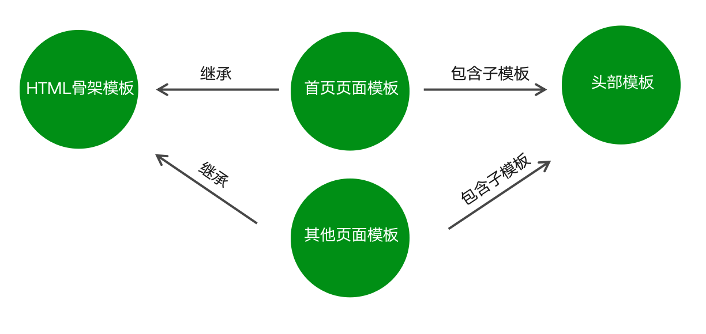
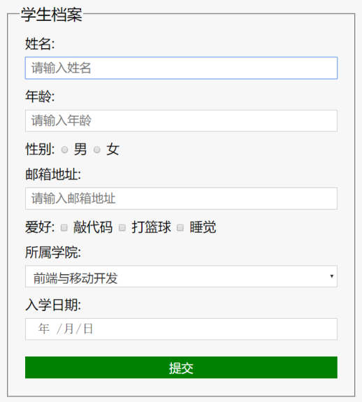
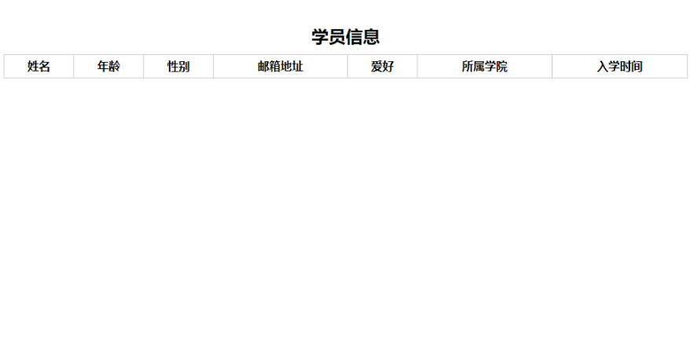

[TOC]

---

# 模板引擎artTemplate

## 1.  模板引擎的基础概念

### 1.1 模板引擎

- 模板引擎是第三方模块。
- 让开发者以更加友好的方式拼接字符串，使项目代码更加清晰、更加易于维护。

```js
 // 未使用模板引擎的写法
 var ary = [{ name: '张三', age: 20 }];
 var str = '<ul>';
 for (var i = 0; i < ary.length; i++) { 
    str += '<li>\
        <span>'+ ary[i].name +'</span>\
        <span>'+ ary[i].age +'</span>\
    </li>';
 }
 str += '</ul>'; 
```

```js
 <!-- 使用模板引擎的写法 --> 
 <ul>
    {{each ary}}
        <li>{{$value.name}}</li>
        <li>{{$value.age}}</li>
    {{/each}}
 </ul>
```

### 1.2 art-template模板引擎

- 在命令行工具中使用 `npm install art-template` 命令进行下载
- 使用`const template = require('art-template')`引入模板引擎
- 告诉模板引擎要拼接的数据和模板在哪 `const html = template(‘模板路径’, 数据)`;
- 使用模板语法告诉模板引擎，模板与数据应该如何进行拼接 


 ###  1.3 art-template代码示例

 ```js
  // 导入模板引擎模块
 const template = require('art-template');
 // 将特定模板与特定数据进行拼接
 const html = template('./views/index.art',{
    data: {
        name: '张三',
        age: 20
    }
 }); 
 ```

```js
 <div>
    <span>{{data.name}}</span>
    <span>{{data.age}}</span>
 </div>
```

## 2. 模板引擎的语法

### 2.1 模板语法

- art-template同时支持两种模板语法：标准语法和原始语法。
- 标准语法可以让模板更容易读写，原始语法具有强大的逻辑处理能力。
- 标准语法：` {{ 数据 }}`
- 原始语法：`<%=数据  %>`

### 2.2 输出

- 将某项数据输出在模板中，标准语法和原始语法如下：
- 标准语法：`{{ 数据 }}`
- 原始语法：`<%=数据 %>`

```js
  <!-- 标准语法 -->
 <h2>{{value}}</h2>
 <h2>{{a ? b : c}}</h2>
 <h2>{{a + b}}</h2>

  <!-- 原始语法 -->
 <h2><%= value %></h2>
 <h2><%= a ? b : c %></h2>
 <h2><%= a + b %></h2>
```

### 2.3 原文输出

- 如果数据中携带HTML标签，默认模板引擎不会解析标签，会将其转义后输出。
- 标准语法：`{{@ 数据 }}`
- 原始语法：`<%-数据 %>`

```js
 <!-- 标准语法 -->
 <h2>{{@ value }}</h2>
 <!-- 原始语法 -->
 <h2><%- value %></h2>
```

### 2.4 条件判断

```js
 <!-- 标准语法 --> 
 {{if 条件}} ... {{/if}}
 {{if v1}} ... {{else if v2}} ... {{/if}}
 <!-- 原始语法 -->
 <% if (value) { %> ... <% } %>
 <% if (v1) { %> ... <% } else if (v2) { %> ... <% } %>
```

### 2.5 循环

- 标准语法：`{{each 数据}} {{/each}}`
- 原始语法：`<% for() { %> <% } %>`

```js
 <!-- 标准语法 -->
 {{each target}}
     {{$index}} {{$value}}
 {{/each}}
  <!-- 原始语法 -->
 <% for(var i = 0; i < target.length; i++){ %>
     <%= i %> <%= target[i] %>
 <% } %>
```

### 2.6 子模版

- 使用子模板可以将网站公共区块(头部、底部)抽离到单独的文件中。
- 标准语法：`{{include '模板'}}`
- 原始语法：`<%include('模板') %>`

```js
  <!-- 标准语法 -->
 {{include './header.art'}}
  <!-- 原始语法 -->
 <% include('./header.art') %>
```

### 2.7 模板继承

- 使用模板继承可以将网站HTML骨架抽离到单独的文件中，其他页面模板可以继承骨架文件。



| 序号| 名称| |名称|
|:---:  |:-----|---| :----|
|1 | 坑一: 填充 css 内容   || 填充: main.css|
|2 | 坑二: 填充 js 内容   || 填充: index.js |
|3 | 坑三: 填充 页面主题内容  || 填充: `<p>Hello</p>` |

### 2.8 模板继承示例

```js
 <!doctype html>
 <html>
     <head>
         <meta charset="utf-8">
         <title>HTML骨架模板</title>
         {{block 'head'}}{{/block}}
     </head>
     <body>
         {{block 'content'}}{{/block}}
     </body>
 </html>
```

```js
 <!--index.art 首页模板-->
 {{extend './layout.art'}}
 {{block 'head'}} <link rel="stylesheet" href="custom.css"> {{/block}}
 {{block 'content'}} <p>This is just an awesome page.</p> {{/block}}
```

### 2.9 模板配置

- 向模板中导入变量 template.defaults.imports.变量名 = 变量值;
- 设置模板根目录 template.defaults.root = 模板目录
- 设置模板默认后缀 template.defaults.extname = '.art'

## 3. 案例

### 3.1 案例介绍 – 学生档案管理

- **目标**：模板引擎应用，强化node.js项目制作流程。
- **知识点**：http请求响应、数据库、模板引擎、静态资源访问。





### 3.2 制作流程

- 建立项目文件夹并生成项目描述文件
- 创建网站服务器实现客户端和服务器端通信
- 连接数据库并根据需求设计学员信息表
- 创建路由并实现页面模板呈递
- 实现静态资源访问
- 实现学生信息添加功能
- 实现学生信息展示功能

### 3.3 第三方模块 router

- 功能：实现路由
- 使用步骤：
	- 获取路由对象
	- 调用路由对象提供的方法创建路由
	- 启用路由，使路由生效

```js
const getRouter = require('router')
const router = getRouter();
router.get('/add', (req, res) => {
    res.end('Hello World!')
}) 
server.on('request', (req, res) => {
    router(req, res)
})
```

### 3.4 第三方模块 serve-static

- 功能：实现静态资源访问服务
- 步骤：
	- 引入serve-static模块获取创建静态资源服务功能的方法
	- 调用方法创建静态资源服务并指定静态资源服务目录
	- 启用静态资源服务功能


```js
const serveStatic = require('serve-static')
const serve = serveStatic('public')
server.on('request', () => { 
    serve(req, res)
})
server.listen(3000)
```

### 3.5 添加学生信息功能步骤分析

- 在模板的表单中指定请求地址与请求方式
- 为每一个表单项添加name属性
- 添加实现学生信息功能路由
- 接收客户端传递过来的学生信息
- 将学生信息添加到数据库中
- 将页面重定向到学生信息列表页面

### 3.6 学生信息列表页面分析

- 从数据库中将所有的学生信息查询出来
- 通过模板引擎将学生信息和HTML模板进行拼接
- 将拼接好的HTML模板响应给客户端

