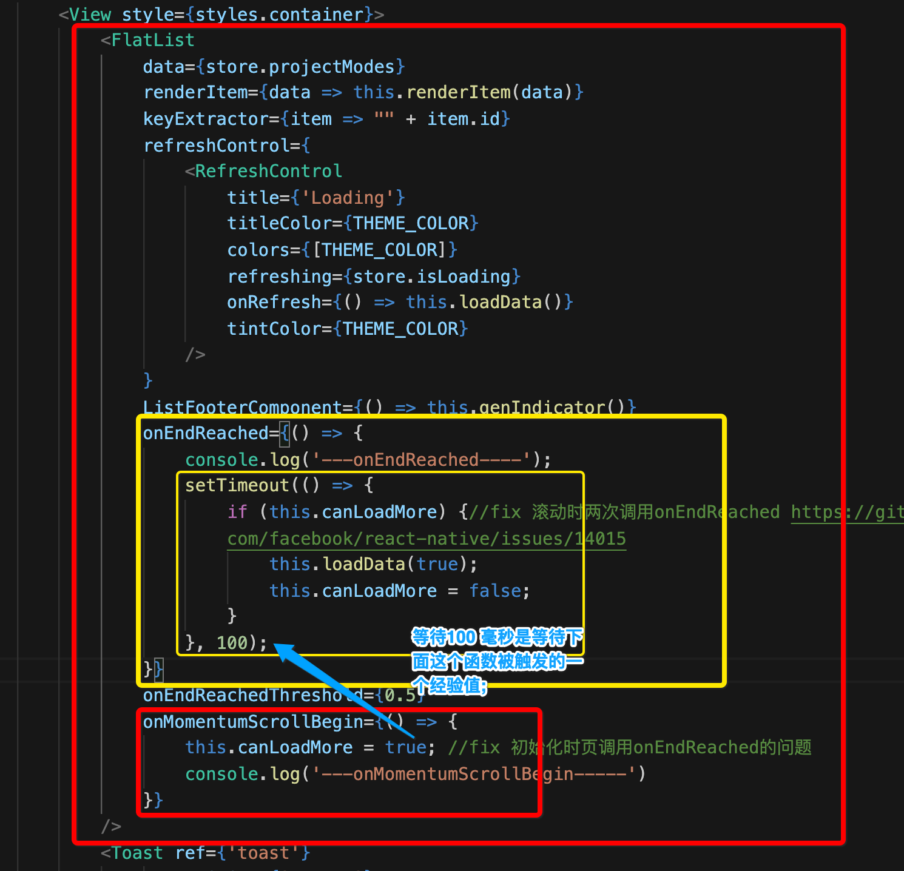

[toc]

---

# 问题

## 1. 在 React Native中connect需要配合export使用吗? 在一个JS 文件中可以多次使用connect吗?

```
connect 不一定非要绑定export,需要根据连接的React 组件而定，如果连接的组件是根组件，用于界面显示的组件，则需要使用export,否则不用。
```

## 2. 你觉的一个组件在订阅store中的数据时需要注意哪些点?

```
state树中包含很多状态属性，组件在订阅state时候值关心自身相关属性，尽量避免不相关属性的订阅，主要为了防止render 被频繁调用刷新
```

## 3. action如何与调用页面进行交互?

```
首先自定义action事件类型，然后定义action事件 所需要的属性，然后调用页面通过mapDispatchToProps函数关联action事件，最后调用dispatch函数发送action 事件
```

## 4. FlatList上拉加载更多, 使用onEndReached时有哪些需要注意的呢?

```
onEndReached 在页面加载时候为自动调用一次，每次滑动时候回多调用一次，所以需要确保保证页面滑动到底部时候再执行onEndReached 中所需要执行的逻辑;
```
- `onEndReached` 方法可以得到用户在上拉操作, 并且此时已经到底;
- 但`onEndReached` 方法可能被多次调用, 导致其中代码块被多次执行 (因为ios中有一个回弹效果, 如果禁止回弹效果可能就不会出现多次调用);
- 这里用到 `onMomentumScrollBegin` 这个是表示用户正在滚动交互的方法, 在 `onMomentumScrollBegin` 方法中添加一个开关变量, 并且在 `onEndReached` 方法中对这个开关变量做判断, 避免以上问题(多次被调用执行);
  - 但是 `onMomentumScrollBegin` 可能延迟执行导致开关变量未被开启, 因此需要在 `onEndReached` 方法中添加一个延时等待, 其中等待的时间根据经验值 100毫秒, 这样避免 `onMomentumScrollBegin` 延迟执行导致 `onEndReached` 方法中代码块无法被执行;



## 5. 当Store中节点不定时, 你应该如何动态的设置store和动态获取store?

```
store 节点不定时，可以使用Map的形式,key的值为不固定，可以使用变量形式替代
```

## 6. 如果多个列表的Item用很多公用的代码, 应该如何封装代码来做到代码的最大程度复用呢?

```
抽取组件代码, 单独成为一个文件, 后续可以通过继承, 将父类代码更大程度上做到复用;
```

## 7. 如何设计state树设计呢?

```
state树设计主要可以页面结构进行设计，如果在多tab页的页面中，可以按照tab页的titile为key,tab页内容为value来设计state,或者可以按照接口返回的json格式进行设计
```

