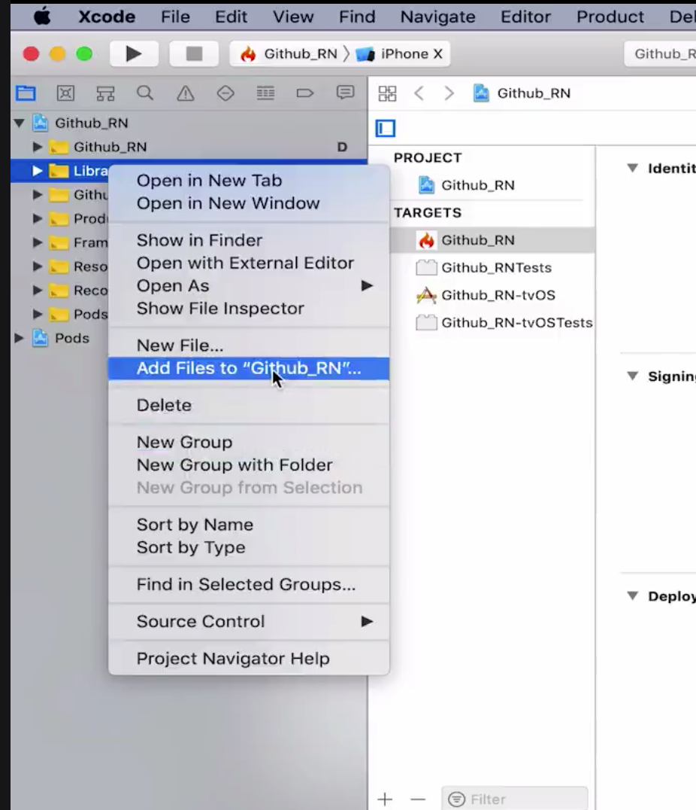
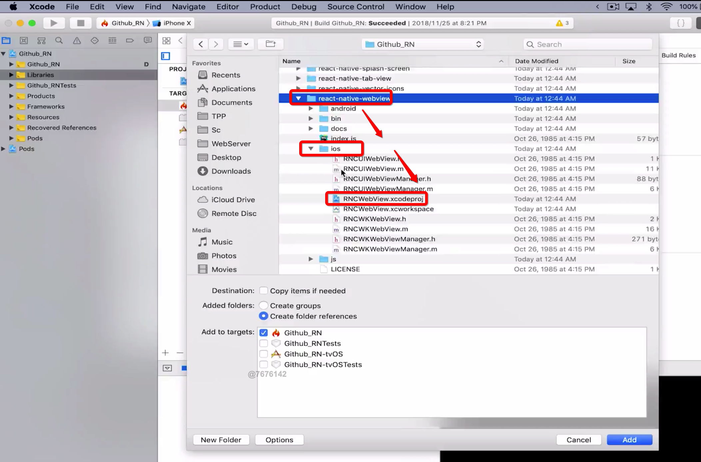
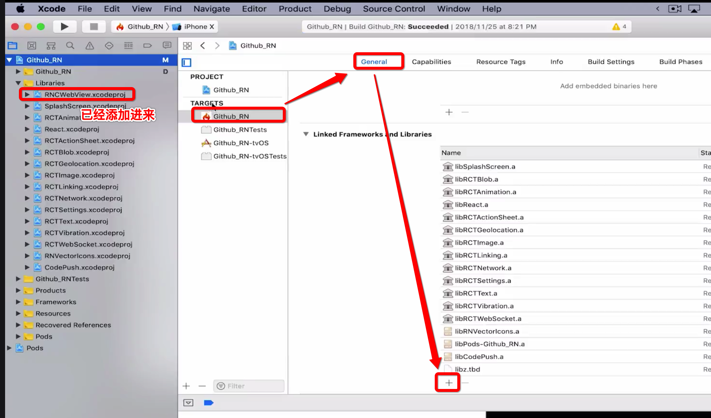
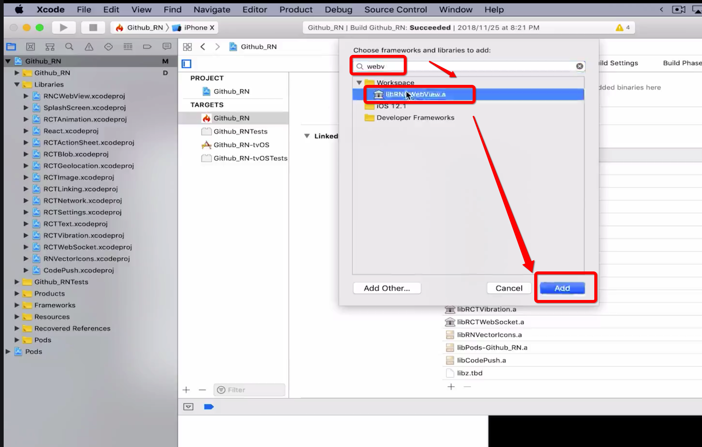

[toc]


# react native 组件webview 与 react-native-community / react-native-webview 的区别

- https://github.com/react-native-community/react-native-webview

- React Native Cross-Platform WebView https://github.com/react-native-community/discussions-and-proposals/pull/3

```jsx
// import {WebView} form 'react-native';
import {WebView} form 'react-native-webview';
// 从react-native-webview 中导入的webview 完全兼容 react-native 导入的webview, 后续也会移植到react-native的webview 中使用;

// react-natvie-webview 在ios中需要手动导入, 有点像 导入矢量图标, 但这里是添加工程到项目中;

// 如果前期使用的是 react-native 中的webview , 后期可以直接替换成 react-native-webview 中的webview, 但反之可能不行, 因为在react-native-webview 中的webview 添加了很多 react-native 的webview 所没有的方法;
```


----

在 App 中，渲染 HTML 是一个非常常见的功能，有可能是直接渲染 HTML 字符串或者是通过 URL 渲染远程 HTML页面。

React Native 提供了一个 WebView 组件以供我们实现 HTML 的渲染。

早先 WebView 是在 React Native 核心包中，后来为了减小 React Native 核心包的体积，便将其单独提出到 [react-native-webview](https://github.com/react-native-community/react-native-webview) 组件中。

话不多说，让我们来试试这个组件吧。

## 渲染远程 HTML 内容

在开始之前，你需要使用 yarn/npm 来安装它:

```
yarn add react-native-webview
```

安装完成后，我们就可以在代码中使用它：

```
import React, { Component } from 'react';
import { View } from 'react-native';
import { WebView } from 'react-native-webview';

export default class App extends Component {
  render() {
    return (
      <View>
        <WebView source={{ uri: 'https://www.baidu.com' }} />
      </View>
    )
  }
}
```

## ios中使用 react-natvie-webview

1. 如果一直报错没有找到相关项目 或者 pod 相关依赖等等;
2. 则需要通过xcode 手动导入 react-native-webview 项目到 Libraries 中;









- 重新运行的时候是可能依然报错, 如下: 

```js
# 运行
DwightdeiMac-96:GitHub_RN dwight$ react-native run-ios --simulator "iPhone 8"
# 错误信息
error React Native CLI uses autolinking for native dependencies, but the following modules are linked manually: 
  - react-native-webview (to unlink run: "react-native unlink react-native-webview")
This is likely happening when upgrading React Native from below 0.60 to 0.60 or above. Going forward, you can unlink this dependency via "react-native unlink <dependency>" and it will be included in your app automatically. If a library isn't compatible with autolinking, disregard this message and notify the library maintainers.
Read more about autolinking: https://github.com/react-native-community/cli/blob/master/docs/autolinking.md
info Found Xcode workspace "GitHub_RN.xcworkspace"
info Building (using "xcodebuild -workspace GitHub_RN.xcworkspace -configuration Debug -scheme GitHub_RN -destination id=E4687B16-78D3-4126-ACEE-1E57527C8E83")
```

- 根据以上错误信息提示, 在项目下终端运行`react-native unlink react-native-webview` 即可;

- 以上步骤完成以后, 重新运行项目即可; 

## Android 中使用 react-native-webview

**需要注意的是：第一次安装完成后，需要重新执行一次 react-native run-* 让 rn 帮我们自动 link 一次，否则会抛出以下错误：**


重新执行 react-native run-* 后，报错没了，但是页面上一片空白：


这是什么原因呢？在查看了一下文档之后，发现 WebView 默认是不会自动设置其高度，所以这个时候高度是0，我们才无法在页面中找到它。需要注意的是，如果 WebView 的父级组件是 View, 直接使用 style 给 WebView 组件设置高度是无效的，需要给这个 View 组件设置高度才能正常显示。然而在 ScrollView 中，则是需要给 WebView 本身设置 height。其它几个组件，例如 SafeAreaView 我没有去尝试，需要你自己亲自去检验。

知道原因后，我们将 WebView 父组件设置 style 为 flex: 1 ，让其铺满整个屏幕，在 reload 一次看看效果：


大功高程，我们已经成功的把百度展现到我们的 App 中了。

## 渲染 HTML 字符串

有时候我们需要将 API 中返回的 HTML 字符串解析出来。渲染 HTML 字符串的时候，我们需要将 source 中的 uri 替换为 html，它的值就是我们的 HTML 字符串。与 uri 不同的是，渲染 HTML 字符串的时候，我们需要设置originWhitelist，比如可以设为["*"]来允许运行本地代码。

```
{/* ... */}
<WebView
  originWhitelist={['*']}
  source={{ html: `<h1>这里是一个标题</h1>` }}
/>
{/* ... */}
```

到这里我们就成功的把标题给渲染出来了。

## 根据内容自动计算高度

往往我们无法提前预知 HTML 内容的高度，所以我们无法给其设置一个固定的高度，而是需要根据内容来设置其高度。

为了达到这个目的，我们需要用到 injectedJavaScript 和 onMessage ，

### injectedJavaScript

这个属性的作用是设置一个在网页加载之前执行的 js 代码。

### onMessage

在 webview 内部的网页中调用 window.postMessage 方法时可以触发此属性对应的函数，从而实现网页和 RN 之间的数据交换。 设置此属性的同时会在 webview 中注入一个 postMessage 的全局函数并覆盖可能已经存在的同名实现。

网页端的 window.postMessage 只发送一个参数 data，此参数封装在 RN 端的 event 对象中，即 event.nativeEvent.data。data 只能是一个字符串。

```
import React, { Component } from 'react';
import { View, ScrollView, SafeAreaView } from 'react-native';
import { WebView } from 'react-native-webview';

export default class App extends Component {
  constructor(props) {
    super(props);

    this.state = { webViewHeight: 0 };
  }

  {/* 根据内容计算 WebView 高度 */}
  onWebViewMessage = (event) => {
    this.setState({ webViewHeight: Number(event.nativeEvent.data) });
  }

  render() {
    return (
      <View style={{ flex: 1 }}>
        <View style={{ height: 100, backgroundColor: 'yellow' }}></View>
        <View style={{ height: this.state.webViewHeight }}>
          <WebView
            originWhitelist={['*']}
            source={{ html: `<p>这里是一个标题</p>` }}
            injectedJavaScript='window.ReactNativeWebView.postMessage(document.documentElement.scrollHeight)'
            onMessage={this.onWebViewMessage}
          />
        </View>
        <View style={{ height: 100, backgroundColor: 'green' }}></View>
      </View>
    )
  }
}
```


从上图可以看出我们的 WebView 已经根据其中内容动态的计算了其高度。但是还是有一个问题，这里的文字太小了，要解决这个问题我们需要用到 meta - viewport 。

### 采用响应式布局

这个其实很简单，只需要在 header 中设置 meta 标签即可。

```
<WebView
  originWhitelist={['*']}
  source={{ html: `
  <html>
    <head>
      <meta name="viewport" content="width=device-width, initial-scale=1.0">
    </head>

    <body>
      <p>这里是一个标题</p>
    </body>
  </html>
  ` }}
  injectedJavaScript='window.ReactNativeWebView.postMessage(document.documentElement.scrollHeight)'
  onMessage={this.onWebViewMessage}
/>
```


## 总结

到此，关于 React Native 的基础使用我们已经讲完了，更多细节请参考以下链接：

- [中文文档](https://reactnative.cn/docs/webview/)
- [仓库地址](https://github.com/react-native-community/react-native-webview)

查看原文： [React Native 使用 react-native-webview 渲染 HTML](https://github.com/collinxz-coder/blog/issues/8)