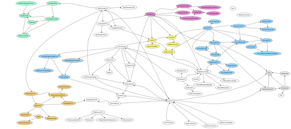

### 变更记录

| 序号 | 录入时间 | 录入人 | 备注 |
|:--------:|:--------:|:--------:|:--------:|
| 1 | 2016-03-15 | [Alfred Jiang](https://github.com/viktyz) | - |

### 方案名称

工具 - 使用 objc_dep 检查项目中的导入依赖(Import Dependancies)

### 关键字

工具 \ objc_dep \ 导入依赖 \ Import Dependancies

### 需求场景

1. 重构工程，实现代码的疏耦合

### 参考链接

1. [Segmentfault - Objective-C 项目重构利器：把项目中的导入依赖（Import Dependancies）图示化](https://segmentfault.com/a/1190000000361642)
2. [GitHub - objc_dep](https://github.com/nst/objc_dep)
3. [GitHub - ObjectGraph-Xcode](https://github.com/vampirewalk/ObjectGraph-Xcode)

### 详细内容

##### 1. 从 [*GitHub - objc_dep*](https://github.com/nst/objc_dep) 获取最新的 objc_dep.py

##### 2. 执行以下命令生成导入依赖关系图

>$ python objc_dep.py /path/to/YourProject > relation.dot

##### 3. 在 [*OmniGraffle*](https://www.omnigroup.com/omnigraffle) 中打开 *relation.dot*


##### 4. 移除 *categories*


##### 5. 将关联类分组


##### 6. 检查有问题的依赖


##### 7. 额外选项，下面会包括所有以 "Internal" 或 "secret" 开头的文件，同时所有 subdir1 和 subdir2 目录下的文件会被忽略

>$ python objc_dep.py /path/to/repo -x "(^Internal|secret)" -i subdir1 subdir2 > graph.dot


### 效果图



### 备注

```python
#!/usr/bin/python

# Nicolas Seriot
# 2011-01-06 -> 2011-12-16
# https://github.com/nst/objc_dep/

"""
Input: path of an Objective-C project
Output: import dependencies Graphviz format
Typical usage: $ python objc_dep.py /path/to/project [-x regex] [-i subfolder [subfolder ...]] > graph.dot
The .dot file can be opened with Graphviz or OmniGraffle.
- red arrows: .pch imports
- blue arrows: two ways imports
"""

import sys
import os
from sets import Set
import re
from os.path import basename
import argparse

local_regex_import = re.compile("^\s*#(?:import|include)\s+\"(?P<filename>\S*)(?P<extension>\.(?:h|hpp|hh))?\"")
system_regex_import = re.compile("^\s*#(?:import|include)\s+[\"<](?P<filename>\S*)(?P<extension>\.(?:h|hpp|hh))?[\">]")

def gen_filenames_imported_in_file(path, regex_exclude, system, extensions):
    for line in open(path):
        results = re.search(system_regex_import, line) if system else re.search(local_regex_import, line)
        if results:
            filename = results.group('filename')
            extension = results.group('extension') if results.group('extension') else ""
            if regex_exclude is not None and regex_exclude.search(filename + extension):
                continue
            yield (filename + extension) if extension else filename

def dependencies_in_project(path, ext, exclude, ignore, system, extensions):
    d = {}
    
    regex_exclude = None
    if exclude:
        regex_exclude = re.compile(exclude)
    
    for root, dirs, files in os.walk(path):

        if ignore:
            for subfolder in ignore:
                if subfolder in dirs:
                    dirs.remove(subfolder)

        objc_files = (f for f in files if f.endswith(ext))

        for f in objc_files:
            
            filename = f if extensions else os.path.splitext(f)[0]
            if regex_exclude is not None and regex_exclude.search(filename):
                continue

            if filename not in d:
                d[filename] = Set()
            
            path = os.path.join(root, f)

            for imported_filename in gen_filenames_imported_in_file(path, regex_exclude, system, extensions):
                if imported_filename != filename and '+' not in imported_filename and '+' not in filename:
                    imported_filename = imported_filename if extensions else os.path.splitext(imported_filename)[0]
                    d[filename].add(imported_filename)

    return d

def dependencies_in_project_with_file_extensions(path, exts, exclude, ignore, system, extensions):

    d = {}
    
    for ext in exts:
        d2 = dependencies_in_project(path, ext, exclude, ignore, system, extensions)
        for (k, v) in d2.iteritems():
            if not k in d:
                d[k] = Set()
            d[k] = d[k].union(v)

    return d

def two_ways_dependencies(d):

    two_ways = Set()

    # d is {'a1':[b1, b2], 'a2':[b1, b3, b4], ...}

    for a, l in d.iteritems():
        for b in l:
            if b in d and a in d[b]:
                if (a, b) in two_ways or (b, a) in two_ways:
                    continue
                if a != b:
                    two_ways.add((a, b))
                    
    return two_ways

def untraversed_files(d):

    dead_ends = Set()

    for file_a, file_a_dependencies in d.iteritems():
        for file_b in file_a_dependencies:
            if not file_b in dead_ends and not file_b in d:
                dead_ends.add(file_b)

    return dead_ends

def category_files(d):
    d2 = {}
    l = []
    
    for k, v in d.iteritems():
        if not v and '+' in k:
            l.append(k)
        else:
            d2[k] = v

    return l, d2

def referenced_classes_from_dict(d):
    d2 = {}

    for k, deps in d.iteritems():
        for x in deps:
            d2.setdefault(x, Set())
            d2[x].add(k)
    
    return d2
    
def print_frequencies_chart(d):
    
    lengths = map(lambda x:len(x), d.itervalues())
    if not lengths: return
    max_length = max(lengths)
    
    for i in range(0, max_length+1):
        s = "%2d | %s\n" % (i, '*'*lengths.count(i))
        sys.stderr.write(s)

    sys.stderr.write("\n")
    
    l = [Set() for i in range(max_length+1)]
    for k, v in d.iteritems():
        l[len(v)].add(k)

    for i in range(0, max_length+1):
        s = "%2d | %s\n" % (i, ", ".join(sorted(list(l[i]))))
        sys.stderr.write(s)

def dependencies_in_dot_format(path, exclude, ignore, system, extensions):
    
    d = dependencies_in_project_with_file_extensions(path, ['.h', '.hh', '.hpp', '.m', '.mm', '.c', '.cc', '.cpp'], exclude, ignore, system, extensions)

    two_ways_set = two_ways_dependencies(d)
    untraversed_set = untraversed_files(d)

    category_list, d = category_files(d)

    pch_set = dependencies_in_project(path, '.pch', exclude, ignore, system, extensions)

    #
    
    sys.stderr.write("# number of imports\n\n")
    print_frequencies_chart(d)
    
    sys.stderr.write("\n# times the class is imported\n\n")
    d2 = referenced_classes_from_dict(d)    
    print_frequencies_chart(d2)
        
    #

    l = []
    l.append("digraph G {")
    l.append("\tnode [shape=box];")

    for k, deps in d.iteritems():
        if deps:
            deps.discard(k)
        
        if len(deps) == 0:
            l.append("\t\"%s\" -> {};" % (k))
        
        for k2 in deps:
            if not ((k, k2) in two_ways_set or (k2, k) in two_ways_set):
                l.append("\t\"%s\" -> \"%s\";" % (k, k2))

    l.append("\t")
    for (k, v) in pch_set.iteritems():
        l.append("\t\"%s\" [color=red];" % k)
        for x in v:
            l.append("\t\"%s\" -> \"%s\" [color=red];" % (k, x))
    
    l.append("\t")
    l.append("\tedge [color=blue, dir=both];")

    for (k, k2) in two_ways_set:
        l.append("\t\"%s\" -> \"%s\";" % (k, k2))

    for k in untraversed_set:
        l.append("\t\"%s\" [color=gray, style=dashed, fontcolor=gray]" % k)
    
    if category_list:
        l.append("\t")
        l.append("\tedge [color=black];")
        l.append("\tnode [shape=plaintext];")
        l.append("\t\"Categories\" [label=\"%s\"];" % "\\n".join(category_list))

    if ignore:
        l.append("\t")
        l.append("\tnode [shape=box, color=blue];")
        l.append("\t\"Ignored\" [label=\"%s\"];" % "\\n".join(ignore))

    l.append("}\n")
    return '\n'.join(l)

def main():
    parser = argparse.ArgumentParser()
    parser.add_argument("-x", "--exclude", nargs='?', default='' ,help="regular expression of substrings to exclude from module names")
    parser.add_argument("-i", "--ignore", nargs='*', help="list of subfolder names to ignore")
    parser.add_argument("-s", "--system", action='store_true', default=False, help="include system dependencies")
    parser.add_argument("-e", "--extensions", action='store_true', default=False, help="print file extensions")
    parser.add_argument("project_path", help="path to folder hierarchy containing Objective-C files")
    args= parser.parse_args()

    print dependencies_in_dot_format(args.project_path, args.exclude, args.ignore, args.system, args.extensions)

if __name__=='__main__':
    main()
```
