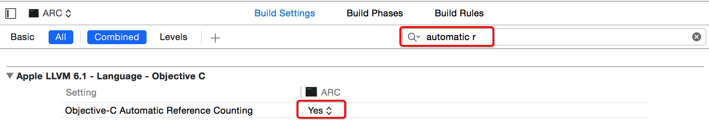

# ARC快速入门
##本小节知识点:
1. 【了解】ARC机制判断
2. 【了解】ARC快速使用

---

##1.ARC机制判断
- OS5以后,创建项目默认的都是ARC



- ARC机制下有几个明显的标志:
    +  不允许调用对象的 release方法
    +  不允许调用 autorelease方法
    +   再重写父类的dealloc方法时,不能再调用 [super dealloc];

---

##2.ARC快速使用

```objc
int main(int argc, const char * argv[]) {
    // 不用写release, main函数执行完毕后p会被自动释放
    Person *p = [[Person alloc] init];
    return 0;
}
```


---